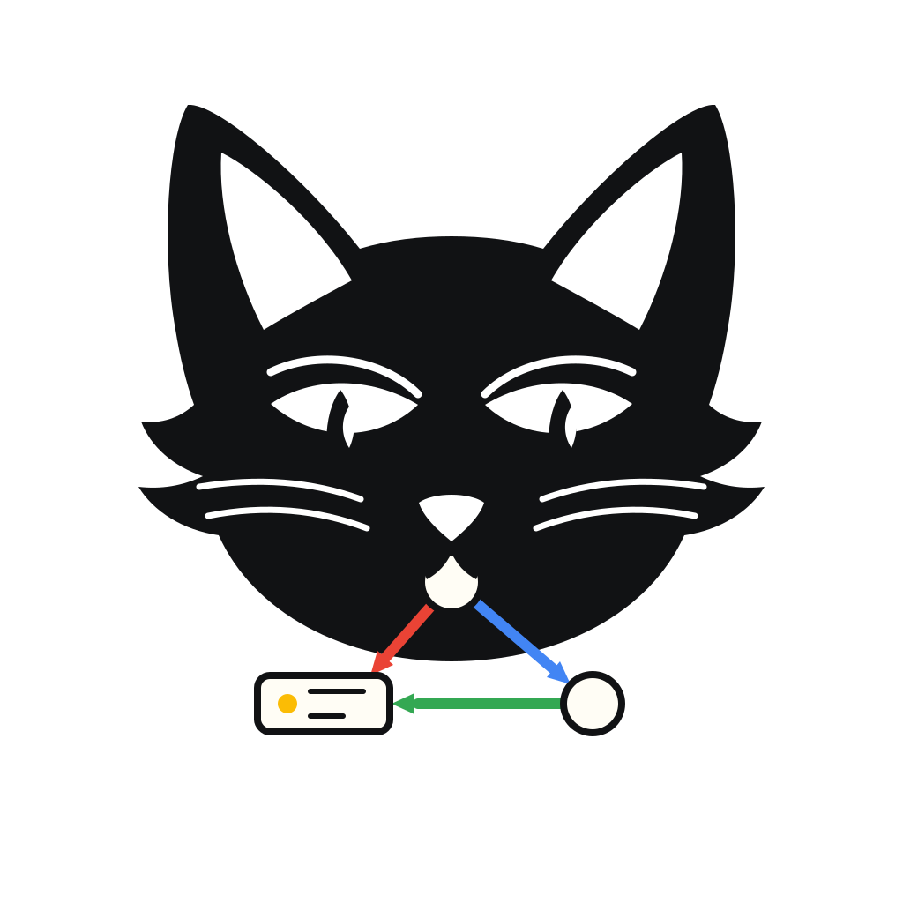

<!--
SPDX-FileCopyrightText: 2026 Blackcat Informatics® Inc. <paudley@blackcatinformatics.ca>
SPDX-License-Identifier: MIT OR Apache-2.0
-->
<p align="center">
  <a href="https://blackcatinformatics.ca/purrdf/">
    
  </a>
</p>

<h1 align="center">PurRDF</h1>

<p align="center">
  <em>The RDF 1.2 toolkit with a purr: primitives, codecs, SPARQL, SHACL, ShEx, and graph transport.</em>
</p>

<p align="center">
  <strong>One RDF engine. One behavior. Every language.</strong>
</p>

<p align="center">
  <a href="https://github.com/Blackcat-Informatics/purrdf/actions/workflows/ci.yaml"></a>
  <a href="https://crates.io/crates/purrdf"></a>
  <a href="https://pypi.org/project/purrdf/"></a>
  <a href="https://www.npmjs.com/package/@blackcatinformatics/purrdf"></a>
  <a href="https://doi.org/10.67342/pkg8gpp4no/v1"></a>
  <a href="./LICENSING.md"></a>
  
</p>

---

## Why does this exist?

RDF tooling fragments along two axes.

**Across languages**: every ecosystem has its own parser, with its own bugs, its own
corner-case interpretations, and its own subset of the spec. Move a graph from a Rust
service to a Python pipeline to a browser and you have silently changed what the data
means three times.

**Across time**: [RDF 1.2](https://www.w3.org/TR/rdf12-concepts/) — triple terms,
reifiers, base-direction literals — is where the standard is going, and almost no
incumbent library carries it.

PurRDF exists so that a graph is **the same graph everywhere**. It is a from-scratch,
dependency-light Rust core — parser to SPARQL engine to SHACL validator to binary
transport — carried verbatim into Python, WebAssembly/JavaScript, and C. There are
deliberately **no Cargo feature flags** anywhere in the workspace (CI enforces this):
a data carrier must not have optional behavior, so every consumer gets the same
byte-identical semantics.

PurRDF is the data backbone of the [GMEOW](https://github.com/Blackcat-Informatics/gmeow-ontology)
stack and the reference home of the [GTS](./docs/GTS-SPEC.md) graph-transport engine,
but it assumes nothing about your ontology or application.

## What's inside

- **RDF 1.2 primitives** — an immutable, value-interned dataset IR (`TermId` space,
  string arena, copy-on-write mutation), with triple terms in object position,
  reifier/annotation side-tables, and base-direction literals (`rdf:dirLangString`).
- **Native codecs** — first-party parsers/serializers for **Turtle, TriG, N-Triples,
  N-Quads, RDF/XML, JSON-LD (star), and YAML-LD**; byte-deterministic output.
- **Canonicalization** — W3C **RDFC-1.0** dataset canonicalization, tested against the
  W3C fixture suite.
- **SPARQL 1.1/1.2** — native parser → algebra → multiset evaluator over the interned
  IR (property paths, aggregates, EXISTS decorrelation, cost-based BGP planning,
  injectable SERVICE federation), gated by the W3C SPARQL 1.1 conformance harness.
  Results in SPARQL JSON/XML/CSV/TSV.
- **SHACL validation** — a native validator with the complete SHACL Core feature
  set (all constraint components, full property paths, qualified value shapes,
  property pairs), SHACL-SPARQL constraints/targets on the native engine, and
  scoped SHACL 1.2 draft support for reifier shapes — **114/120 passing** on the
  vendored W3C test suite (the 6 ledgered are custom-component and
  pre-binding-semantics gaps).
- **ShEx 2.1** — a from-scratch ShExC + ShExJ schema layer and validator gated
  against the official shexTest suite: **1,051/1,051 attempted validation tests,
  zero expected-failures** (imports/semantic-actions staged next), 99/99 negative
  syntax, 14/14 negative structure. See [`docs/CONFORMANCE.md`](./docs/CONFORMANCE.md).
- **GTS graph transport** — a single-file, content-addressed, append-only container
  for RDF 1.2 graphs and the binaries they reference: BLAKE3-chained CBOR segments,
  deterministic fold, COSE signing/encryption, pure-Rust crypto (wasm-friendly).
  Spec in [`docs/GTS-SPEC.md`](./docs/GTS-SPEC.md), frozen cross-language conformance
  vectors in [`vectors/`](./vectors/).
- **Slices, mappings, and provenance** — a manifest-based slice catalog with
  content-addressed artifact IDs, an explicit RDF↔GTS **loss ledger**
  ([`generated/rdf-loss-matrix.json`](./generated/rdf-loss-matrix.json)), SSSOM
  mapping TSV support, and an FnO function-catalog codec.
- **Zero-dependency foundations** — `purrdf-iri` (RFC 3987/3986) and `purrdf-xsd`
  (XSD 1.1 value space) have no runtime dependencies at all; `purrdf-events` (the
  object-safe ingestion seam) has none either.

## Quickstart

### Rust

```sh
cargo add purrdf
```

```rust
use purrdf::{parse_dataset, serialize_dataset, RdfDatasetBuilder, RdfLiteral, SerializeGraph};

// Build a dataset in interned TermId space.
let mut b = RdfDatasetBuilder::new();
let alice = b.intern_iri("https://example.org/alice");
let knows = b.intern_iri("http://xmlns.com/foaf/0.1/knows");
let bob = b.intern_iri("https://example.org/bob");
let name = b.intern_iri("http://xmlns.com/foaf/0.1/name");
let hi = b.intern_literal(RdfLiteral::simple("Alice"));
b.push_quad(alice, knows, bob, None);
b.push_quad(alice, name, hi, None);
let ds = b.freeze().expect("freeze");

// Serialize to any native codec and parse back, losslessly.
let ttl = serialize_dataset(&ds, "text/turtle", SerializeGraph::Dataset).unwrap();
let back = parse_dataset(&ttl, "text/turtle", None).unwrap();
assert_eq!(back.quad_count(), 2);
```

### Python

```sh
pip install purrdf
```

```python
import purrdf

quads = purrdf.parse(
    '<https://example.org/alice> <http://xmlns.com/foaf/0.1/name> "Alice" .',
    purrdf.RdfFormat.TURTLE,
)

from purrdf_native import shacl
report = shacl.validate(shapes_ttl=my_shapes, data_nt=my_data)
print(report["conforms"])
```

The Python package also ships an [rdflib compatibility layer](./bindings/python/python/src/purrdf/compat/rdflib/)
and GTS relational exports (`gts_to_sqlite`, `gts_to_duckdb`, `gts_to_parquet`).

### JavaScript / WebAssembly

An [RDF/JS](https://rdf.js.org/)-shaped API (`DataFactory` / `Dataset` / `Stream`)
over the same engine, including the RDF 1.2 features no incumbent RDF/JS library
carries — quoted triple terms and base-direction literals:

```js
import { ready, DataFactory, Dataset } from "@blackcatinformatics/purrdf";

await ready(); // one-time async wasm instantiation

const f = new DataFactory();
const rtl = f.directionalLiteral("مرحبا", "ar", "rtl");

const ds = new Dataset();
ds.add(f.quad(f.namedNode("https://ex/s"), f.namedNode("https://ex/says"), rtl));

const nq = ds.serialize("nquads");           // directions survive the round-trip
const reparsed = Dataset.parse(nq, "nquads");
```

See [`crates/rdf-wasm`](./crates/rdf-wasm/) (`make wasm-pkg` builds the ESM package).

### C

`libpurrdf` ([`crates/rdf-capi`](./crates/rdf-capi/)) exposes parse, serialize,
pattern iteration, copy-on-write mutation, SPARQL, and GTS round-trips behind a
panic-safe C ABI with a committed header ([`include/purrdf.h`](./crates/rdf-capi/include/purrdf.h))
that CI checks for drift. Built with cargo-c: `make capi-build`.

## Crate map

| Crate | What it is |
| --- | --- |
| [`purrdf`](./crates/purrdf/) | Umbrella facade: the RDF surface at the root, `slice` and `shapes` as modules. Start here. |
| [`purrdf-rdf`](./crates/rdf/) | RDF 1.2 implementation: native codecs, GTS adapters, describe, canonicalization entry points. |
| [`purrdf-core`](./crates/rdf-core/) | The kernel: interned IR, diagnostics, store traits, provenance, loss ledger, RDFC-1.0. |
| [`purrdf-gts`](./crates/gts/) | GTS container engine: reader, writer, fold, verify, COSE sign/encrypt. |
| [`purrdf-sparql-algebra`](./crates/sparql-algebra/) | SPARQL 1.1/1.2 parser → query algebra AST. |
| [`purrdf-sparql-eval`](./crates/sparql-eval/) | Multiset SPARQL evaluator in interned `TermId` space. |
| [`purrdf-sparql-results`](./crates/sparql-results/) | SPARQL results JSON/XML/CSV/TSV, plus a provenance-carrying extension. |
| [`purrdf-shapes`](./crates/shapes/) | SHACL validation engine (full Core + SHACL-SPARQL). |
| [`purrdf-shex`](./crates/shex/) | ShEx 2.1: ShExC/ShExJ schemas and validation. |
| [`purrdf-slice`](./crates/slice/) | Slice catalog: manifests, typed artifacts, ownership/dependency analysis. |
| [`purrdf-iri`](./crates/iri/) | Zero-dependency IRI/URI parsing, resolution, normalization, CURIEs. |
| [`purrdf-xsd`](./crates/xsd/) | Zero-dependency XSD 1.1 value space with SPARQL numeric promotion. |
| [`purrdf-events`](./crates/rdf-events/) | Zero-dependency object-safe RDF event sink/source seam. |
| [`purrdf-wasm`](./crates/rdf-wasm/) | The wasm32 engine behind the `purrdf` ESM package. |
| [`purrdf-capi`](./crates/rdf-capi/) | `libpurrdf` C ABI (unpublished; built via cargo-c). |
| [`purrdf-sparql-conformance`](./crates/sparql-conformance/) | W3C SPARQL conformance harness (unpublished). |

## Fast by measurement, not by assertion

The IR keeps every term **once** in a string arena addressed by copyable
`NonZeroU32` ids, hashes with fixed-key `ahash` everywhere hot, and freezes datasets
into `Box<[QuadRow]>` tables with lazy ordinal permutation indexes (~4 bytes/quad
per axis). Performance claims are backed by criterion benchmarks rather than
adjectives — `crates/rdf-core/benches/ir_layout.rs` measures AoS vs. SoA vs.
predicate-adjacency layouts (allocation counts, high-water mark, end-to-end
latency), and the shipped layout is whichever wins. Run them with `make bench`.

## Conformance

Every engine is gated by its official test suite, vendored and frozen in-repo —
full scoreboard and how-to-run in [`docs/CONFORMANCE.md`](./docs/CONFORMANCE.md):

| Engine | Suite | Result |
| --- | --- | --- |
| ShEx 2.1 validation | shexTest v2.1.0 (`vectors/shexTest/`) | **1,051 / 1,051** attempted, 0 xfail |
| ShEx schemas / negative syntax / structure | shexTest v2.1.0 | **425/425 · 99/99 · 14/14** |
| SHACL | W3C data-shapes (`vectors/shacl/`) | **114 / 120** (6 ledgered) |
| SHACL (first-party frozen corpus) | `crates/shapes/corpus/` | **48 / 48** |
| SPARQL 1.1 | W3C suite via `purrdf-sparql-conformance` | green, xfail-ledgered |
| RDFC-1.0 | W3C canonicalization fixtures | green |
| GTS | frozen cross-language vectors (`vectors/`) | byte-exact |

## Development

```sh
make metadata   # regenerate + verify generated artifacts
make check      # fmt, build, tests, hygiene gates
make bench      # criterion benchmarks
```

Releases are tag-driven with OIDC trusted publishing (crates.io and PyPI), with
build-provenance attestations and SPDX SBOMs — see [`docs/RELEASE.md`](./docs/RELEASE.md).

## The GMEOW family

PurRDF is the library layer of a small family of linked-data projects:

- [`gmeow-ontology`](https://github.com/Blackcat-Informatics/gmeow-ontology) — the
  GMEOW reasoning-centric super-vocabulary and its publishing toolchain (PurRDF's
  primary consumer).
- [`gmeow-gts`](https://github.com/Blackcat-Informatics/gmeow-gts) — the GTS
  specification and its multi-language engines; PurRDF hosts the Rust engine.

Extraction history and source commits: [`PROVENANCE.md`](./PROVENANCE.md).
Brand assets and usage: [`docs/BRAND.md`](./docs/BRAND.md).

## License

Licensed under either of [Apache License 2.0](./LICENSE-APACHE) or
[MIT license](./LICENSE-MIT) at your option, as described in
[`LICENSING.md`](./LICENSING.md).

If you use PurRDF in research, please cite it — see [`CITATION.cff`](./CITATION.cff).
