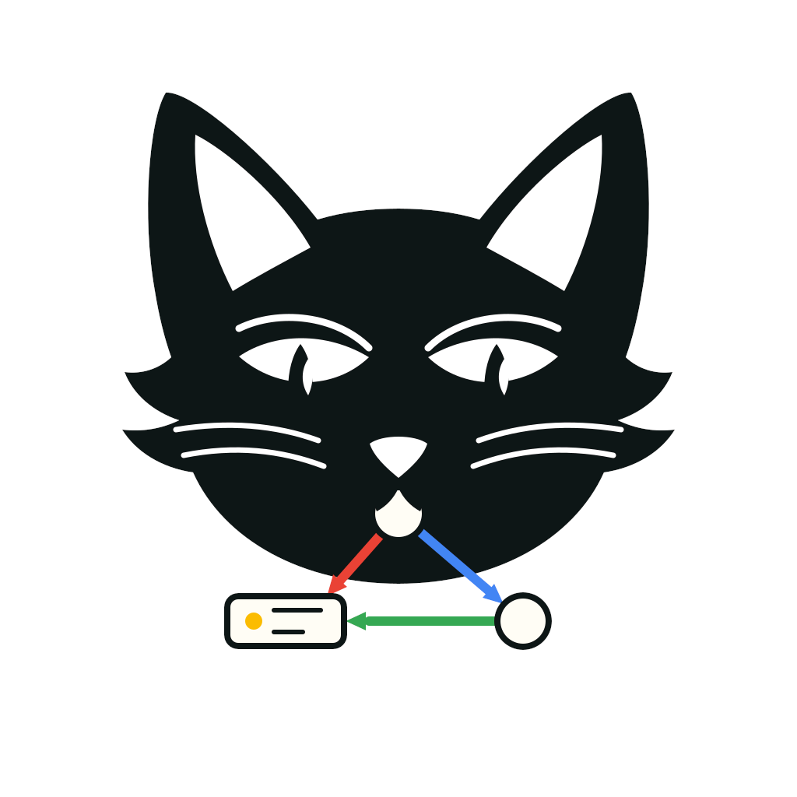

<!--
SPDX-FileCopyrightText: 2026 Blackcat Informatics® Inc. <paudley@blackcatinformatics.ca>
SPDX-License-Identifier: MIT OR Apache-2.0 OR MulanPSL-2.0
-->
<p align="center">
  <a href="https://blackcatinformatics.ca/purrdf/">
    
  </a>
</p>

<h1 align="center">PurRDF</h1>

<p align="center">
  <em>RDF 1.2, reasoning, retrieval, and graph transport — one Rust engine, shared across languages.</em>
</p>

<p align="center">
  <strong>One RDF engine. One behavior. Every language.</strong>
</p>

<p align="center">
  <a href="https://github.com/Blackcat-Informatics/purrdf/actions/workflows/ci.yaml"></a>
  <a href="https://crates.io/crates/purrdf"></a>
  <a href="https://pypi.org/project/purrdf/"></a>
  <a href="https://www.npmjs.com/package/@blackcatinformatics/purrdf"></a>
  <a href="https://doi.org/10.67342/pkg8gpp4no/v1"></a>
  <a href="./LICENSING.md"></a>
  
</p>

<p align="center">
  <a href="https://blackcat-informatics.github.io/purrdf/playground/"></a>
</p>

---

PurRDF is a Rust toolkit for building applications around knowledge graphs.
It brings RDF 1.2, SPARQL, validation, reasoning, text and vector retrieval,
document codecs, and graph transport into one engine. Python, JavaScript /
WebAssembly, and C call that engine rather than reimplementing it.

A graph can carry statements about statements, multilingual literals, named
graphs, provenance, and linked binary content. PurRDF keeps those distinctions
through querying, validation and the carriers that can represent them; a
projection that loses information returns a located loss ledger.

**One RDF engine. One behavior. Every language.** The language surfaces expose
different portions of the toolkit, described below. Every published Rust crate
also builds for `wasm32-unknown-unknown`.

[Try the browser playground](https://blackcat-informatics.github.io/purrdf/playground/)
· [Read the book](https://blackcat-informatics.github.io/purrdf/)
· [Rust API](https://docs.rs/purrdf)
· [Migrating to 3.0](./docs/MIGRATION-3.0.md)

## What you can build

| Job | PurRDF provides |
| --- | --- |
| Carry RDF 1.2 through an application | Interned datasets, triple terms, reifiers, annotations, directional literals and named graphs; native text codecs, canonicalization, diff and isomorphism. |
| Query and change a graph | SPARQL 1.1/1.2 query and Update, prepared execution, property paths, host extensions, resource governors and explain receipts. |
| Validate and derive knowledge | SHACL 1.2, ShEx 2.1, deterministic Datalog, RDF/RDFS/OWL-RL/D materialization, OWL-Direct reasoning and RIF-Core. |
| Retrieve across several signals | Exact fixed-point BM25, GeoSPARQL predicates, exact embedding kNN, deterministic HNSW, and reciprocal-rank fusion with per-producer evidence. |
| Make a document queryable | Structural Markdown and ordered JSON codecs with byte-addressed occurrences, explicit profiles and exact reconstruction. |
| Exchange graph data | GTS containers with binary payloads; canonical five-table Parquet; graph, tabular and research-object projections with loss records. |
| Read an immutable snapshot under a budget | Certified segmented storage, authenticated range reads, pinned terms, sparse caches and shared workspace admission through the ordinary dataset/evaluator seams. |

Start with the [`purrdf`](./crates/purrdf/) facade in Rust. It exposes the RDF
surface at the root and the other engines as modules. Applications supply their
own vocabularies, extension registrations, network transports and embedding
models. Standard RDF vocabulary terms are built in; application namespaces are
explicit configuration.

## Query, reason and retrieve together

A Rust host can join graph patterns with text search, spatial relations and
embedding neighbours in the same SPARQL evaluator. Register each relation under
a predicate IRI supplied by the application:

```sparql
PREFIX ex:  <https://example.org/>
PREFIX geo: <http://www.opengis.net/ont/geosparql#>

SELECT ?doc ?score ?distance WHERE {
  ?doc ex:search ( "harbour dredging" ?score ?rank ?lang ?matched ) .
  ?doc ex:locatedIn ?feature .
  ?feature geo:sfWithin ex:PortDistrict .
  ?doc ex:nearest ( ex:doc-42 5 ?distance )
}
ORDER BY ?rank
```

This query assumes the host has registered the text, spatial and vector
relations and supplied the coordinate-system configuration. An unregistered
predicate remains an ordinary RDF pattern.

- **Text:** [`purrdf-text`](./crates/text/) indexes RDF literals, including the
  annotation layer, with Unicode normalization, case folding and segmentation.
  BM25 scores use exact fixed-point arithmetic. Ranked search and term-occurrence
  relations support phrase and proximity composition in SPARQL. The index is
  resident and built over a frozen dataset; stemming, stop-word dictionaries and
  a separate query dialect are outside its surface.
- **Geometry:** [`purrdf-geo`](./crates/geo/) implements GeoSPARQL 1.1 topological
  predicates over exact rational WKT/GeoJSON geometry, plus accessors and
  exactly computable measures and constructors. Coordinate transformation,
  ellipsoidal geodesics, buffers and overlay set operations are not implemented;
  registered unsupported functions refuse by name. The host declares the CRS
  and which coordinate systems use metres.
- **Vectors:** [PURREMB](./docs/PURREMB.md) carries caller-produced embeddings,
  their coordinates and derivation identities. Exact kNN supports cosine,
  negative dot and squared Euclidean distance. [`purrdf-hnsw`](./crates/hnsw/)
  adds an approximate index with deterministic levels, build scheduling and
  payload bytes under its default arithmetic. Approximate candidates never
  certify that no nearer row exists. PurRDF writes and reads embedding artifacts;
  it does not run a model to generate the vectors.
- **Fusion:** [`purrdf-retrieval`](./crates/retrieval/) plans a typed request,
  compiles it to per-producer SPARQL, executes it and fuses the ranked streams.
  Exact fixed-point reciprocal-rank fusion carries plan, fusion-law and evidence
  identities, per-stratum provenance, index-generation attestations and declared
  search fidelity. Unserved request terms and incomplete producers remain
  visible in the result. Producers, strata and weights are caller-supplied.

Default distance arithmetic pins the accumulation order across native and WASM
paths. Explicit `Reassociated` arithmetic permits different last bits in exchange
for different code generation; HNSW artifacts bind that choice to their recorded
build and execution path. Approximation and arithmetic are separate contracts.
See [embedding kNN](./docs/design/purrdf-embedding-knn.md),
[HNSW's recall and build evidence](./crates/hnsw/README.md),
[retrieval composition](./docs/design/purrdf-retrieval-ladder.md), and
[SIMD and arithmetic contracts](./docs/design/purrdf-simd.md).

These ranked producer integrations are Rust APIs, also usable by a Rust host
compiled to WASM. The shipped Python and npm packages expose data-shaped
property functions and path witnesses; they do not expose the text, spatial or
vector producer registrations.

## Documents, carriers and storage

**Documents can be graphs of themselves.**
[`purrdf-markdown`](./crates/markdown/SPEC.md) projects a specified Markdown
dialect into headings, paragraphs and other structural units over verbatim byte
spans. [`purrdf-json`](./crates/json/SPEC.md) records ordered JSON occurrences
and their byte cover. Both require explicit profiles, bind identity to the
profile's law and source bytes, and reconstruct the source byte for byte.
The Markdown dialect is specified by the codec; it is not a CommonMark parser.

**Conversions account for loss.** Native codecs cover Turtle, TriG,
N-Triples, N-Quads, RDF/XML, TriX, HexTuples, JSON-LD and YAML-LD. The JSON-LD
context lens compiles reusable offline contexts; it supplies expansion,
compaction and derived-prefix modes, with caller-provided context registries
and no network loader or framing API. Graph and research-object projections
include Neo4j CSV, openCypher, GraphML, CSVW, OBO Graphs, SKOS, DCAT, VoID,
RO-Crate, Croissant, DataCite and Frictionless. Supported reversible carriers
retain RDF 1.2 through an exact sideband; lossy views report what was lost.
See [projections](./docs/book/src/concepts/projections.md) and the
[generated loss matrix](./generated/transcode-loss-matrix.json).

**One canonical columnar projection.**
[`purrdf-columnar`](./crates/columnar/) supplies the native five-table v1
contract: `terms`, `quads`, `reifiers`, `annotations` and `blobs`. Python's
SQLite, DuckDB and Parquet exporters use its canonical IDs and schema, retaining
scoped blanks, quoted terms, directions, empty named graphs and verified blobs.
GTS's append-order inspection IDs remain a separate authority.

**Two immutable storage paths.** Eager pack snapshots provide a front-coded
dictionary, bitmap indexes and content verification. The new
[`SegmentedSession`](./crates/rdf-core/STORAGE.md) reads a certified persistent
representation through a host range provider, authenticates admitted blocks,
and shares a live ledger between sparse caches, pins, evidence and operator
workspace. It preserves global IDs across sealing and reopening; persisted
handles identify the exact snapshot.

Resident datasets retain compact four-byte term IDs, sixteen-byte quad rows
and borrowed term access. Operational reads use typed failures and pinned guards
through the same `DatasetView` seam. A storage failure discards the operation's
result at its final checkpoint. Bounded query admission currently covers a plain
variable-projected `SELECT` over a basic graph pattern; unpriced operational
forms return a typed refusal. Construction, full certification, host buffers
and caller-owned outputs have separate memory obligations. The kernel performs
no filesystem or network I/O. See the [storage contract](./crates/rdf-core/STORAGE.md)
and [3.0 migration guide](./docs/MIGRATION-3.0.md) for the exact boundaries.

Rust's `explain_query_fallible_view` measures the operational view directly and
returns its explanation with final storage evidence. Its options and stop-signal
variants share the query admission rule; a storage failure discards the entire
explanation, and a stop alone appears in the explanation's governor evidence.

**Graph transport with its payloads.** [GTS](./docs/GTS-SPEC.md) is a
content-addressed, append-only container with deterministic fold, binary
payloads, chained CBOR segments, COSE signing/encryption and pure-Rust crypto.
Its container API reaches Rust, Python and C, and the CLI reads it as an input
format. The npm / JavaScript package does not expose it. Frozen transport
vectors are shared with the [authoritative GTS project](https://github.com/Blackcat-Informatics/gmeow-gts).

## Validation, reasoning and accountable execution

SHACL 1.2 covers Core, SPARQL Extensions, Node Expressions, Inference Rules
and SPARQL 1.2 RL, with SHACL-AF spellings mapped to the shared representation.
Reports are RDF datasets. ShEx 2.1 supplies ShExC/ShExJ schemas and validation,
including imports and semantic actions. Imports resolve from explicit host
registries. The Rust schema compiler also projects shapes into JSON Schema,
OpenAPI, Pydantic, LinkML, TypeScript and GraphQL, with coverage and loss reports;
those schema lanes are Rust-only.

The entailment engine implements **all 78 OWL 2 RL rules** and all 18 RDF + RDFS
patterns. That is rule-table coverage, distinct from entailment conformance:
on the vendored W3C corpus the chase scores **27 of 27 positive and 23 of 23
negative**, the latter recording that no unsoundness was found. The additional
`ext-eq-diff-sym` rule is disclosed in reasoning reports and excluded from those
rule counts. OWL-Direct supplies an open-world SHOIQ(D) tableau and reasoning
services with certificates; a capped search returns `unknown`. RIF-Core and
entailment-aware SPARQL run alongside the materialization regimes. See
[the rule inventory](./docs/book/src/entailment-rules.md) and
[reasoning services](./docs/book/src/entailment.md).

Query governors bound execution and return evidence about a trip, including
which rows can be certified under non-monotone operators. Governed Update
commits entirely or not at all. Prepared execution and scoped callbacks reuse
the same evaluator. The charge schedule and the frozen 50-case governor corpus
are published in the [governor profile](./docs/SPARQL-GOVERNOR-PROFILE.md).
Structured diagnostics preserve stable codes and readable English, with named
parameters and exact logical anchors in JSON, SARIF and the C diagnostic record.

## Quickstart

### Rust

```sh
cargo add purrdf
```

```rust
use purrdf::{parse_dataset, serialize_dataset, SerializeGraph};

fn main() -> Result<(), Box<dyn std::error::Error>> {
    let source = r#"
        @prefix ex: <https://example.org/> .
        ex:alice ex:knows ex:bob .
    "#;
    let dataset = parse_dataset(source.as_bytes(), "text/turtle", None)?;
    assert_eq!(dataset.quad_count(), 1);
    let turtle = serialize_dataset(&dataset, "text/turtle", SerializeGraph::Dataset)?;
    let restored = parse_dataset(&turtle, "text/turtle", None)?;
    assert_eq!(restored.quad_count(), 1);
    Ok(())
}
```

Use the facade's `sparql`, `shapes`, `shex`, `entail`, `retrieval`, `columnar`,
`json` and `markdown` modules as your application grows.
[More Rust examples](./docs/book/src/getting-started/rust.md).

### Python

```sh
pip install purrdf
```

```python
import purrdf

quads = purrdf.parse(
    '<https://example.org/alice> <https://example.org/name> "Alice" .',
    purrdf.RdfFormat.TURTLE,
)
print(quads)
```

Python 3.13+ wheels carry the native extension. `Store` exposes SPARQL and
Update; `shapes`, `shex` and `entail` expose validation and reasoning. Dataset
and GTS columnar export use the native projection.
[Python guide](./bindings/python/README.md).

An explicit compatibility layer is available at `purrdf.compat.rdflib`.
For applications that need the top-level `rdflib` import name:

```sh
pip install 'purrdf[rdflib]'
```

This installs the separate `purrdf-rdflib` distribution with a matching version.
Its `rdflib` package and genuine rdflib cannot share one environment; keep real
rdflib environments separate and omit the shadow extra there.

### JavaScript / WebAssembly

```sh
npm install @blackcatinformatics/purrdf
```

```javascript
import { ready, DataFactory, Dataset } from "@blackcatinformatics/purrdf";

await ready();
const f = new DataFactory();
const dataset = new Dataset();
dataset.add(f.quad(
  f.namedNode("https://example.org/alice"),
  f.namedNode("https://example.org/greeting"),
  f.directionalLiteral("مرحبا", "ar", "rtl"),
));
const restored = Dataset.parse(dataset.serialize("nquads"), "nquads");
console.log(restored.size, dataset.id.toString());
```

The RDF/JS-shaped API also exposes SPARQL, SHACL, reasoning, projections and
static RDF 1.2 SVG visualization. Asynchronous queries can use host-provided
`SERVICE` / `LOAD` resolvers through JSPI. In 3.0, dataset identities and
generations are `bigint`; use decimal strings in JSON.
[JavaScript guide](./crates/rdf-wasm/js/README.md).

### C and CLI

[`libpurrdf`](./crates/rdf-capi/) exposes parse, serialize, iteration, mutation,
SPARQL, validation, reasoning and GTS through a panic-safe C ABI. `make capi-build`
builds the library with cargo-c; `make capi-bundle` prepares a relocatable
header/library distribution with recipient notices. The committed
[`purrdf.h`](./crates/rdf-capi/include/purrdf.h) is checked against generated output.

The [CLI](./crates/cli/) provides `convert`, `query`, `update`, `reason`,
`entails`, `consistency`, `validate`, `shex`, `describe`, `project`, `lift` and
`pack verify`. Build it from this repository; the CLI crate is not published
on crates.io. See [CLI usage](./crates/cli/README.md).

Every parsing surface accepts an explicit document base for relative IRIs.
An unresolved relative IRI is diagnosed when no explicit or in-document base
is available.
Network access is host-supplied: synchronous shipped surfaces install no
federation resolver, and the core ships no HTTP client.

## Crate map

| Crate | Role |
| --- | --- |
| [`purrdf`](./crates/purrdf/) | Start here: the umbrella facade. |
| [`purrdf-rdf`](./crates/rdf/) | Native RDF codecs, GTS adapters, projections and canonicalization. |
| [`purrdf-core`](./crates/rdf-core/) | Interned IR, read sessions, segmented storage, diagnostics, provenance, pack and PURREMB. |
| [`purrdf-sparql-algebra`](./crates/sparql-algebra/) | SPARQL parsing and algebra. |
| [`purrdf-sparql-eval`](./crates/sparql-eval/) | Query/Update evaluation, governors and extension seams. |
| [`purrdf-sparql-results`](./crates/sparql-results/) | Results JSON, XML, CSV and TSV. |
| [`purrdf-shapes`](./crates/shapes/) | SHACL validation/rules and schema compilation. |
| [`purrdf-shex`](./crates/shex/) | ShEx schemas and validation. |
| [`purrdf-datalog`](./crates/datalog/) | Deterministic semi-naive rule substrate. |
| [`purrdf-entail`](./crates/entail/) | Materialization, OWL-Direct and RIF-Core. |
| [`purrdf-text`](./crates/text/) | Exact fixed-point full-text search. |
| [`purrdf-geo`](./crates/geo/) | Exact GeoSPARQL geometry and relations. |
| [`purrdf-hnsw`](./crates/hnsw/) | Deterministic approximate nearest-neighbour indexes. |
| [`purrdf-retrieval`](./crates/retrieval/) | Typed planning, execution and ranked fusion with evidence. |
| [`purrdf-columnar`](./crates/columnar/) | Canonical five-table Parquet codec. |
| [`purrdf-gts`](./crates/gts/) | Container, fold, verification and cryptography. |
| [`purrdf-markdown`](./crates/markdown/) | Structural Markdown codec. |
| [`purrdf-json`](./crates/json/) | Ordered JSON byte-cover codec. |
| [`purrdf-jsonschema`](./crates/jsonschema/) | Native JSON Schema drafts 2020-12, 2019-09 and 07. |
| [`purrdf-slice`](./crates/slice/) | Slice catalogs, artifact ownership and dependencies. |
| [`purrdf-validate`](./crates/validate/) | Shared validation, governor and diagnostic host boundary. |
| [`purrdf-iri`](./crates/iri/) | IRI/URI, language tags, base resolution and standard vocabularies. |
| [`purrdf-xsd`](./crates/xsd/) | XSD value spaces, exact numbers and temporal arithmetic. |
| [`purrdf-cdt`](./crates/cdt/) | SPARQL composite datatypes and their function library. |
| [`purrdf-events`](./crates/rdf-events/) | Zero-dependency ingestion protocol and text direction. |
| [`purrdf-lex`](./crates/lex/) | Shared terminals, Unicode and JSON/YAML/CBOR/XML codecs. |
| [`purrdf-hash`](./crates/hash/) | Zero-dependency hashes and shared identity kernels. |
| [`purrdf-deflate`](./crates/deflate/) | Native deterministic DEFLATE/gzip. |
| [`purrdf-ed25519`](./crates/ed25519/) | Ed25519 signing and strict verification. |
| [`purrdf-stack`](./crates/stack/) | Native/WASM stack admission. |
| [`purrdf-wasm`](./crates/rdf-wasm/) | Engine and ESM bindings for JavaScript. |

The C ABI, CLI, Python extension and test/benchmark tools live in the same
workspace but are not published as Cargo packages. Shared first-party lexical,
codec, hashing and signature foundations reduce the external dependency surface;
each shared job has one enforced home. There are no semantic Cargo features,
so an install-time feature selection cannot change the carrier's behavior.

## Evidence and performance

The [conformance scoreboard](./docs/CONFORMANCE.md) distinguishes official
suites, first-party corpora, approved divergences and untested boundaries.
SPARQL evaluation has **1393 passing**, 0 ledgered.
SHACL has **129/129 passing** on the vendored W3C SHACL 1.0 test suite, zero ledgered,
and **538/544 passing** on the vendored W3C SHACL 1.2 test suite (6 approved results
spell a computed decimal non-canonically and are graded by canonical XSD spelling).


Conformance gates distinguish official suites, first-party frozen corpora and
explicitly recorded boundaries. The full scoreboard and commands are in
[`docs/CONFORMANCE.md`](./docs/CONFORMANCE.md):

| Engine | Suite | Result |
| --- | --- | --- |
| ShEx 2.1 validation | shexTest v2.1.0 (`vectors/shexTest/`) | **1,105 / 1,105** attempted, 0 xfail |
| ShEx schemas / negative syntax / structure | shexTest v2.1.0 | **425/425 · 99/99 · 14/14** |
| SHACL | W3C data-shapes (`vectors/shacl/`) | **129 / 129** pass · 0 ledgered |
| SHACL 1.2 | W3C shacl12-test-suite (`vectors/shacl12/`) | **538 / 544** pass · 6 non-canonical expected decimals · 0 ledgered; 3 unlisted vendored files graded apart |
| SHACL (first-party frozen corpus) | `crates/shapes/corpus/` | **73 / 73** |
| SHACL Rules | DASH + first-party (`vectors/shacl/af/rules/`) | **20 / 20** |
| Syntax codecs | W3C rdf-tests round-trip | **264 / 264** |
| JSON-LD 1.1 context lens | W3C JSON-LD 1.1 REC toRDF + compaction (`crates/rdf/tests/fixtures/jsonld-w3c-rec/`) | **73 / 73** applicable toRDF · **13 / 13** exact compaction |
| SPARQL 1.0/1.1/1.2 | full W3C sparql10 (data-r2) + sparql11 + sparql12 + first-party, via `purrdf-sparql-conformance` | **1393** pass · 0 ledgered |
| SPARQL CDT (SEP-0009) | vendored `awslabs/SPARQL-CDTs` (`vectors/sparql-cdt/`) | **658 / 658**, 0 ledgered — see the lexical-space divergence in [`docs/CONFORMANCE.md`](./docs/CONFORMANCE.md) |
| SPARQL execution governors | first-party frozen corpus (`vectors/sparql-governors/`) | **50 / 50**, 0 ledgered |
| Entailment (SPARQL regimes) | W3C sparql11 `entailment/` group | **70 / 70**, 0 ledgered |
| Entailment (OWL 2 DL consistency) | vendored W3C OWL 2 suite | **258 / 262** agreeing, 4 ledgered, 0 unledgered |
| Entailment (OWL 2 RL, W3C entailment tests) | vendored W3C OWL 2 entailment suite | **50 / 50** agreeing, 0 ledgered, 0 unledgered — negative lane **23 / 23** (no unsoundness), positive lane **27 / 27** |
| RDFC-1.0 | W3C canonicalization fixtures | green |
| RDF 1.2 canonicalization profile (`purrdf-rdfc12` v2) | first-party vectors (`vectors/rdf12-canon/`) | **12 / 12** |
| GTS | frozen cross-language vectors (`vectors/`) | **38 / 39** fold byte-exactly into their committed expectation, 1 ledgered divergence |

Performance evidence is workload- and host-specific. The benchmark harness
records distributions and allocation evidence; `make bench` runs the native
microbenchmarks. Scale-corpus, LUBM and WatDiv comparison lanes are report-only
and need their documented inputs. Comparative runs need controlled machine
conditions, matched builds and preserved raw samples. Browser memory caps,
reader ledgers and physical-device limits establish different facts.
See [benchmark methodology](./docs/BENCHMARKS.md).

## Direction

PurRDF is growing into a foundation for applications that combine graph
reasoning, retrieval and document data across deployment sizes. The next gains
should make those capabilities easier to compose and carry into more workflows,
while keeping identities, resource limits and evidence explicit. The public
contracts and the implemented surfaces above are the basis for that growth.

## Documentation and development

- [The PurRDF Book](https://blackcat-informatics.github.io/purrdf/): language
  guides, concepts and engine contracts.
- [Browser playground](https://blackcat-informatics.github.io/purrdf/playground/):
  parse, query, validate, serialize and compare graphs locally in the browser.
- [Migration to 3.0](./docs/MIGRATION-3.0.md) and [changelog](./CHANGELOG.md).
- [GTS](./docs/GTS-SPEC.md), [PURREMB](./docs/PURREMB.md),
  [RDF 1.2 canonicalization](./docs/RDF12-CANON-PROFILE.md),
  [storage contracts](./crates/rdf-core/STORAGE.md) and
  [release process](./docs/RELEASE.md).

```sh
make metadata      # regenerate and verify projections and license bundles
make check         # formatting, clippy, build, tests and hygiene
make bench         # report-only microbenchmarks
make scale-corpus  # deterministic corpus generation
make lubm          # comparison lane; pinned network inputs and a JRE
make watdiv        # comparison lane; frozen network dataset
```

Consumers need stable Rust **1.98** or newer. Contributors use the nightly
analysis toolchain declared in `rust-toolchain.toml`; the source uses no
nightly-only features. CI separately enforces the stable MSRV and builds every
published crate for WASM. Release artifacts use stable Rust.

The Cargo suite, Python distributions and npm package share one coordinated
version and follow semantic versioning. The C ABI is separately versioned,
currently **0.8**, with signature checks and `purrdf_abi_version` at runtime.
See [contributing](./CONTRIBUTING.md) for the verified commit workflow.

PurRDF is developed by Blackcat Informatics® Inc. and is the library backbone
of [GMEOW](https://github.com/Blackcat-Informatics/gmeow-ontology).
[Extraction history and provenance](./PROVENANCE.md) record its relationship
to the [GTS project](https://github.com/Blackcat-Informatics/gmeow-gts).

## License

First-party code is offered under [MIT](./LICENSE-MIT),
[Apache License 2.0](./LICENSE-APACHE), or [MulanPSL-2.0](./LICENSE-MULAN),
at your option. Separately licensed documentation and third-party material
retain their own terms. Actual distribution archives include applicable full
texts, recipient notices and provenance inventories.
[Licensing guidance](./LICENSING.md) explains the scope and
[提供中文说明](./docs/LICENSING.zh-Hans.md).

If you use PurRDF in research, please cite [CITATION.cff](./CITATION.cff).
