<!--
SPDX-FileCopyrightText: 2026 Blackcat Informatics® Inc. <paudley@blackcatinformatics.ca>
SPDX-License-Identifier: CC-BY-4.0
-->

# RDF 1.2 Visualization

PurRDF projects RDF into a renderer-neutral statement model before producing a
layout or SVG. The projection keeps structural triple terms, assertion
occurrences, reifier identity, annotations, graph context, nesting, and RDF
dialect diagnostics distinct. The SVG carries that model as embedded JSON
metadata, so it is both a visual document and a lossless machine-readable
export.

The examples below are generated directly by the Rust visualization surface.
Line colour varies subtly within each semantic relation class to make dense
routes easier to follow; line width, dash pattern, labels, and arrow grammar
continue to carry the RDF meaning without relying on colour.

## Ordinary shared resources

The compact view preserves the familiar RDF resource graph while separating
routes that share nodes.

[Open compact SVG](../assets/visualization/purrdf-viz2-ordinary-shared-compact.svg)

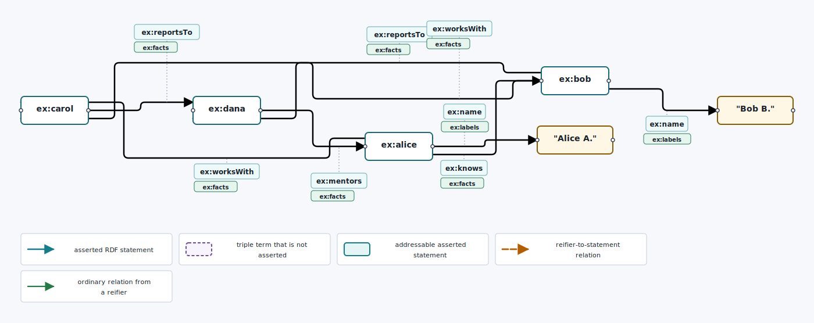

<details>
<summary>Exact statement incidence view</summary>

[Open exact SVG](../assets/visualization/purrdf-viz2-ordinary-shared-incidence.svg)

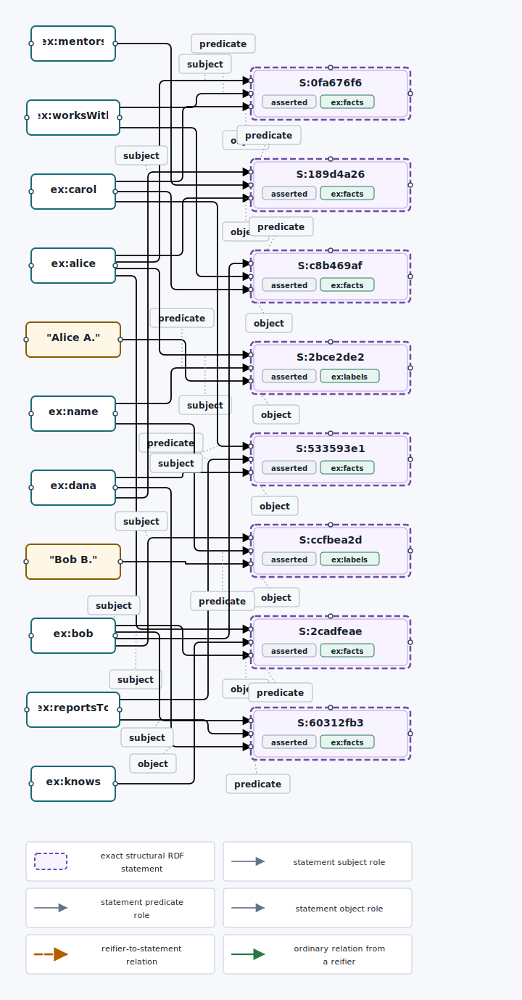

</details>

<details>
<summary>Statement table</summary>

[Open table SVG](../assets/visualization/purrdf-viz2-ordinary-shared-table.svg)

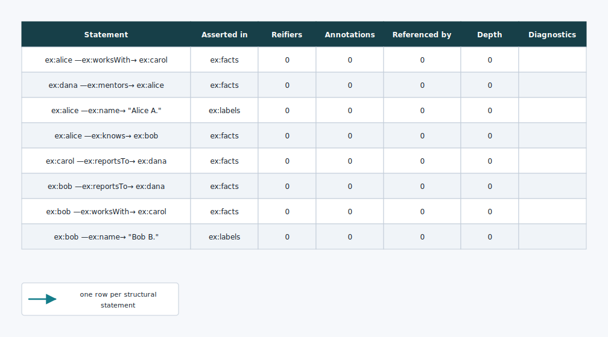

</details>

## Asserted, reified, and annotated statements

Solid arrows remain assertions. Addressable statement anchors connect those
assertions to reifier resources, whose ordinary RDF properties carry provenance,
confidence, timestamps, and directional language literals.

[Open compact SVG](../assets/visualization/purrdf-viz2-asserted-reified-compact.svg)

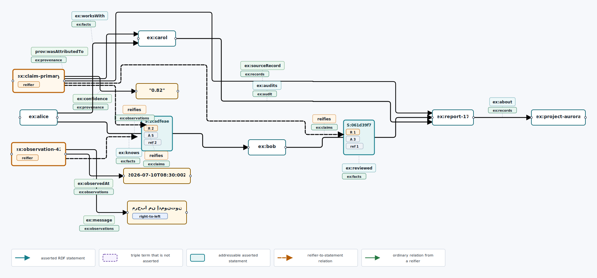

<details>
<summary>Exact statement incidence view</summary>

[Open exact SVG](../assets/visualization/purrdf-viz2-asserted-reified-incidence.svg)

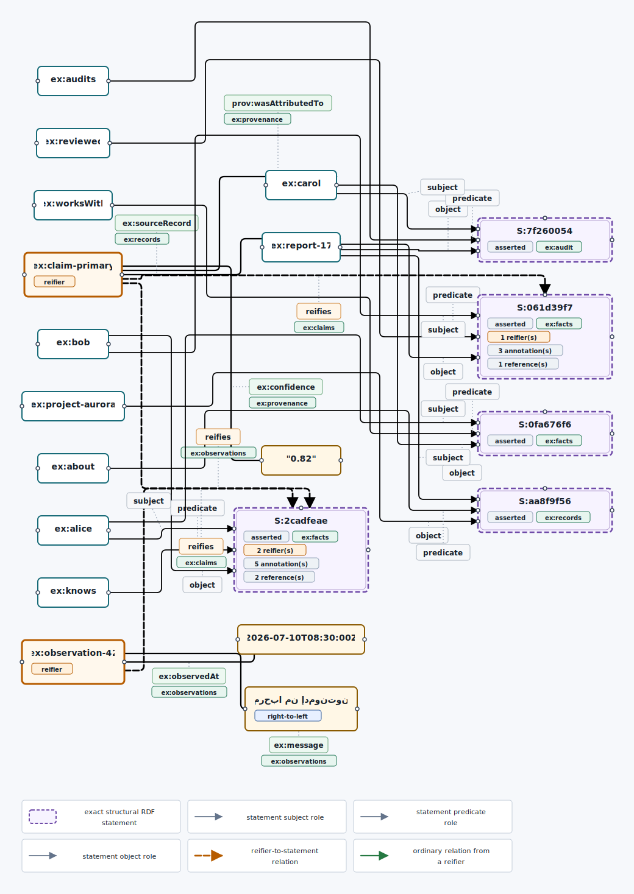

</details>

<details>
<summary>Statement table</summary>

[Open table SVG](../assets/visualization/purrdf-viz2-asserted-reified-table.svg)

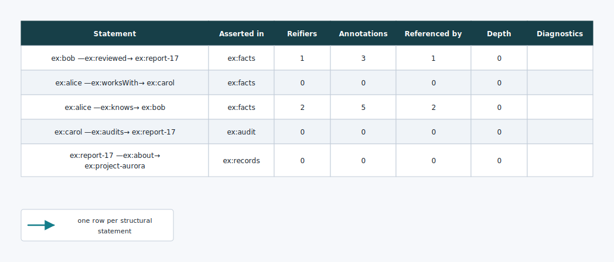

</details>

## Quoted-only and nested triple terms

A quoted-only triple is a bounded statement glyph, never a solid assertion
arrow. Reifier resources stay distinct from the structural statement they
reify.

[Open quoted-only compact SVG](../assets/visualization/purrdf-viz2-quoted-only-compact.svg)

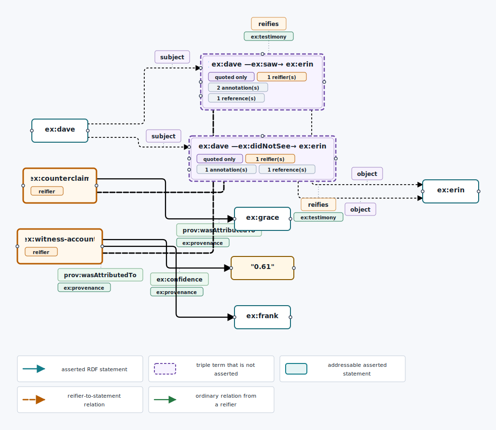

<details>
<summary>Quoted-only exact view and table</summary>

[Open exact SVG](../assets/visualization/purrdf-viz2-quoted-only-incidence.svg) ·
[Open table SVG](../assets/visualization/purrdf-viz2-quoted-only-table.svg)

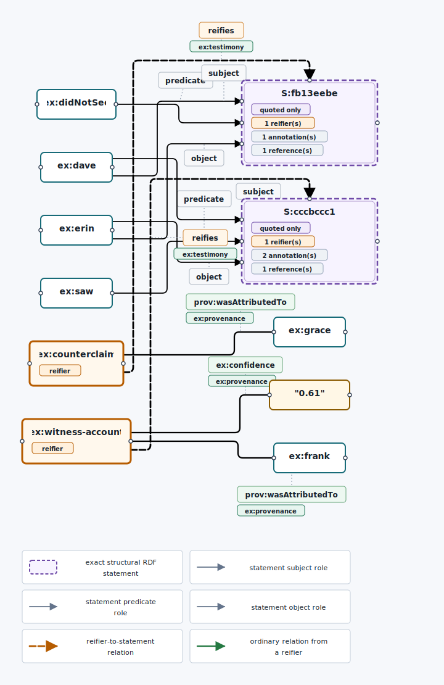

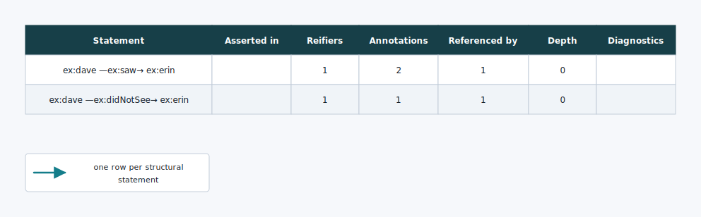

</details>

Nested triple terms retain recursive statement identity. Dialect badges make
symmetric or generalized RDF positions explicit rather than silently rendering
them as ordinary RDF 1.2.

[Open nested compact SVG](../assets/visualization/purrdf-viz2-nested-dialect-compact.svg)

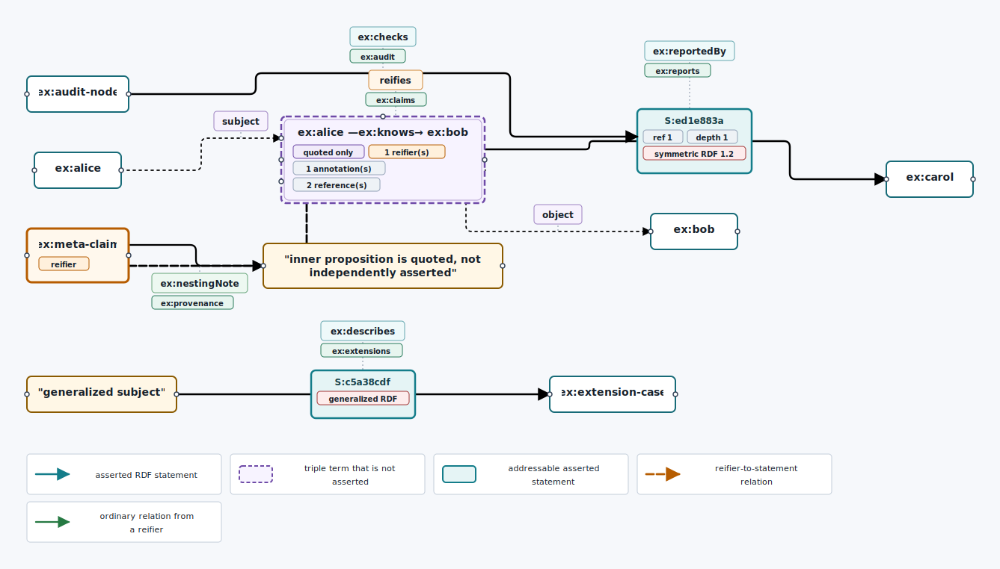

<details>
<summary>Nested exact view and table</summary>

[Open exact SVG](../assets/visualization/purrdf-viz2-nested-dialect-incidence.svg) ·
[Open table SVG](../assets/visualization/purrdf-viz2-nested-dialect-table.svg)

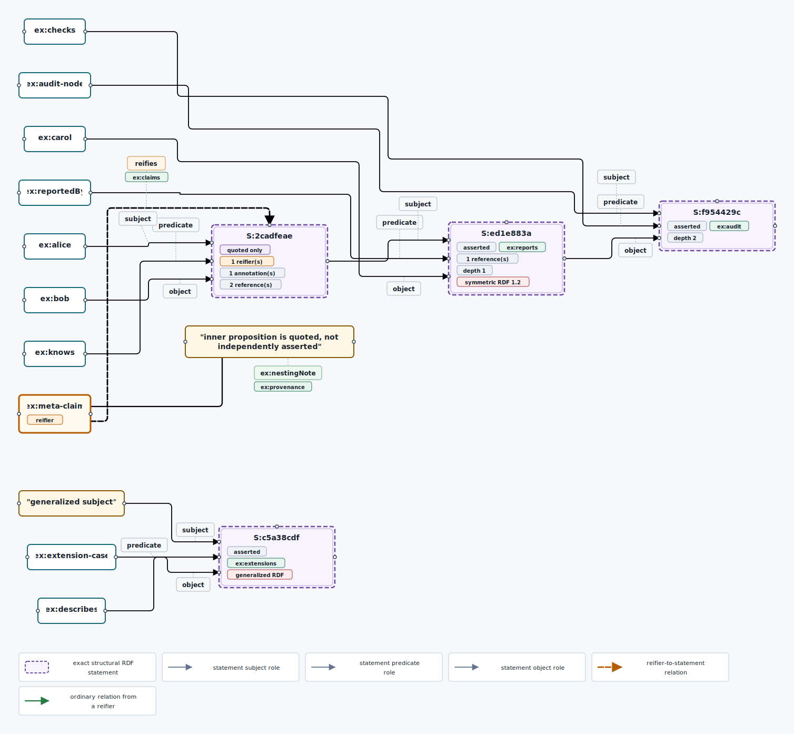

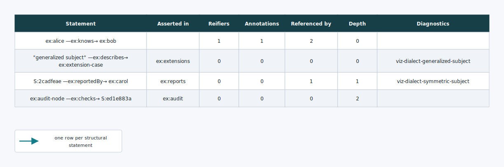

</details>

## Dense connected data

The exact view uses separated vertical channels and rounded orthogonal turns so
individual subject, predicate, object, reification, and annotation routes remain
traceable through a dense connected dataset.

[Open dense exact SVG](../assets/visualization/purrdf-viz2-dense-connected-incidence.svg)

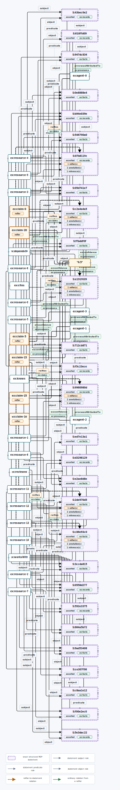

<details>
<summary>Dense compact view and table</summary>

[Open compact SVG](../assets/visualization/purrdf-viz2-dense-connected-compact.svg) ·
[Open table SVG](../assets/visualization/purrdf-viz2-dense-connected-table.svg)

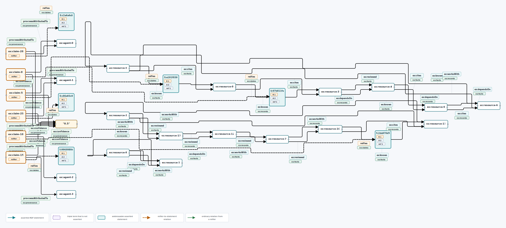

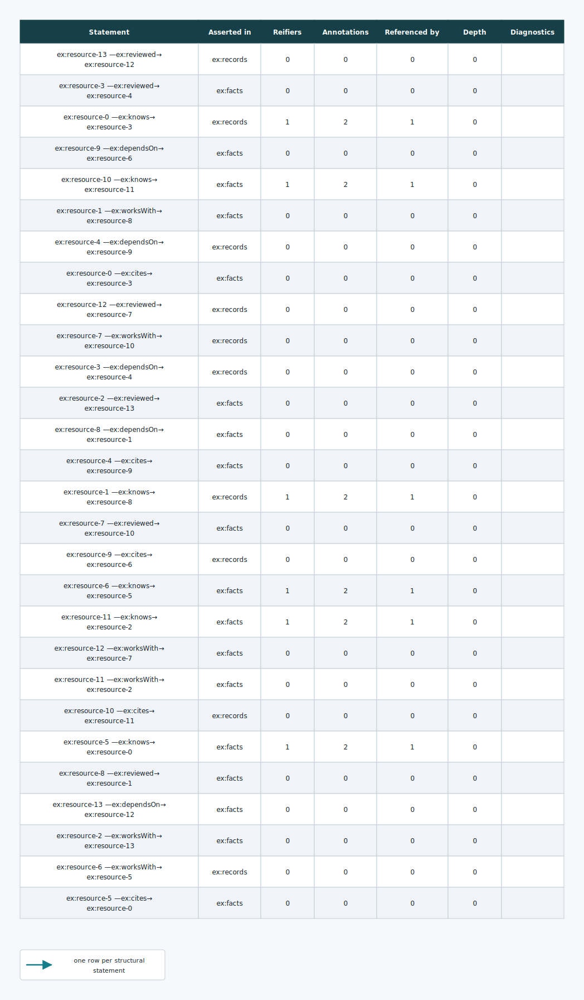

</details>

## Regenerating the samples

The committed SVGs are projections of the Rust fixtures, not hand-edited book
artwork:

```bash
make book-samples
make book
```

`make check` regenerates the same artifacts in a temporary directory and rejects
any drift between the renderer and the book.
