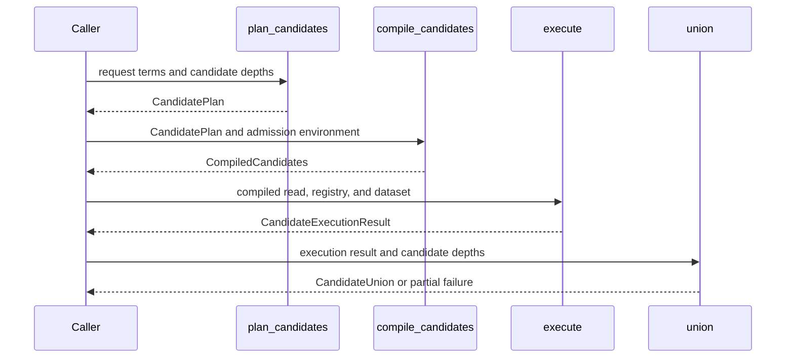

# PR #522 — comments and review threads

3 comment(s). **Every one needs a disposition** in
`review-debt.md`: addressed (with the commit hash) or declined (with the
reason posted in reply). Bot comments count.

## 1. coderabbitai — 

<!-- This is an auto-generated comment: summarize by coderabbit.ai -->
<!-- review_stack_entry_start -->

<!-- review_stack_entry_end -->
<!-- This is an auto-generated comment: rate limited by coderabbit.ai -->

> [!WARNING]
> ## Review limit reached
> 
> Your organization has reached its usage spending cap. Adjust your spending cap in the [billing tab](https://app.coderabbit.ai/settings/billing?tab=usage&orgId=b268aba6-a194-4fd6-8ca5-f1a13a313209).
> 
> **Next included review available in 46 minutes.**
> 
> [Check out review usage here](https://app.coderabbit.ai/dashboard/review-capacity?orgId=b268aba6-a194-4fd6-8ca5-f1a13a313209).
> 
> 

> 
<strong>View limit details</strong>

> 
> **Limit details:** You’ve used the included review currently available. Your 111 included PR review attempts over the past 7 days set your current allowance at 1 review per hour.
> 
> [Learn how review limits work](https://docs.coderabbit.ai/management/plans#rate-limits).
> 
> **Review configuration:**
> 
> 

> 
<strong>⚙️ Run configuration</strong>

> 
> - **Configuration used**: defaults
> - **Review profile**: CHILL
> - **Plan**: Team
> - **Run ID**: `af4531b5-c4c3-4d86-bea1-228456f0172e`
> 
> 
> 

> 
> 

> 
> 

> 
<strong>📥 Commits</strong>

> 
> Reviewing files that changed from the base of the PR and between 08ed781ba21010308d31f5b126b216d5befb3a80 and 1bfae60ded2a735bfcda6914d39013dd2cec5e49.
> 
> 
> 

> 
> 

> 
> 

> 
<strong>📒 Files selected for processing (3)</strong>

> 
> * `crates/retrieval/src/lib.rs`
> * `crates/sparql-eval/src/bgp.rs`
> * `scripts/simd-asm-manifest.toml`
> 
> 
> 

> 
> 

> 
> 
> 

> 
> 

<!-- end of auto-generated comment: rate limited by coderabbit.ai -->

<!-- walkthrough_start -->

<strong>📝 Walkthrough</strong>

## Walkthrough

The pull request adds an explicit-depth candidate retrieval path that preserves producer ranks and evidence in a union result. It also adds host-reported access work to BGP join ordering, while retaining cardinality estimates for join-prefix forecasts.

### Changes

**Candidate Retrieval and Union**

|Layer / File(s)|Summary|
|:---|:---|
|**Candidate depth planning and plan encoding**   `crates/retrieval/src/candidate.rs`, `crates/retrieval/src/planner.rs`, `crates/retrieval/src/plan.rs`|Candidate plans use caller-supplied per-stratum depths and canonical plan encoding. Shared planning records the terms, bindings, row declarations, and unserved evidence.|
|**Candidate admission and depth policy**   `crates/retrieval/src/admission.rs`|Admission accepts candidate plans, permits zero depths and requested depths above a declared row bound, and checks probe limits and invocation declarations.|
|**Compiled reads and shared execution**   `crates/retrieval/src/compile.rs`, `crates/retrieval/src/candidate.rs`, `crates/retrieval/src/execute.rs`|Candidate compilation validates unit attribution and depth. Shared execution returns streams with requested-depth metadata and handles producer-cap outcomes.|
|**Rank-preserving union and validation**   `crates/retrieval/src/union.rs`, `crates/retrieval/src/ranked_stream.rs`, `crates/retrieval/src/fusion_stream.rs`, `crates/retrieval/tests/*`, `crates/retrieval/src/lib.rs`, `docs/design/purrdf-retrieval-ladder.md`, `helpers-ledger.toml`|The union deduplicates candidates while preserving per-producer ranks and evidence. It validates streams, settles invocations, and records partial results on failures. Integration tests cover planning, execution, union behavior, and deterministic encoding.|

**Access-Cost BGP Planning**

|Layer / File(s)|Summary|
|:---|:---|
|**Dataset access-cost contract**   `crates/rdf-core/src/dataset_view.rs`, `crates/rdf-core/src/lib.rs`|`DatasetView::cost` reports access work and optional physical measurements. Its default uses cardinality as a fallback.|
|**Work-based BGP ordering and checks**   `crates/sparql-eval/src/bgp.rs`|BGP planners select orders by accumulated access work while cardinality continues to advance the estimated prefix. Tests cover host costs and cardinality fallback behavior.|

<!-- change_assessment_start -->
**Priority:** ⬇️ Low

**Estimated code review effort:** 4 (Complex) | ~60 minutes

<!-- change_assessment_commit:"08ed781ba21010308d31f5b126b216d5befb3a80" -->
**Change:** Feature
<!-- change_assessment_end -->

### Sequence Diagram(s)

<!-- walkthrough_end -->
<!-- final_review_risk_start -->
**Merge Risk:** **🔵 Low** · up to `08ed7`
<!-- final_review_risk_coverage:{"sourceCommitId":"08ed781ba21010308d31f5b126b216d5befb3a80","coveredCommitId":"08ed781ba21010308d31f5b126b216d5befb3a80","kind":"reviewed"} -->

The candidate union and the access-cost join ordering look ready to merge. One cosmetic documentation glitch should be fixed: a literal "//!" will appear in the rendered crate docs.
<!-- final_review_risk_end -->
<!-- pre_merge_checks_walkthrough_start -->

<strong>Pre-merge checks | <picture></picture> 4 | <picture></picture> 1</strong>

### ❌ Failed checks (1 warning)

|     Check name     |                                              Status                                              | Explanation                                                                                                                                                                                               | Resolution                                                                         |
| :---------------- | :----------------------------------------------------------------------------------------------: | :-------------------------------------------------------------------------------------------------------------------------------------------------------------------------------------------------------- | :--------------------------------------------------------------------------------- |
| Docstring Coverage |  | Docstring coverage is 59.77% which is insufficient. The required threshold is 80.00%. Docstring coverage is scoped to functions touched by this diff. Analyzed 174 functions across 16 files. (2 skipped… | Write docstrings for the functions missing them to satisfy the coverage threshold. |

<strong>✅ Passed checks (4 passed)</strong>

|         Check name         |                                             Status                                             | Explanation                                                                                                                                                                                               |
| :------------------------ | :--------------------------------------------------------------------------------------------: | :-------------------------------------------------------------------------------------------------------------------------------------------------------------------------------------------------------- |
|      Description Check     |  | Check skipped - CodeRabbit’s high-level summary is enabled.                                                                                                                                               |
|         Title check        |  | The title clearly and concisely identifies both primary changes: candidate unions and caller-measured join access cost.                                                                                   |
|     Linked Issues check    |  | The PR meets the coding requirements in `#510` and `#517`. For `#510`, `CandidateDepths`, `CandidatePlan`, `compile_candidates`, the shared `CompiledRead` executor, and `union` implement independent per-str… |
| Out of Scope Changes check |  | The changes remain connected to `#510` and `#517`. The `compile.rs`, `plan.rs`, `planner.rs`, `execute.rs`, and `fusion_stream.rs` changes extract shared retrieval behavior needed for candidate execution … |

<strong>Full details: Docstring Coverage</strong>

**Explanation**

Docstring coverage is 59.77% which is insufficient. The required threshold is 80.00%. Docstring coverage is scoped to functions touched by this diff. Analyzed 174 functions across 16 files. (2 skipped: 2 unsupported.)

<!-- pre_merge_checks_walkthrough_end -->
<!-- finishing_touch_checkbox_start -->

<strong>✨ Finishing Touches 💡 1</strong>

<!-- finishing_touch_suggestion:docstrings -->

<strong>📝 Generate docstrings 💡</strong>

- [ ] <!-- {"checkboxId":"3e1879ae-f29b-4d0d-8e06-d12b7ba33d98"} --> Commit to this branch
- [ ] <!-- {"checkboxId":"7962f53c-55bc-4827-bfbf-6a18da830691"} --> Create a new PR

<strong>🧪 Generate unit tests (beta)</strong>

- [ ] <!-- {"checkboxId": "6ba7b810-9dad-11d1-80b4-00c04fd430c8", "radioGroupId": "utg-output-choice-group-unknown_comment_id"} --> Commit to this branch
- [ ] <!-- {"checkboxId": "f47ac10b-58cc-4372-a567-0e02b2c3d479", "radioGroupId": "utg-output-choice-group-unknown_comment_id"} --> Create a new PR

<!-- finishing_touch_checkbox_end -->

<!-- autopilot:start -->
- [ ] <!-- {"checkboxId":"2708ad07-9f24-4260-9c11-7dc76a49f2e3"} --> <strong title="Keep fixing CodeRabbit findings and required CI, and resolving merge conflicts">Autofix</strong> · Keep fixing CodeRabbit findings and required CI, and resolving merge conflicts
<!-- autopilot:end -->
<!-- tips_start -->

---

Comment `@coderabbitai help` to get the list of available commands.

<!-- tips_end -->

## 2. paudley — 

Both concrete review findings are addressed in `1bfae60de`: the crate paragraph has one documentation marker, and the planner carries its explicit cardinality-only flag instead of inferring it from float bits. Affected all-target Clippy and all 49 BGP planner tests pass. Normal commit hooks and push pass.

The aggregate documentation percentage does not identify a missing public contract. The candidate and host-cost APIs document their production guarantees; adding comments to private helpers or test fixtures solely to meet the aggregate percentage would not clarify those guarantees. That blanket suggestion is declined. The independent review covers the exact three-file follow-through; the bot's quota-limited review is not being represented as a final-delta source review.

The assembly manifest now selects the actual production DP function, retaining all seven configurations and instruction constraints. Fresh hosted checks and integration acceptance remain pending; neither issue is complete until merged.

## 3. paudley — 

retrieval: preserve candidate prefixes and order joins by measured host work

Closes #510
Closes #517

Candidate requests now carry independent caller-selected depths through the existing planner, compiler and executor. The union consumer returns an unscored subject set while retaining every original producer rank, depth, settlement, failure and completeness/index/order evidence. Asymmetric depths, explicit zero, partial native failures and real TEXT/kNN producers are verified. Existing fusion/search identities and execution remain intact; the shared ranked-stream home owns receipt validation for both consumers.

DatasetView now exposes host-measured AccessCost beside cardinality. The original DP/greedy optimizer orders work by that measurement while retaining cardinality for prefix selectivity and replay. Its fallback preserves original u64 accumulation, rounding, overflow and deterministic ties; an explicit cardinality-only flag retains provenance rather than inferring it from numeric coincidence. Statistics fingerprints still invalidate cached orders. There is one optimizer/executor and no page/residency multiplier, semantic Cargo feature, runtime dependency or hidden workspace prerequisite.

Affected all-target Clippy, full native retrieval/evaluator matrix, real-producer and failure controls, actual portable8/8 acceptance and required full-check-2 passed. The final three-file review correction passed affected all-target Clippy,49 planner tests and normal signed hooks. The assembly manifest names the exact production planner specialization with unchanged seven-configuration instruction constraints. All final-head hosted checks pass; four conditional native-profile/projection jobs are expected skips, not claimed execution.

The actual clean integration candidate combines d608b0584 with1bfae60de, tree a63858606154299e32f6a5ea5df636499736de69. Hosted integration shards checked out matching PR merge4d993f24 and passed candidate_union10/10 and real_producers15/15, closing the text declaration identity interaction. No conflicts required resolution. Final input refresh remains mandatory.

Independent applied-contract-review.md found no missing behavior or silent deferral. Independent review-debt.md covers the exact final delta: both concrete review findings are fixed; the only thread is resolved/outdated. The aggregate docstring percentage request is declined with a posted reason because the relevant public contracts are documented; quota-limited bot processing is not represented as a complete review of that delta.

Authoritative plan and selected evidence: .stage/retrieval-a-union-stage-beside-fuse-per/plan.md and .stage/retrieval-a-union-stage-beside-fuse-per. Validation, integration assessment, full logs, portable controls and review dispositions are retained there. Both complete contracts land together; unrelated storage/workspace/model campaigns are not claimed complete.

Defect-Class: none

