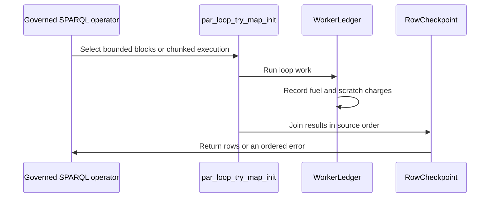

# PR #480 — comments and review threads

1 comment(s). **Every one needs a disposition** in
`review-debt.md`: addressed (with the commit hash) or declined (with the
reason posted in reply). Bot comments count.

## 1. coderabbitai — 

<!-- This is an auto-generated comment: summarize by coderabbit.ai -->
<!-- review_stack_entry_start -->

<!-- review_stack_entry_end -->
<!-- walkthrough_start -->

📝 Walkthrough

## Walkthrough

The PR changes governed SPARQL loop parallelism and output allocation. It also adds fixed-work instruction and allocation counting, report formats, benchmark workloads, and related tests and documentation.

### Changes

**Governed Parallel SPARQL Evaluation**

|Layer / File(s)|Summary|
|:---|:---|
|**Governor bounds and worker accounting**   `crates/sparql-algebra/src/parser.rs`, `crates/sparql-eval/src/eval.rs`, `crates/sparql-eval/src/row_checkpoint.rs`, `crates/sparql-eval/src/scratch.rs`|Cell row bounds account for valid solution-vector layouts. Fuel and scratch ceilings determine when governed loops use bounded parallel blocks. Worker charge logging and shared totals use compact checkpoints and saturating updates.|
|**Parallel workers and ordered output**   `crates/sparql-eval/src/parallel.rs`, `crates/sparql-eval/src/binop.rs`, `crates/sparql-eval/src/expr.rs`, `crates/sparql-eval/src/modifier.rs`, `crates/sparql-eval/src/row_checkpoint.rs`|Parallel collection joins results in source order and reports allocation failures. Governed FILTER, BIND, GROUP BY, and filtered OPTIONAL loops use the bounded-loop selector and updated commit methods.|
|**Governor regressions and behavior records**   `crates/cli/tests/governors_cli.rs`, `crates/sparql-eval/tests/governed_parallel_allocation.rs`, `crates/sparql-eval/tests/governed_query.rs`, `crates/sparql-eval/tests/numeric_parallel_determinism.rs`, `CHANGELOG.md`, `docs/SPARQL-GOVERNOR-PROFILE.md`|Tests cover query results, worker consistency, fuel and scratch boundaries, cell limits, and parallel allocation. The changelog and profile describe the revised governed-loop behavior.|

**Fixed-Work Benchmark Counters**

|Layer / File(s)|Summary|
|:---|:---|
|**Count reports and storage**   `crates/testkit/src/bench/estimates.rs`, `crates/testkit/src/bench/store.rs`, `crates/testkit/tests/counter.rs`|Schema 2 count reports include units, work and worker counts, fixture and boundary identity, raw samples, and a bootstrap seed. Parsing validates the report and supports legacy schema 1 time records.|
|**Native counter control and collection**   `crates/testkit/src/bench/counter.rs`, `crates/testkit/src/bench/mod.rs`, `crates/testkit/tests/counter.rs`, `scripts/hash-workloads.rs`|The testkit adds instruction parsing, Linux perf collection, FIFO counter control, and report helpers. The hash-workload script uses the shared typed counter control.|
|**Governor workloads and count benchmarks**   `crates/sparql-eval/tests/support/*`, `crates/sparql-eval/benches/governor_instructions.rs`, `crates/sparql-eval/benches/governor_allocations.rs`, `crates/sparql-eval/benches/governed_eval.rs`, `crates/sparql-eval/benches/numeric_eval.rs`, `crates/sparql-eval/tests/numeric_governance.rs`, `crates/sparql-eval/Cargo.toml`, `docs/BENCHMARKS.md`, `docs/design/purrdf-simd.md`, `scripts/bench-hash-workloads.py`|Shared fixtures and answer guards support fixed-work samples. New benchmark executables and collection commands measure instructions or allocations. Benchmark documentation describes collection conditions, reporting, and comparison rules.|

<!-- change_assessment_start -->
**Priority:** ➖ Normal

**Estimated code review effort:** 4 (Complex) | ~60 minutes

<!-- change_assessment_commit:"3d62728c3ab6ef86705e9b171db24ee368071b69" -->
**Change:** Refactor
<!-- change_assessment_end -->

### Sequence Diagram(s)

<!-- walkthrough_end -->
<!-- final_review_risk_start -->
**Merge Risk:** _🔵 Low_ · up to `3d627`
<!-- final_review_risk_coverage:{"sourceCommitId":"3d62728c3ab6ef86705e9b171db24ee368071b69","coveredCommitId":"3d62728c3ab6ef86705e9b171db24ee368071b69","kind":"reviewed"} -->

The governed evaluation changes have no verified defects. However, the hash-workload benchmark comparison script cannot build older baseline checkouts on Linux because those checkouts lack the new counter module. This affects only benchmark workflows. A small follow-up would fix it.
<!-- final_review_risk_end -->
<!-- pre_merge_checks_walkthrough_start -->

🚥 Pre-merge checks | ✅ 4 | ❓ 1

### ❌ Failed checks (1 inconclusive)

|     Check name     | Status         | Explanation                                                                                                                                                                                               | Resolution                                                                         |
| :---------------- | :------------- | :-------------------------------------------------------------------------------------------------------------------------------------------------------------------------------------------------------- | :--------------------------------------------------------------------------------- |
| Docstring Coverage | ❓ Inconclusive | Docstring coverage is 67.06% which is insufficient. The required threshold is 80.00%. Docstring coverage is scoped to functions touched by this diff. Analyzed 170 functions across 27 files. (6 skipped… | Write docstrings for the functions missing them to satisfy the coverage threshold. |

✅ Passed checks (4 passed)

|         Check name         | Status   | Explanation                                                                                                                      |
| :------------------------ | :------- | :------------------------------------------------------------------------------------------------------------------------------- |
|     Linked Issues check    | ✅ Passed | Check skipped because no linked issues were found for this pull request.                                                         |
| Out of Scope Changes check | ✅ Passed | Check skipped because no linked issues were found for this pull request.                                                         |
|      Description Check     | ✅ Passed | Check skipped - CodeRabbit’s high-level summary is enabled.                                                                      |
|         Title check        | ✅ Passed | The title clearly and concisely describes the primary changes: bounded parallel governor work and reuse of admitted row buffers. |

Full details: Docstring Coverage

**Explanation**

Docstring coverage is 67.06% which is insufficient. The required threshold is 80.00%. Docstring coverage is scoped to functions touched by this diff. Analyzed 170 functions across 27 files. (6 skipped: 5 unsupported, 1 too large.)

<!-- pre_merge_checks_walkthrough_end -->
<!-- finishing_touch_checkbox_start -->

✨ Finishing Touches 💡 1

<!-- finishing_touch_suggestion:docstrings -->

📝 Generate docstrings 💡

- [ ] <!-- {"checkboxId":"3e1879ae-f29b-4d0d-8e06-d12b7ba33d98"} --> Commit to this branch
- [ ] <!-- {"checkboxId":"7962f53c-55bc-4827-bfbf-6a18da830691"} --> Create a new PR

🧪 Generate unit tests (beta)

- [ ] <!-- {"checkboxId": "6ba7b810-9dad-11d1-80b4-00c04fd430c8", "radioGroupId": "utg-output-choice-group-unknown_comment_id"} --> Commit to this branch
- [ ] <!-- {"checkboxId": "f47ac10b-58cc-4372-a567-0e02b2c3d479", "radioGroupId": "utg-output-choice-group-unknown_comment_id"} --> Create a new PR

<!-- finishing_touch_checkbox_end -->

<!-- autopilot:start -->
- [ ] <!-- {"checkboxId":"2708ad07-9f24-4260-9c11-7dc76a49f2e3"} --> <strong title="Keep fixing CodeRabbit findings and required CI, and resolving merge conflicts">Autopilot</strong> · Keep fixing CodeRabbit findings and required CI, and resolving merge conflicts
<!-- autopilot:end -->
<!-- tips_start -->

---

Comment `@coderabbitai help` to get the list of available commands.

<!-- tips_end -->

