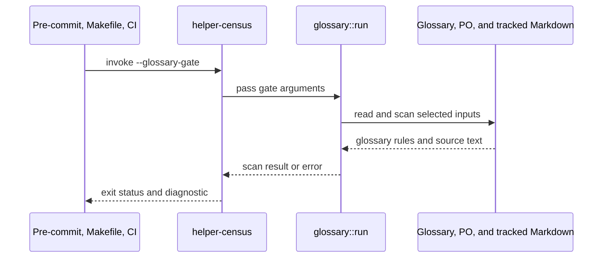

# PR #502 — comments and review threads

3 comment(s). **Every one needs a disposition** in
`review-debt.md`: addressed (with the commit hash) or declined (with the
reason posted in reply). Bot comments count.

## 1. coderabbitai — 

<!-- This is an auto-generated comment: summarize by coderabbit.ai -->
<!-- review_stack_entry_start -->

<!-- review_stack_entry_end -->
<!-- walkthrough_start -->

📝 Walkthrough

## Walkthrough

The pull request replaces the Python zh-Hans glossary gate with a native `helper-census --glossary-gate` implementation. It adds bounded pattern matching, PO parsing, Markdown surface projection, scanning and self-test modes, and updates gate callers, documentation, and tests.

### Changes

**zh-Hans glossary gate**

|Layer / File(s)|Summary|
|:---|:---|
|**Glossary inputs and matching**   `crates/helper-census/src/glossary/pattern.rs`, `crates/helper-census/src/glossary/po.rs`, `crates/helper-census/src/glossary/surface.rs`, `crates/helper-census/src/glossary/mod.rs`, `crates/helper-census/Cargo.toml`|Adds bounded Python-compatible pattern matching, PO parsing, Markdown surface projection, and glossary table parsing and validation.|
|**Glossary scanning and self-tests**   `crates/helper-census/src/glossary/mod.rs`|Adds checks for rejected spellings and keep-English tokens across active PO entries and selected translated Markdown. Adds inventory output and self-tests for rule and Markdown behavior.|
|**Gate callers and integration coverage**   `.githooks/pre-commit`, `Makefile`, `.github/workflows/ci.yaml`, `.github/workflows/docs.yaml`, `crates/helper-census/src/main.rs`, `crates/helper-census/tests/glossary_callers.rs`, `scripts/check-gate-parity.py`, `scripts/check-i18n-glossary.py`, `scripts/po_catalog.py`, `layers.toml`, `docs/book/po/*`|Routes glossary checks through `helper-census --glossary-gate`, updates related caller checks and documentation, and removes the Python glossary-check script.|
|**Staged-index hook probe**   `crates/helper-census/examples/glossary_hook_probe.rs`, `crates/helper-census/Cargo.toml`|Adds a probe for staged and working-tree catalogue behavior when the pre-commit hook runs with a private Git index. It checks that original index and catalogue bytes are restored.|

<!-- change_assessment_start -->
**Priority:** ⬇️ Low

**Estimated code review effort:** 4 (Complex) | ~60 minutes

<!-- change_assessment_commit:"b1833aeed387299546f883baaacb87f2206e169a" -->
**Change:** Bug fix
<!-- change_assessment_end -->

### Sequence Diagram(s)

<!-- walkthrough_end -->
<!-- final_review_risk_start -->
**Merge Risk:** **🔵 Low** · up to `b1833`
<!-- final_review_risk_coverage:{"sourceCommitId":"b1833aeed387299546f883baaacb87f2206e169a","coveredCommitId":"b1833aeed387299546f883baaacb87f2206e169a","kind":"reviewed"} -->

The native glossary gate replaces the Python checker and appears sound. One narrow gap remains: a keep-English rule written with a regex anchor would never fire. The gate does not reject that configuration today. It is a small parse-time fix and does not affect current rows unless they use that form.
<!-- final_review_risk_end -->
<!-- pre_merge_checks_walkthrough_start -->

🚥 Pre-merge checks | ✅ 4 | ❌ 1

### ❌ Failed checks (1 warning)

|     Check name     | Status     | Explanation                                                                                                                                                                                               | Resolution                                                                         |
| :---------------- | :--------- | :-------------------------------------------------------------------------------------------------------------------------------------------------------------------------------------------------------- | :--------------------------------------------------------------------------------- |
| Docstring Coverage | ⚠️ Warning | Docstring coverage is 20.97% which is insufficient. The required threshold is 80.00%. Docstring coverage is scoped to functions touched by this diff. Analyzed 62 functions across 9 files. (8 skipped: … | Write docstrings for the functions missing them to satisfy the coverage threshold. |

✅ Passed checks (4 passed)

|         Check name         | Status   | Explanation                                                                                                                                                                                               |
| :------------------------ | :------- | :-------------------------------------------------------------------------------------------------------------------------------------------------------------------------------------------------------- |
|     Linked Issues check    | ✅ Passed | Issue `#260` is open and directly linked. The native glossary gate checks visible Markdown text and applies anchored rejection rules only when the source has a matching visible anchor. Link destinations… |
| Out of Scope Changes check | ✅ Passed | The changes remain within the glossary-gate objective. Gate dispatch updates, Make and CI integration, staged-index probing, regex and PO parsing, Markdown surface projection, parity tests, documentat… |
|      Description Check     | ✅ Passed | Check skipped - CodeRabbit’s high-level summary is enabled.                                                                                                                                               |
|         Title check        | ✅ Passed | The title clearly and concisely describes the primary change: enforcing Chinese glossary rules through the shared native gate.                                                                            |

Full details: Docstring Coverage

**Explanation**

Docstring coverage is 20.97% which is insufficient. The required threshold is 80.00%. Docstring coverage is scoped to functions touched by this diff. Analyzed 62 functions across 9 files. (8 skipped: 8 unsupported.)

<!-- pre_merge_checks_walkthrough_end -->

- [ ] <!-- {"checkboxId":"585bb3f6-faf5-4dbf-96d2-74e382adf19a"} --> Fix all pre-merge checks with AI
<!-- finishing_touch_checkbox_start -->

✨ Finishing Touches 💡 1

<!-- finishing_touch_suggestion:docstrings -->

📝 Generate docstrings 💡

- [ ] <!-- {"checkboxId":"3e1879ae-f29b-4d0d-8e06-d12b7ba33d98"} --> Commit to this branch
- [ ] <!-- {"checkboxId":"7962f53c-55bc-4827-bfbf-6a18da830691"} --> Create a new PR

🧪 Generate unit tests (beta)

- [ ] <!-- {"checkboxId": "6ba7b810-9dad-11d1-80b4-00c04fd430c8", "radioGroupId": "utg-output-choice-group-unknown_comment_id"} --> Commit to this branch
- [ ] <!-- {"checkboxId": "f47ac10b-58cc-4372-a567-0e02b2c3d479", "radioGroupId": "utg-output-choice-group-unknown_comment_id"} --> Create a new PR

<!-- finishing_touch_checkbox_end -->

<!-- autopilot:start -->
- [ ] <!-- {"checkboxId":"2708ad07-9f24-4260-9c11-7dc76a49f2e3"} --> <strong title="Keep fixing CodeRabbit findings and required CI, and resolving merge conflicts">Autopilot</strong> · Keep fixing CodeRabbit findings and required CI, and resolving merge conflicts
<!-- autopilot:end -->
<!-- tips_start -->

---

Comment `@coderabbitai help` to get the list of available commands.

<!-- tips_end -->

## 2. paudley — 

# Visible-text glossary enforcement in Rust

## Authority and evidence

This is an independent early delivery in the authorized portfolio. Main stays
protected; use the Stage260 worktree. AGENTS.md and main .baseline/.goals govern:
original Rust tooling, one implementation home, no new external or shipping
dependency, semantic feature, verification bypass or alternative merge path.
Final integration uses ghprsq. No translation pour, release or upstream action.

Generated intake contains the body, zero comments, four linked and six related
items and two defect classes in the last200commits. This is bounded coverage,
not a claim of zero recurrence. Independent prior-art assessment identifies
merged249 fixes and later69-row inventory. Three collision exclusions, whole-token
K survival, escaped table backslashes and half-width Research Object acceptance
already exist. Preserve them. Current scan/collision counts have not been run.

## Design and executable completeness contract

1. Add a host-only helper-census glossary mode with explicit root, po, glossary
   and self-test options. Reuse purrdf_jsonschema::ecma's public bounded matcher
   through one first-party host dependency and its layers row. No second regex
   engine or private row-specific fallback. Pattern syntax/resource errors are
   hard failures. Diagnostics name the offending rule and actual source location;
   the boolean matcher does not establish an exact matched substring span.
2. Preserve the existing supported glossary pattern contract. Adapt Python's
   Unicode word/boundary/space and newline/case behavior to the existing native
   engine deliberately, with fixtures for current expressions and Unicode/ASCII
   boundary differences. Unknown adapter constructs fail actionably. Pin the
   workspace Unicode version where relevant and document any interpreter-version
   distinction; do not silently change current patterns to ASCII word behavior.
   ASCII left boundaries of ordinary anchors and both sides of K tokens remain
   their explicit current contract. K names remain case-sensitive.
3. Preserve seven-column table/header parsing, escaped pipes/backticks and regex
   backslashes, nonempty entries, global reasons, mandatory K anchors, every
   existing rejection specimen/neighbour and cross-row rendering check. Preserve
   PO continuations/escapes/context/header handling, fuzzy/obsolete/empty suppression,
   current plural fallback, deliberate unknown-escape preservation, deterministic
   diagnostics and external input paths.
   Malformed or missing inputs and absent real standardized-spelling specimens
   are hard failures. All rule self-tests run before every normal gate scan.
4. Define visible anchor/token text once. Inline link/image destinations and
   titles and reference-definition destinations do not anchor English prose or
   satisfy K survival. Keep visible labels, reference-link labels, ordinary text,
   visible autolinks and visible code identifiers for K survival. Rejection prose
   excludes exact backtick spans and fenced blocks. Test inline/reference links,
   nested/escaped parentheses, images, titles, code, autolinks, mixed prose and
   URL-only anchors. Removed syntax must not concatenate separate tokens into an
   invented match. Process translated Markdown as whole documents so fence
   state survives lines; preserve real source line numbers.
5. Every current K row/token gets production-path dropped/kept, prefix/suffix
   embedded-token and case-sensitive controls on both English and translated
   sides, plus positive punctuation/CJK boundaries. Derive fixtures from actual
   table rows, including multiword and hyphenated names, rather than RDF alone.
6. Sweep every current translated catalogue pair whose visible English text
   anchors a rejection. Retain a deterministic inventory and inspect any rejected
   substring in its Chinese context. Exempt only evidenced specific other-sense
   contexts, with an anchored positive neighbour AND genuine wrong-rendering
   refusal. Do not add a broad Chinese-word-boundary exemption. Current zero-hit
   counts must come from execution. Poison real anchored paragraphs and prove
   that the gate still refuses incorrect renderings. Existing provenance,
   determinism, global reference-material and other regex exclusions remain tested.
7. Document the specific half-width English parenthetical gloss exception already
   allowed by row40, without broadening general CJK typography. Test both accepted
   half/full-width forms and refused bare/translated Research Object forms.
8. Preserve git-ls-files NUL-safe sorted content-based Markdown selection, glossary
   exclusion, current CJK ranges and15percent threshold. Markdown lacks msgid and
   receives global refusals only. Fuzzy/obsolete/untranslated units remain inactive.
9. Wire actual Make check/check-i18n, workspace CI and staged-index hook snapshot
   to the single Rust gate. Compile admitted helper code and inspect the staged
   snapshot root in hooks; never drop the old slot from verification. Remove the
   obsolete Python glossary implementation and fix source references. Keep the
   PO/render Python tooling still required by the independent rendering gate;
   no new non-Rust implementation or ratchet growth. Regenerate affected generated
   projections through their generators, never hand-edit them.

Parser/matcher adapters are concrete compatibility boundaries, not a new generic
Markdown or regex framework. No glossary translation expansion, broad i18n rewrite
or arbitrary collision immunity is needed. Current regex engine reuse costs a
host-only first-party edge; a new copied matcher costs a second behavior and is
rejected. Missing required behavior blocks handoff regardless of severity.

## Task 1: Native gate and adversarial visible-text behavior

Implement the single Rust gate, compatible patterns/table/PO inputs and complete
default self-tests, visible-text projection, K-row fixtures and typography rule.
Retain the old wired gate until Task2 switches all callers coherently. Focused
Rust tests exercise real parser/gate entry points, every current pattern and
malformed/resource failures; run native self-test and current catalogue scan.
Write actual sweep inventory with any needed narrow contexts and poison controls.
Independent task review, normal hook commit/push and issue progress update.

## Task 2: Production wiring and obsolete-path retirement

Switch both Make callers, CI and staged snapshot hook to the Rust gate. Remove
the old implementation and update authoritative glossary/source references;
keep render tooling intact. Regenerate affected metadata. Exercise normal and
external-input invocation, renamed content-selected Markdown, multiline fences,
staged snapshot-only poisoned input and actual hook refusal, without bypass.
Run focused gate/layer/target/hygiene checks and affected strict clippy. Independent
review, normal commit/push/update; no full-suite discovery run.

## Task 3: Settled qualification and integrated delivery

Run the one settled full gate and relevant i18n qualification, clearly separating
native glossary from mdbook/render prerequisites and output acceptance. Record
current source/compiler/69-row actual results; if table grows use measured current
count rather than a frozen prose claim. Independent completion audit all criteria,
Stage PR only when all acceptance is met, then hosted CI/review/Stage2–3 ghprsq
integration. Preserve selected evidence and clean only this merged delivery.

## Review and progress

Independent issue/prior-art analyses complete; focused plan review PASS
(plan-review.md). Its compatibility, offset-mask, isolated K-case and inverse
staged/worktree fixtures are required implementation checks.
Task1 implementation and actual catalogue scan completed:10 native tests,
1,716 production controls and4,181 scan units passed; independent review found
multiline inline URL leakage, then re-review PASS after the paragraph correction.
Normal hooks passed;97b05f758 committed and pushed. Task2 production caller
migration and focused qualification passed independent review; normal hooks
passed and4db9f7947 committed/pushed, progress6052454288.
Task3 full/render qualification, PR and merge remain pending.

## 3. paudley — 

Fixed in cdc43aaa6. K rows now refuse regex anchors before constructing patterns,
with the row, term and anchor in the error. Actual tests cover lone and mixed
regex anchors, literal K keep/drop neighbours, and valid non-K regex neighbours.
The glossary documents the literal-only K contract; existing rows are unchanged.

The restoration guard also preserves the original panic when a restoration write
fails during unwind. Normal restoration failure remains a hard failure with its
path and OS error; silently returning would conceal a failed qualification.
Three actual example controls verify exact restoration, normal refusal and
original-panic preservation.

Seventeen affected Rust tests, strict all-target clippy, production 1716 controls
and the 4181-unit scan, caller/parity/helper gates and source readbacks passed.
Independent completion review confirms all four issue requirements and nine plan
criteria remain met locally. The prior settled full/render checks apply to their
unchanged scope; current-head hosted checks are still running.

The generic 80% private-function docstring threshold is not a repository or
accepted-plan requirement. Existing module and behavioural contract documentation
and strict lint gates satisfy the applicable requirements; we decline boilerplate
added solely to meet that unrelated numeric threshold.

