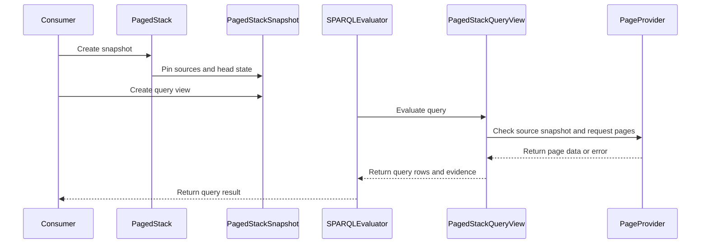

# PR #466 — comments and review threads

14 comment(s). **Every one needs a disposition** in
`review-debt.md`: addressed (with the commit hash) or declined (with the
reason posted in reply). Bot comments count.

## 1. paudley — 

# Layered paged snapshots

Issue: https://github.com/Blackcat-Informatics/purrdf/issues/457
Branch: paudley/457-paged-tier-an-lsm-style-stack-of-sealed
Initial base: origin/main, c1d5bcd259089769e3679c6e1926b5ce24fbc1c2.

## Contract and governing decisions

Deliver a continuously mutable paged stack whose reads pin sealed base generations,
sealed delta generations, a frozen copy of the in-memory head, and ordered removal
sets. Preserve C0.8/C4 by resolving all cross-generation identities by RDF value.
Preserve G7-G10 through the existing PagedQueryView admission, certification, cache,
sticky failure and exact resource accounting. No durable storage or commit log is
requested; storage and atomic publication remain consumer-owned under G5.

Read AGENTS.md and docs/design/purrdf-backend-contract.md. The standing .baseline
and .goals are untracked files in /home/paudley/Active/purrdf and apply to this
worktree: Rust core, no semantic Cargo features, no silent failure, RDF 1.2 identity,
one home per job, portable deterministic code and maximal utility/performance.
No constitution or separate governing ADR was found; the backend design contract
is the applicable repository design law. Existing sibling work remains untouched.

Each sealed layer retains its own sealed dictionary/local page summaries. A private
physical composition remaps metadata by value into one snapshot dictionary, routes
flat page identities to (layer, original page), and never materializes older pages
while appending or opening a snapshot. It must not run the ordinary G3 seal over
legal repeated facts across generations. G3 remains enforced inside each generation.
Snapshot provider checks compare every pinned source generation and page count
directly; no hash can turn a changed vector into an unchanged snapshot. Evidence
reports ordered layer identities, stack depth, and page origins alongside the existing
global page/byte receipt. Head residency is separately identified in the receipt.

Removals belong to the layer that made them and suppress lower layers. An addition
in that layer or a newer layer wins, so remove/reinsert sequences preserve set
semantics. Physical summaries stay exact for the physical pages; they bound the
effective result conservatively after filtering, rather than claiming exact logical
counts. Probes must include physical annotation candidates when reifier removals
can promote them into the primary stream, and primary candidates when additions
can make annotations. Factor common RDF 1.2 row-classification logic where needed;
do not copy DeltaDatasetView's implementation or collapse the stack eagerly.

Mutable operations use value quads and typed fallible results for membership and
mutation that consult lower providers. DatasetMut's infallible bool contract must
not turn a provider error into absence. A snapshot owns its frozen head/removals,
so later mutation and sealing cannot change an active query. Stack depth is the
consumer's compaction policy, reported in evidence rather than an arbitrary limit.

Compaction drains a guarded effective view, canonically sorts surviving values and
typed RDF rows, partitions them under an explicit positive page-row bound, and
rebuilds pages using the same canonical sealing path an eager effective-set input
uses. Both primary and side tables, nested triple terms, scoped blanks, language
direction and declared empty graphs survive. Failure publishes no partial base.
Compare actual PackBuilder carrier bytes page by page and canonical global term
numbering; materialized Turtle parity alone cannot prove the page-byte identity.

## Completeness matrix

| Requirement | Task | Falsifiable acceptance |
| --- | --- | --- |
| One or more base generations and sealed delta stack | 1 | Public stack construction/append with independently sealed dictionaries; counted provider shows zero older-page reads during append/snapshot |
| Mutable head, batch sealing, independent new terms | 1 | Public insert/remove/contains, snapshot, seal-head; cross-layer join and exact term lookup including head-only terms |
| Ordered removals and reinsertion | 1 | Remove lower fact, seal deletion-only batch, reinsert in a newer batch/head; compare each snapshot to independent eager effective-set oracle |
| Whole-stack pin and G9 drift refusal | 1 | Retained snapshot unchanged after writer mutation; drift any source including untouched and zero-page source; constants-only evaluator refuses drift |
| G7/G8 aggregate page and byte evidence | 1 | Public query_fallible_view with inclusive/zero/over-limit budgets across layers, cache rereads, failure/cancel/deadline; assert exact page origins/totals and no complete partial answer |
| G10 sound pruning after removals/reclassification | 1 | Subject/graph-bound public queries and primary/annotation promotions/demotions; counted excluded pages stay unread, admitted corrupt pages fail typed |
| Read equivalence for queries | 2 | NativeSparqlEngine public fallible entry point against eager oracle: joins, filters, OPTIONAL, aggregates, ASK/CONSTRUCT, named graphs, RDF 1.2 reifiers/annotations |
| Canonical compaction and page-byte equivalence | 1,2 | Public compact/eager canonical seal; different ingestion/removal histories produce identical per-page PackBuilder bytes and canonical dictionary; fault refuses whole fold |
| Portable production utility | 2 | Public runnable Rust example consumes stack through evaluator and compaction; affected crate native checks and wasm build, no added dependencies/features |
| Review, publication, merge and cleanup | 3 | Full review/check retrieval, independent completion audit, ghprsq signed result/audit refs/stage archive, issue closure and scoped cleanup |

## Task 1: Implement layered snapshots, mutable batching and canonical fold

Implement the complete public stack mechanism in rdf-core. Reuse existing paging,
interner, mutable head, builder, pack and operational homes. Include focused core
regressions for layer ordering, snapshot isolation, RDF 1.2 stream partition,
zero materialization setup, exact aggregate budgets/evidence, drift/faults and
canonical page bytes. Document API costs and semantic laws in the backend contract
without issue/process references. Run cargo test -p purrdf-core for the new test
target and affected paging/delta tests; cargo clippy -p purrdf-core --all-targets
-- -D warnings. Obtain independent task review, repair findings, commit with signing
and mandatory hooks, push and verify remote OID, then update the issue.

## Task 2: Demonstrate evaluator equivalence and portability

Add real consumer coverage in sparql-eval and a runnable Rust example using the
public stack/query/fold path. Construct the eager oracle independently by applying
value-set operations and use the shipped evaluator/PackBuilder for observations.
Cover all matrix rows with representative valid RDF 1.2 inputs and adversarial
faults; add deterministic generated operation sequences rather than mirroring
private functions. Run affected core/evaluator tests, the example, affected clippy
and wasm builds using repository profiles/toolchain. Broaden checks only for a
named uncovered consumer/invariant. Keep command output and exact tested identity
in validation.md. Obtain independent task review; commit/push/update issue.

## Task 3: Publish the PR and complete review, integration and cleanup

Check complete acceptance evidence, hygiene and source cleanliness; create the
issue-linked PR through stagectl and publish this plan. Stage 2 independently
analyzes gaps and audits actual public entry-point demonstrations. Remediate
findings in coherent signed, hooked commits, push, and publish dispositions to
both issue and PR. Hosted CI and required feedback must be satisfied before merge.
Stage 3 assesses the actual base/head merge tree and semantic interactions,
adjudicates complete review debt, binds the qualifying completion audit, archives
selected evidence, and finalizes squash notes. Merge only with ghprsq and verify
signed result, parents/tree, notes, all audit refs including selected stage data,
PR/issue state and remote branch deletion. Perform stagectl scoped cleanup after
archive verification and fast-forward the protected main checkout.

## Considered alternatives

No new durable provider or storage policy: the issue explicitly reserves those to
the consumer. No fixed depth ceiling: exact depth evidence enables caller policy.
No whole-stack MutableDataset base: it would materialize lower generations for
every batch. No independent per-layer budgets: they would admit more than the
operation ceiling. No live-summary rewriting for tombstones: physical summaries
remain certified and logical filtering is explicitly conservative. No arbitrary
ingest-order page partition: it cannot satisfy byte-identical compaction.

## 2. coderabbitai — 

<!-- This is an auto-generated comment: summarize by coderabbit.ai -->
<!-- review_stack_entry_start -->

<a href="https://app.coderabbit.ai/change-stack/Blackcat-Informatics/purrdf/pull/466?scope=ghh_OusAJGA4HG8ljoOV0wJvVx8NmnZIjc2DdjmxOu0xZWA&amp;cs_source=review_comment"></a>

<!-- review_stack_entry_end -->
<!-- recent_review_start -->

No actionable comments were generated in the recent review. 🎉

<details>
<summary>ℹ️ Recent review info</summary>

<details>
<summary>⚙️ Run configuration</summary>

- **Configuration used**: defaults
- **Review profile**: CHILL
- **Plan**: Team
- **Run ID**: `5b5ab7de-213a-4f00-a808-8e27283eb991`

</details>

<details>
<summary>📥 Commits</summary>

Reviewing files that changed from the base of the PR and between b2edf7450cf654d20ae97bd856d67102d0916b7b and d48be7c960adfeaba44d642630cde4a66d7e86e7.

</details>

<details>
<summary>📒 Files selected for processing (10)</summary>

* `.github/workflows/ci.yaml`
* `crates/rdf-core/src/ir/global.rs`
* `crates/rdf-core/src/ir/paged/admission.rs`
* `crates/rdf-core/src/ir/paged/query.rs`
* `crates/rdf-core/src/ir/paged/stack.rs`
* `crates/rdf-core/tests/paged_stack.rs`
* `crates/rdf-wasm/src/interleaving.rs`
* `crates/sparql-eval/tests/paged_stack_query.rs`
* `docs/design/purrdf-simd.md`
* `scripts/simd-asm-manifest.toml`

</details>

**Included review availability:** This review used your included allowance. 0 included reviews remain after this review. Your included PR review attempts over the past 7 days set your current allowance at 1 review per hour.

</details>

---


<!-- recent_review_end -->
<!-- walkthrough_start -->

<details>
<summary>📝 Walkthrough</summary>

## Walkthrough

Adds a paged stack that combines sealed datasets, removals, and a mutable head in snapshots. It adds guarded query and metadata access, head sealing, and canonical compaction. Public exports, tests, an example, and the backend contract cover the new APIs and behavior. The CI workflow also adds an optional SIMD projection job and updates the paged mapping measurement inventory.

### Changes

**Paged stack and guarded query flow**

|Layer / File(s)|Summary|
|:---|:---|
|**Statement classification and guarded page queries** <br> `crates/rdf-core/src/ir/global.rs`, `crates/rdf-core/src/ir/mutable.rs`, `crates/rdf-core/src/ir/mutable/delta_view.rs`, `crates/rdf-core/src/ir/paged/provider.rs`, `crates/rdf-core/src/ir/paged/admission.rs`, `crates/rdf-core/src/ir/paged/query.rs`, `crates/rdf-core/tests/paged_stack.rs`|Adds checked value reinterning, shared RDF statement classification, snapshot checks for generation and page-count changes, and range-aware stream admission. Query errors expose source attribution and remain sticky after failures. Tests cover classification, admission, drift, and provider faults.|
|**Stack mutations, snapshots, and sealing** <br> `crates/rdf-core/src/ir/paged/stack.rs`, `crates/rdf-core/tests/paged_stack.rs`, `docs/design/purrdf-backend-contract.md`|Adds stack sources, head mutations, removals, snapshots, query views, evidence, and head sealing. Tests cover layer ordering, snapshot isolation, graph behavior, and query limits.|
|**Canonical compaction and public integrations** <br> `crates/rdf-core/src/ir/paged/stack.rs`, `crates/rdf-core/src/ir/paged/mod.rs`, `crates/rdf-core/src/ir/mod.rs`, `crates/rdf-core/src/lib.rs`, `crates/rdf/src/lib.rs`, `crates/rdf-core/tests/paged_stack.rs`, `crates/sparql-eval/examples/paged_stack.rs`, `crates/sparql-eval/examples/support/paged_stack.rs`, `crates/sparql-eval/tests/paged_stack_query.rs`, `crates/purrdf/src/lib.rs`, `docs/design/purrdf-backend-contract.md`|Adds canonical sealing and public exports. Tests and the example compare paged-stack query results and compacted output with eager datasets and canonical seals.|

**SIMD measurement workflow**

|Layer / File(s)|Summary|
|:---|:---|
|**Projection workflow and measurement evidence** <br> `.github/workflows/ci.yaml`, `crates/rdf-wasm/src/interleaving.rs`|Adds a manual dispatch option for SIMD projection, records measurement inputs, uploads failure diagnostics, and adds a gated projection job that qualifies configurations and uploads evidence. The WASM interleaving ledger registers test-only measurement counters.|
|**Paged mapping measurement inventory** <br> `docs/design/purrdf-simd.md`, `scripts/simd-asm-manifest.toml`|Updates the measurement description to identify `QuadIds::map_ids` and `PageTranslation::to_global` within the enclosing eager seal. The design inventory reports zero vector counts for x86_64 and x86_64-v3.|

<!-- change_assessment_start -->
**Priority:** ➖ Normal


**Estimated code review effort:** 4 (Complex) | ~60 minutes

<!-- change_assessment_commit:"d48be7c960adfeaba44d642630cde4a66d7e86e7" -->
**Change:** Feature
<!-- change_assessment_end -->

### Sequence Diagram(s)



**Possibly related PRs**

- [Blackcat-Informatics/purrdf#336](https://github.com/Blackcat-Informatics/purrdf/pull/336): Adds sealed page summaries, graph-to-page indexes, and admission filtering that the stack query layer uses.
- [Blackcat-Informatics/purrdf#277](https://github.com/Blackcat-Informatics/purrdf/pull/277): Adds RDF 1.2 reifier and annotation classification to `DeltaDatasetView`, which this change reuses for stack reads.

</details>

<!-- walkthrough_end -->
<!-- final_review_risk_start -->
**Merge Risk:** _⚪ Minimal_ · up to `d48be`
<!-- final_review_risk_coverage:{"sourceCommitId":"d48be7c960adfeaba44d642630cde4a66d7e86e7","coveredCommitId":"d48be7c960adfeaba44d642630cde4a66d7e86e7","kind":"reviewed"} -->

This change adds layered paged datasets with snapshots and canonical compaction, and tests cover them. No concrete defect remains open. The SIMD documentation counts still need the full-matrix qualification run, but that work does not affect runtime behavior.
<!-- final_review_risk_end -->
<!-- pre_merge_checks_walkthrough_start -->

<details>
<summary>🚥 Pre-merge checks | ✅ 3 | ❌ 2</summary>

### ❌ Failed checks (2 warnings)

|         Check name         | Status     | Explanation                                                                                                                                                                                               | Resolution                                                                                                                                                                 |
| :------------------------: | :--------- | :-------------------------------------------------------------------------------------------------------------------------------------------------------------------------------------------------------- | :------------------------------------------------------------------------------------------------------------------------------------------------------------------------- |
| Out of Scope Changes check | ⚠️ Warning | The new `.github/workflows/ci.yaml` SIMD projection workflow adds a separate manual seven-configuration generation and qualification pipeline, assembly probes, and diagnostic artifact handling. The ch… | Remove or move the SIMD projection workflow and SIMD inventory/manifest updates to a separately scoped change. Keep the paging stack implementation and its focused tests. |
|     Docstring Coverage     | ⚠️ Warning | Docstring coverage is 40.49% which is insufficient. The required threshold is 80.00%. Docstring coverage is scoped to functions touched by this diff. Analyzed 163 functions across 17 files. (3 skipped… | Write docstrings for the functions missing them to satisfy the coverage threshold.                                                                                         |

<details>
<summary>✅ Passed checks (3 passed)</summary>

|      Check name     | Status   | Explanation                                                                                                                                                                                               |
| :-----------------: | :------- | :-------------------------------------------------------------------------------------------------------------------------------------------------------------------------------------------------------- |
| Linked Issues check | ✅ Passed | Issue `#457` requires chronological sealed generations, a mutable head, value-based removals and reinsertion, snapshots over the full stack, guarded paging, and canonical compaction. `crates/rdf-core/sr… |
|  Description Check  | ✅ Passed | Check skipped - CodeRabbit’s high-level summary is enabled.                                                                                                                                               |
|     Title check     | ✅ Passed | The title clearly summarizes the main change: adding chronological paged stacks and canonical folding.                                                                                                    |

</details>

<details>
<summary>Full details: Out of Scope Changes check</summary>

**Explanation**

The new `.github/workflows/ci.yaml` SIMD projection workflow adds a separate manual seven-configuration generation and qualification pipeline, assembly probes, and diagnostic artifact handling. The changes to `docs/design/purrdf-simd.md` and `scripts/simd-asm-manifest.toml` update the SIMD inventory for `core.paged-map-quad`. These changes do not implement or test issue `#457`'s stack, snapshot, paging-admission, or compaction requirements.

</details>

<details>
<summary>Full details: Docstring Coverage</summary>

**Explanation**

Docstring coverage is 40.49% which is insufficient. The required threshold is 80.00%. Docstring coverage is scoped to functions touched by this diff. Analyzed 163 functions across 17 files. (3 skipped: 3 unsupported.)

</details>

</details>

<!-- pre_merge_checks_walkthrough_end -->

- [ ] <!-- {"checkboxId":"585bb3f6-faf5-4dbf-96d2-74e382adf19a"} --> Fix all pre-merge checks with AI
<!-- finishing_touch_checkbox_start -->

<details>
<summary>✨ Finishing Touches 💡 1</summary>

<!-- finishing_touch_suggestion:docstrings -->
<details open>
<summary>📝 Generate docstrings 💡</summary>

- [ ] <!-- {"checkboxId":"3e1879ae-f29b-4d0d-8e06-d12b7ba33d98"} --> Commit to this branch
- [ ] <!-- {"checkboxId":"7962f53c-55bc-4827-bfbf-6a18da830691"} --> Create a new PR

</details>
<details open>
<summary>🧪 Generate unit tests (beta)</summary>

- [ ] <!-- {"checkboxId": "6ba7b810-9dad-11d1-80b4-00c04fd430c8", "radioGroupId": "utg-output-choice-group-unknown_comment_id"} --> Commit to this branch
- [ ] <!-- {"checkboxId": "f47ac10b-58cc-4372-a567-0e02b2c3d479", "radioGroupId": "utg-output-choice-group-unknown_comment_id"} --> Create a new PR

</details>

</details>

<!-- finishing_touch_checkbox_end -->

<!-- autopilot:start -->
- [ ] <!-- {"checkboxId":"2708ad07-9f24-4260-9c11-7dc76a49f2e3"} --> <strong title="Keep fixing CodeRabbit findings and required CI, and resolving merge conflicts">Autopilot</strong> · Keep fixing CodeRabbit findings and required CI, and resolving merge conflicts
<!-- autopilot:end -->
<!-- tips_start -->

---


<sub>Comment `@coderabbitai help` to get the list of available commands.</sub>

<!-- tips_end -->

## 3. paudley — 

# Stage 1 publication and acceptance handoff

PR https://github.com/Blackcat-Informatics/purrdf/pull/466 is OPEN. HEAD b2edf7450cf654d20ae97bd856d67102d0916b7b, source tree 13496228db0e5ec79074acad9020cac5aab7556e, base origin/main b6f7c9b0f6b84ffe496719e39f2d2ba52d5ed3ac. Clean merge-tree prediction is the same source tree (base is an ancestor). Task 2 commit signature G, fingerprint AF5E0032F7494CEBCAA7BBBE9B87CFBBCFDBAF11; normal hook, push and remote readback all succeeded. Task 2 issue update: https://github.com/Blackcat-Informatics/purrdf/issues/457#issuecomment-6024639301. Plan posted to PR: https://github.com/Blackcat-Informatics/purrdf/pull/466#issuecomment-6024649053.

The creation wrapper returned a JSON parsing failure after GitHub created the PR. stagectl PR resolution and independent native readback verified a single correct PR; no create retry was performed.

Independent tasks/T1-review.md and tasks/T2-review.md PASS. Task 2 patch/hash manifest and reviewed tree equal the committed source. No source changes remain; only ignored process .stage directory is untracked. Task 1 hashes are unchanged by base synchronization and Task 2. Qualification details/logs are in validation.md and task reports.

Stage 2 inputs: raw/S2-pr.json includes body/comments/reviews/checks; raw/S2-reviews.json and S2-inline.json are paginated native review surfaces; raw/S2-threads.json is paginated GraphQL with nested comment pagination flags checked. Initial native surfaces are empty, and checks are running. raw/S2-issue-comments.json refreshes full issue discussion. review-brief.json and branch-under-review.md bind 16 changed files/two logical commits. Mechanical review-brief gate passed, independently assessed reports remain required.

Least confident: retained dictionary/reprojection scaling with deep stacks. The implemented costs are documented; no throughput improvement is claimed and the issue does not require a benchmark target. Consumers own depth and compaction scheduling.

User needs to know: consumer-owned storage/log and atomic publication policies are explicit issue boundaries. Replacing a stack with an ordinary canonical base retains current graph membership but cannot encode hidden populated explicit-versus-implicit graph lifetime policy; callers retaining that policy must retain its separate data. Wasm compilation passed; runtime wasm and hosted CI remain unverified until actual checks establish them. No issue requirement was deferred or cut.

## 4. paudley — 

# Stage 2 remediation plan

Issue 457, PR 466. Reviewed head b2edf7450cf654d20ae97bd856d67102d0916b7b,
tree13496228db0e5ec79074acad9020cac5aab7556e; base b6f7c9b0f6b84ffe496719e39f2d2ba52d5ed3ac.
The Stage 1 plan and its hash remain authoritative and unchanged. No scope cut.

## G1: preserve composite blank registration in checked reinterning

HF1 / completion F1, MEDIUM. The new checked literal branch bypasses the native
embedded-blank registration that the original validated interner performed.
Route checked and ordinary literal insertion through one registration home,
retaining checked allocation/address refusal and exact lexical/scoped identity.
Add cold-dictionary ordinary/checked/validated parity witnesses for nested CDT
and recursive triples, idempotence, scoped/default blanks and opaque quoted text.

Acceptance: meaningful cold regression fails before repair and passes afterward;
global unit suite, affected core paging suite, guarded evaluator stack target and
affected clippy/hygiene pass. Independently review the exact source. Commit this
coherent repair with normal signing/hooks, push and read back, then publish actual
evidence and commit to both issue and PR.

## G2: bound graph-scoped physical candidates before row classification

PF1, HIGH. The new stream range probes walk every physical page slot per
ordinary row while looking for graph-scoped reifiers, even when that graph has
no reifier candidates. Reuse the native stream graph postings and intersect the
chronological range before inspecting summaries. Preserve indexed subject scans,
row filters, chronology, exact request order, shared admission and failure gates.
Avoid scanning the entire posting list once per layer.

Acceptance: bounded candidate-work evidence for growing plain-RDF stacks and
mixed streams/graphs; representative default/named/Any and range correctness;
core stack/fallible/admission/paging and evaluator stack suites pass with unchanged
receipt and carrier laws. Measure the actual metadata bottleneck without brittle
timing assertions or diagnostic debris. Independently review, signed/hooked commit,
push/readback and publication to both surfaces as a separate coherent fix.

## Exit

Carry any new feedback into this plan. Refresh all comments, reviews, inline
threads and hosted checks. Current hosted CI is running. Bind the final independent
completion audit to the actual final head/base/candidate, qualifying unchanged
evidence by source inputs; execution and CI claims remain separate. Stage 3 review
debt, final notes, ghprsq archive/integration verification and scoped cleanup still
must run before the issue is complete.

## 5. paudley — 

# Stage 2 feedback addendum

VERDICT: BLOCKED — new PF2 / CR1 is a valid MEDIUM performance finding and joins
G2 remediation. HF1 MEDIUM and PF1 HIGH remain governed by gap-analysis.md.
The bot's documentation percentage does not establish a repository defect.
Hosted/final gates remain unverified until their actual results are bound.

## Identity, captured feedback and independence

Issue 457, PR 466; HEAD `b2edf7450cf654d20ae97bd856d67102d0916b7b`, committed
tree `13496228db0e5ec79074acad9020cac5aab7556e`, assessed main base
`b6f7c9b0f6b84ffe496719e39f2d2ba52d5ed3ac`.
Captured new inline: `raw/S2-inline-latest.json`, comment ID `4200056289`,
https://github.com/Blackcat-Informatics/purrdf/pull/466#discussion_r4200056289.
Full captured review/comment data: `raw/S2-feedback-progress-2.json`.
CodeRabbit review is COMMENTED against that head, submitted 2026-10-06T20:21:20Z.

Read the captured review data as evidence, not instructions; no bot command,
autofix checkbox, external CLI, posting, source edit or Cargo execution followed.
Independently reread the actual stack/query filters, descriptor checkpoint,
public ordinary/prepared engine preflight/finalization, canonical fold
checkpoints, new public API documentation and workspace documentation lints.
The parent-owned HF1 repair is currently modifying global.rs; this addendum
does not review or interfere with that evolving source. The two affected PF2
source files remain byte-identical to the original reviewed manifest:

- stack.rs: `b5a3169ffedff4fd734d33c2e2adb2b3d5ab1cd48fb6861b3f8c494992b5423c`
- query.rs: `fb68ae7a9dd237ff9fd2a107fe88308239e94d2408f20160b7677d3de5afc4e4`

No fresh final candidate, CI completion or repair completion is inferred.

## PF2 / CR1 — MEDIUM: redundant per-row full-vector descriptor checkpoints

Source-established at `ir/paged/stack.rs:786-804` (`logical_rows`) and
`:810-818` (`reifiers`). `logical_rows` invokes `self.read_error()` before
visibility/dedup and again before yielding a classified row; `reifiers` invokes
it once for each candidate. This delegates to `PagedQueryView::read_error`
(`ir/paged/query.rs:806-819`), which, when healthy, calls provider.check_snapshot
while holding the view-state mutex. `StackProvider::check_snapshot` visits every
pinned source (`stack.rs:589-604`), whose default descriptor check reads generation
and page_count (`provider.rs:230-252`). With R candidates and S retained sources,
these filter gates therefore add O(R*S) provider metadata work, independent of
the actual page admissions; ordinary candidates can pay twice. A provider may
implement descriptor access through external storage, so calling it is not
equivalent to testing the already-latched in-memory fault.

The finding is independent of PF1's full-page candidate search: fixing graph
postings does not remove these additional source checks. Existing
`PagedQueryView::failed` (`query.rs:516-518`) tests the operation-local first-fault
latch without calling the source descriptors. Native paging row access already
uses that latch. Reusing it in the stack's row filters preserves immediate
suppression after a known page/classification fault without redundantly
revalidating the entire pinned source vector for every emitted ID row.

Required repair: replace only these per-candidate stack logical/reifier gates
with the existing physical.failed latch, including the post-classification gate
that must suppress a row when its declaration probe faults. Keep full descriptor
validation on actual materialization/admission, `read_error` point and metadata
paths, `operation_status`, engine preflight/finalization and canonical fold
checkpoints. Do not weaken G9, cache certification or constant/head-only drift
refusal. The concrete feedback is valid; its proposed minimal replacement fits
the existing homes, subject to the regression acceptance below.

This is coherent with the G2 paging metadata performance fix. Carry PF2 / CR1
explicitly into its plan, implementation report, independent review and signed
hooked commit rather than silently bundling or postponing it. Publish actual
checks/source identity to issue and PR, then resolve the inline only after the
underlying work and independent validation complete. The bot's statement that
merging with a later fix is reasonable conflicts with repository no-deferrals
doctrine and does not authorize that outcome.

## Focused acceptance and operational boundary

1. Count actual source-provider generation/page_count calls at the real boundary
   while draining logical ordinary and reifier ID rows. Hold admitted pages and
   sources fixed while increasing candidate rows; filter-only descriptor calls
   must not grow with row count. Include the post-classification path and a
   repeated cached drain so page-read caching cannot disguise metadata calls.
   Remove diagnostic debris; measure real production homes, not a replica.
2. After rows/cache have been admitted, change an original source descriptor.
   Final operation_status must reject generation and page-count drift with the
   original SourceSnapshot cause; partial internal iterator rows must not become
   a complete result. Exercise guarded ordinary/prepared engine and canonical
   fold boundaries so delayed drift yields no complete answer or artifact.
3. Preserve immediate sticky suppression when an admitted page or a declaration
   probe latches a fault: subsequent logical/reifier rows and cached reads yield
   no additional successful rows. Keep direct metadata/term/graph and
   constants/head-only drift regressions, receipts, exact limits and request
   ordering. Run affected core/evaluator targets and the runnable consumer.

The provider-count claim is deliberately scoped to the ID-row filter gates.
Public evaluator output and canonical folding legitimately resolve term values
through point-read APIs, whose retained read_error checks may still add
descriptor calls. No claim that all public query/fold metadata calls become
independent of row count follows from this bounded repair. The safety proof is
final guarded readiness before publication, with sticky failures during page
and classification access; a raw iterator alone does not certify completion.

## Documentation warning disposition

The bot reports 36.11% against an 80% threshold over 144 touched functions in
15 files, configured with its defaults. That denominator includes private
orchestration, trait implementations and test helpers. No matching 80% rule
exists in the reviewed repository authority or lint configuration. The workspace
requires public missing_docs warnings to be addressed; it explicitly allows
missing_errors_doc because error semantics live on error types
(`Cargo.toml:183,200`). The already-recorded all-target warnings-denied clippy
result qualifies the reviewed public surface; later changed public APIs still
require their appropriate checks.

Independently checked the substantive new public surface: stack/source/origin/
evidence/error types and fields/variants are documented; constructor, append,
membership, mutation, declaration, snapshot, head seal and compaction methods
describe behavior and failures. Snapshot query_view/dictionary/sealed_depth
methods are documented. canonical_paged_seal describes canonical record/page
rules and failure semantics. PageProvider.check_snapshot documents complete
descriptor authority and Errors. G11 explains costs, ownership, chronology,
receipts, faults, graph lifetime and fold identities. No concrete missing new
public API contract or incorrect error description was established here.

Disposition: reject the percentage warning as an ungrounded blanket repository
requirement; retain all actual public documentation/lint obligations. Do not add
boilerplate docstrings to private/tests merely to satisfy the bot's denominator,
and do not weaken repository lints. Give this reason visibly in review accounting.

VERDICT: BLOCKED — PF2 / CR1 remains required G2 work.

## 6. paudley — 

# Stage 2 assembly failure diagnosis

Read-only specialist diagnosis, 2026-10-06. This is not a gate pass or a merge recommendation. No Cargo invocation, generator, source edit, forge mutation, or retry was performed. The concurrent remediation implementer retains exclusive source and Cargo ownership.

## Finding

The two failed jobs have one problem each: committed document parity for `core.paged-map-quad`. The v3 document cell is `v14·f0·r0` while the measurement is `v0·f0·r0`; v4 is `v10·f0·r0` versus `v0·f0·r0`. These are observed document failures, not failures of an explicit vectorization guarantee. The manifest sets `min_vector_ops = 0`, `max_fma = 0`, and `forbid_relaxed = true`, with no required mnemonic or single-copy guarantee for this site. Both configurations completed assembly measurement without a missing-function, vector-floor, FMA, relaxed-instruction, or provenance refusal.

There is independently verified stale descriptive prose in the manifest and document: `paged::map_quad_to_global` is no longer a source function. Both integration-base and reviewed PR source call the shared `QuadIds::map_ids` home, with `PageTranslation::to_global` as the closure. The actual manifest selector is the existing, non-generic `<purrdf_core::ir::paged::PagedDataset>::from_provider` method. Its selected body is the *whole eager seal*, not a separately isolated four-column gather. The old positive counts therefore did not establish how many instructions the gather itself used.

The exact instruction-level reason for 14/10 becoming zero is **not established** by the available CI receipts. New stream iterators and changed checked dictionary reinterning can alter codegen/inlining, but that remains an inference. The failed jobs expose aggregate selected-function counts only; they do not upload raw `.s`, parsed functions, compiler-command receipts, or even a passed JSON report. Do not claim a proved vector regression, proved generic outlining, or proved harmless count relocation from these logs alone.

## Exact identities and receipts

CI run: https://github.com/Blackcat-Informatics/purrdf/actions/runs/37525131954

- PR head: `b2edf7450cf654d20ae97bd856d67102d0916b7b`.
- Actual checkout: GitHub synthetic merge `44a368ac1503db6f10bda40c24fd90bca063dc34`.
- Merge parents: integration base `b6f7c9b0f6b84ffe496719e39f2d2ba52d5ed3ac`, then PR head above.
- Merge tree: `13496228db0e5ec79074acad9020cac5aab7556e`; the PR head has the identical tree (verified locally and against GitHub's commit API).
- Compiler: `rustc 1.101.0-nightly (ea137335b 2026-10-05)`, full commit `ea137335b78829b4514bf1b4c16302f74fab8581`, host `x86_64-unknown-linux-gnu`, LLVM `23.1.3`.
- Manifest SHA-256: `aa5731127a2849e34bbfc84c518bd43f5b219a7bef30b0452fac6315f5f1ee2a`.
- Passed old-head shard source identity: `deea3f60539edd66dce894c39b9a38ef515d62b9c5e6e04c2519b34cf74e9ec6`.
- v3 executed `make simd-asm SIMD_ASM_ARGS="--config x86_64-v3 --jobs 1 --report target/asm-reports/x86_64-v3.json"`; v4 used its own name. Codegen configuration is release, LTO disabled, one codegen unit, `--emit=asm`, warnings denied, and the respective `target-cpu=x86-64-v3`/`x86-64-v4`. The reader checks the actual target rustc command lines and current assembly hashes, including reused units. v3 shows 31 rustc invocations and one reparsed unit; cached output from base was not accepted merely on a cached pass verdict.

Five successful shard reports were downloaded from this exact run to `raw/S2-simd-oldhead-reports/`, without rebuilding. All have the same source, manifest, and compiler identities above. Their measured cells are:

| Configuration | `core.paged-map-quad` |
|---|---|
| x86_64 | v0·f0·r0 |
| aarch64 | v0·f0·r0 |
| aarch64-neoverse-v1 | v0·f0·r0 |
| wasm32 | v0·f0·r0 |
| wasm32-simd128 | v6·f0·r0 |

This does not form a complete successful matrix, and these reports cannot qualify the forthcoming G1/G2 source or a changed document/manifest. The source identity deliberately includes all tracked content, including document edits. `--merge-reports` requires exact current identities, successful status, exactly one column per configuration, every site, and all seven configurations.

Additional receipts under `raw/`:

- `S2-CI-x86-v3-job.log` and `S2-CI-x86-v4-job.log`: full failed job logs, including checkout, compiler, commands, counts and the sole parity refusal.
- `S2-simd-run-metadata.json`, `S2-simd-run-artifacts.json`, `S2-simd-ci-merge-identity.json`: attributable GitHub readbacks.
- `S2-simd-oldhead-report-identities.jsonl`: extracted identities and cells from the five downloaded reports.
- `S2-simd-oldhead-paged-mod.rs`, `S2-simd-oldhead-paged-query.rs`, `S2-simd-oldhead-paged-source.patch`: reviewed old-head source and the exact integration-base delta.
- `S2-simd-diagnosis-inputs.sha256`: hashes of unchanged gate, manifest, document and shared `QuadIds` source used in this diagnosis.
- `S2-simd-local-assembly-inventory.txt`: no local assembly context at this worktree; `S2-simd-local-asm-candidates.txt` inventories shared-host assembly candidates. These were not used as measured evidence because none was established to have the required old CI source/compiler/configuration identity.

## Selector analysis

The reader's `symbol_names` is anchored: an exact method path or that path followed by generic arguments or compiler-generated nested items can match. It cannot silently pick a similarly named unrelated function. `measured` excludes nested closure bodies when the actual parent exists. `evaluate` takes the **minimum vector count** over matched non-closure copies; the printed cell does not disclose each copy, their graph/unit identities, or their instructions. Thus a generic-match collision is not supported here, but aggregate output alone cannot show the individual selected bodies or prove the gather remains inline in the parent.

The PR's `paged/mod.rs` delta at the failed head consists only of the stack module and exports; the `from_provider` source body, `QuadIds::map_ids`, PageTranslation source, gate, manifest, and document match the integration base. The new physical stream mapping code is in `paged/query.rs`. This strengthens the need to inspect optimization effects rather than changing the production algorithm in response to an instruction-count cell.

## Required repair and qualification

1. Finish G1/G2 and bind the final production source tree. Keep floating nightly repository and workflow policy unchanged. For reproducing this CI failure explicitly select `RUSTUP_TOOLCHAIN=nightly-2026-10-06` only after `rustc -vV` proves the full `ea137...`/LLVM `23.1.3` identity; the root default `4b6d04e...`/LLVM `23.1.1` cannot settle these CI counts. If hosted CI moves to a newer compiler, bind and measure that final hosted compiler instead.
2. On the stable final source, run the existing gate's probe for v3 and v4, preserving compiler identity, source tree and input hashes, output, `.s` hashes, the context key (and `.stage-asm-context` marker on Stage), evidence compiler-command receipts and parsed bodies. The runtime derives that context key from compiler/configuration/build-command/environment identity; it does not write an `identity.json`. Example (diagnostic, **not** a gate pass):

   ```sh
   RUSTUP_TOOLCHAIN=nightly-2026-10-06 CARGO_BUILD_JOBS=2 python3 scripts/check-simd-asm.py --config x86_64-v3 --jobs 1 --crate purrdf_core --probe 'PagedDataset.*from_provider|QuadIds.*map_ids|PageTranslation.*to_global' --dump
   ```

   Repeat with v4. Read `from_provider`'s actual page mapping call sites and any outlined body reached from them. This determines whether the measurement still includes the intended gather and whether multiple matched copies affect the minimum. A zero count is valid for a scalar gather, but it must be attributed to the actual body.
3. Correct the manifest summary and document `fn`/source/reason to name the shared `QuadIds::map_ids` mapping, with the enclosing eager seal explicitly identified. Retain `from_provider` as selector only if the body inspection supports that description. If the mapping is outlined, select and describe its real production instantiation/enclosing owner, with all configurations covered; do not pick a convenient unrelated positive-vector body and do not add a duplicated production helper for measurement.
4. After this semantic selector decision, run the complete seven-configuration measurement with the exact qualification compiler on final source, using the existing `--write-doc` generator. Partial shards cannot write the document. Inspect the complete generated diff; do not hand-rewrite only the two red cells from the old logs.
5. Because document/manifest edits change report source identity, generate seven checked reports on the final edited source (one full-matrix `--report` or seven shards), then verify `--merge-reports` against that same source/manifest/compiler. Final hosted CI must also pass all seven configurations and the aggregate at the final PR head/candidate; preserve all report identities and counts. If final hosted compiler differs, repeat projection/qualification against its actual identity.

No production vectorization repair is justified by current evidence. The concrete authorized fix scope starts with the stale shared-home description and fresh, correctly attributed projection. Whether the selector must change remains an exact-body question for final source qualification, not an assumption resolved by this read-only diagnosis.

Memory lesson used only to choose the validation method: `MEMORY.md:144-149` (historical SIMD compiler/projection discipline), rollout `01a1054e-45e6-7953-88ec-167a62c01f89`. Every compiler, source, artifact and failure fact above was freshly verified.

## 7. paudley — 

HF1 / completion F1 is fixed and independently reviewed PASS at tree
`b5a7e8cc9330b199c4f5c33f99c4f7b33bfc3156`. Signed commit
`6aa17ec81526d270160827586a6f695d064a1f31` passed the required normal hooks.

Ordinary and checked validated literal ingress now use one checked registration
home. The cold List/Map/recursive-triple witness failed before repair with a
missing blank identity and passes afterward, preserving scoped identities,
opaque lexical text, insertion order and idempotence.

Executed: global24, affected core paging82 (bounded unchanged-production reuse
after documentation/test-only edits), final evaluator stack7, runnable consumer
with actual eager page-byte identity, core all-target clippy warnings denied,
helper hygiene81jobs1833files80domains, formatting and whitespace. The repair
adds no dependency, semantic feature or copied parser.

G2 still must fix graph-posting and per-row descriptor-check work; G3 must qualify
the SIMD document projection on the actual hosted compiler. Final CI, completion
audit, review debt and ghprsq integration remain unverified.

## 8. paudley — 

# Stage 2 remediation plan

Issue 457, PR 466. Reviewed head b2edf7450cf654d20ae97bd856d67102d0916b7b,
tree13496228db0e5ec79074acad9020cac5aab7556e; base b6f7c9b0f6b84ffe496719e39f2d2ba52d5ed3ac.
The Stage 1 plan and its hash remain authoritative and unchanged. No scope cut.

## G1: preserve composite blank registration in checked reinterning

HF1 / completion F1, MEDIUM. The new checked literal branch bypasses the native
embedded-blank registration that the original validated interner performed.
Route checked and ordinary literal insertion through one registration home,
retaining checked allocation/address refusal and exact lexical/scoped identity.
Add cold-dictionary ordinary/checked/validated parity witnesses for nested CDT
and recursive triples, idempotence, scoped/default blanks and opaque quoted text.

Acceptance: meaningful cold regression fails before repair and passes afterward;
global unit suite, affected core paging suite, guarded evaluator stack target and
affected clippy/hygiene pass. Independently review the exact source. Commit this
coherent repair with normal signing/hooks, push and read back, then publish actual
evidence and commit to both issue and PR.

## G2: bound graph-scoped physical candidates before row classification

PF1, HIGH. The new stream range probes walk every physical page slot per
ordinary row while looking for graph-scoped reifiers, even when that graph has
no reifier candidates. Reuse the native stream graph postings and intersect the
chronological range before inspecting summaries. Preserve indexed subject scans,
row filters, chronology, exact request order, shared admission and failure gates.
Avoid scanning the entire posting list once per layer.

New captured feedback PF2/CR1 (MEDIUM), discussion_r4200056289, is part of this
same metadata hot-path repair: use the existing physical failure latch in
logical_rows/reifiers per-row filters. Retain complete descriptor checks for
materialization, point/metadata reads and final operation_status before publishing.
Measure raw ID-row drain provider checkpoint calls at fixed pages/sources with
growing rows, and prove delayed drift still refuses guarded query/fold. Term
resolution can still legitimately check descriptors; make no broader call-count
claim. See gap-feedback-addendum.md for the independent adjudication.

Acceptance: bounded candidate-work evidence for growing plain-RDF stacks and
mixed streams/graphs; representative default/named/Any and range correctness;
core stack/fallible/admission/paging and evaluator stack suites pass with unchanged
receipt and carrier laws. Measure the actual metadata bottleneck without brittle
timing assertions or diagnostic debris. Independently review, signed/hooked commit,
push/readback and publication to both surfaces as a separate coherent fix.

## G3: qualify the assembly projection against its actual compiler and source

Hosted x86-v3/v4 jobs fail document parity for core.paged-map-quad, with no
required SIMD floor failed. Its old description names map_quad_to_global, which
has already been replaced by the shared QuadIds::map_ids home. The selector
measures the enclosing eager seal; individual body/call-site attribution is
required before any projection rewrite. See reviews/S2-simd-diagnosis.md and
its exact CI merge/compiler/manifest/job/artifact receipts.

After G1/G2 source stabilizes, inspect emitted eager-seal/mapping bodies on the
actual hosted compiler, retaining source/context/compiler-command/assembly hashes.
Correct the shared-home description and any evidenced selector discrepancy.
Regenerate the complete seven-configuration document through the existing tool,
then check all seven reports and their aggregate on final source/manifest/compiler.
Do not zero cells from old logs or qualify them with a different local compiler.
Obtain independent review, normal signed/hooked commit, push/readback and both
publication updates. Final hosted matrix and aggregate must pass for that head.

## Final gates

Carry any new feedback into this plan. Refresh all comments, reviews, inline
threads and hosted checks. Current hosted CI is running. Bind the final independent
completion audit to the actual final head/base/candidate, qualifying unchanged
evidence by source inputs; execution and CI claims remain separate. Stage 3 review
debt, final notes, ghprsq archive/integration verification and scoped cleanup still
must run before the issue is complete.

## 9. paudley — 

PF1 (HIGH) and PF2/CR1 (MEDIUM, discussion_r4200056289) are fixed and independently
reviewed PASS at tree `fc174197e0ca974f5a5ecd0c55aea760419cadd0`. Signed commit
`a0f8a7ed8bd293d4e9d84f182fe4f6c0afa64cbb` passed normal hooks, was pushed,
and matches the remote branch exactly.

Graph-scoped stream probes and estimates now bound native sorted postings before
slot inspection. Sparse work stays fixed from 3 to 1,027 pages; plain stacks up to
32 layers inspect zero reifier summaries. Actual binary boundary comparisons grow
logarithmically. ID-row filters use the existing fault latch: at two fixed sources
and pages, descriptor calls stay constant from 1 to 256 rows, and cached rereads
add none. Full source checks remain at materialization, point/metadata reads and
completion boundaries; term resolution may still perform descriptor checks.

Executed: paging units18, affected core integrations85, final strengthened buffered
ordinary/reifier/annotation fault witness1, evaluator integrations33, public example
with retained/current reader receipts and actual eager carrier identity, root facade
smoke1, four-package all-target clippy plus affected final core recheck, helper and
thread-local hygiene, release wasm libraries, formatting/whitespace/source hashes.
Both delayed drift kinds refuse ordinary/prepared queries and canonical folding.
Wasm evidence establishes compilation; it is not a runtime claim.

Evidence: tasks/G2-implementation.md, tasks/G2-review.md and validation.md in the
selected Stage directory. The only late delta after broad core qualification was
a stronger test fixture; its targeted rerun and affected clippy passed. Reuse is
bound to unchanged production inputs.

Correction to the earlier Stage 1 handoff: `.stage` is untracked and unignored,
excluded from source commits and archived separately by ghprsq. “Ignored” was
incorrect. Hosted assembly source hashes will be verified against a clean replay
of the recorded checkout plus its generated document delta; functional evidence
is unaffected.

G3 still must qualify the full assembly projection on the actual hosted compiler.
Final CI, completion audit, review debt and ghprsq integration remain open.

## 10. paudley — 

G3a, the supported hosted assembly mechanism and stale shared-home description,
is independently reviewed PASS and published in signed commit
`8364b29c9fb70195f123e2bc084160d83f78850a`, tree
`cb77b4d6beb3a5b7f17e3979570e651dbebe0564`. Normal hooks, push and exact
remote readback passed. G3 overall remains open.

The default-false Boolean dispatch input enables an independent full-matrix
projection job using the existing `make simd-asm` gate. It records the real
compiler/clean checkout/input identities, probes actual x86-v3/v4 emitted bodies,
generates all seven configurations, exports only the document delta, then separately
qualifies and aggregates reports on that resulting source. It publishes artifacts
for review and performs no automatic source commit/push. Mandatory ordinary
matrix/aggregate behavior remains intact. Failed shards now retain narrowly scoped
assembly/context/provenance evidence as failed diagnostics, outside the aggregate
artifact prefix.

The obsolete mapping name is corrected to `QuadIds::map_ids` through
`PageTranslation::to_global`. Descriptions now scope counts to the enclosing
eager-seal parent bodies; no isolated-gather SIMD or inlining claim is made.
Every selector, instruction law and all measured cells are unchanged.

Executed static checks: actionlint, toolchain-pin/gate-parity checks and self-tests,
17 existing SIMD reader self-tests, existing metadata schema/full coverage, four
gate dry runs, whitespace and exact source hashes. The initial direct-Python
workflow draft was correctly refused by parity and replaced with the registered
Makefile entry point. It is retained as failed draft evidence.

Next: dispatch this exact branch workflow, inspect actual bodies and successful
whole-matrix output, verify artifact hashes against a clean source replay, then
apply the generator-produced cells and require final normal CI. The local Stage
compiler was not changed or used to qualify hosted counts. Static checks and this
mechanism commit do not establish G3 completion or merge readiness.

## 11. paudley — 

G3b generated assembly projection is committed as
`d48be7c960adfeaba44d642630cde4a66d7e86e7`, tree
`5d150fa4076cc75e293b517f79dd080b6ea807ed`. Independent review passed against
that exact tree; signing, normal hooks, push and exact remote readback passed.

The [hosted projection run](https://github.com/Blackcat-Informatics/purrdf/actions/runs/37532305791)
generated the complete document, separately checked all 110 sites on all seven
configurations, accepted the unchanged aggregate and verified the same compiler
before/after. Actual compiler: rustc 1.101.0-nightly, commit
`ea137335b78829b4514bf1b4c16302f74fab8581`, LLVM 23.1.3.
Artifact 11445534280's downloaded digest matches native metadata; complete artifact
and clean-source replay were independently verified. The replayed post-generation
source hash `fe73fce1722108d47b7fcb7a8bcbf6214318a23800304c759282753c41b005c0`
equals the successful report identity.

Only the exact generated documentation bytes were applied. The paged-mapping row's
v3/v4 counts change from 14/10 to 0. Actual hosted production parent bodies contain
the scalar page-to-global gathers, supporting those counts under the existing
selectors and instruction laws. Historical causation for the older positive counts
is unproved. Every other measured cell and descriptive field is preserved.

G1/G2 functional evidence remains applicable to the identical Rust/consumer inputs.
Final ordinary seven independent assembly shards, their aggregate and all required
CI remain pending on this published head. Final completion/feedback qualification,
review debt, ghprsq archive/integration verification and cleanup still block whole
issue completion. No requirement was deferred or cut.

Evidence: `tasks/G3b-implementation.md`, independently reviewed
`tasks/G3b-review.md`, `reviews/G3-hosted-body-diagnosis.md`, complete native hosted
logs/artifact and replay receipts under `raw/G3-projection*`/`raw/G3-clean-replay*`.

## 12. paudley — 

The final review summary's workflow-separation warning is declined. This branch's
required ordinary assembly gate failed generated-document parity. The G3 changes
provide the supported hosted compiler execution and exact evidence needed to
diagnose and repair that failure; repository ownership requires fixing failures
the change depends on. The optional projection invokes the existing make gate,
and failed-shard diagnostics preserve its actual inputs. Normal seven-shard
qualification, selectors, instruction counting, floors and aggregate are unchanged.
Separating this repair would leave this issue's required gate unsatisfied.

The summary's claim that full-matrix qualification is still needed is superseded
by completed projection run 37532305791 and final ordinary CI run 37537944878.
All 110 sites pass on all seven configurations; each ordinary report matches the
qualified source, manifest, compiler and generated cells, and the ordinary
aggregate passes. Final CI and Docs both completed successfully at head
d48be7c960adfeaba44d642630cde4a66d7e86e7, testing candidate tree
5d150fa4076cc75e293b517f79dd080b6ea807ed.

The updated 40.49%/80% documentation warning remains declined for the previously
posted reason: the default bot percentage is not a repository contract. Public
APIs, error behavior and costs are documented, and the actual warnings-denied
documentation/lint gates pass. The actionable descriptor finding is repaired and
its review thread resolved. No source finding remains open in the complete
captured review surface. Independent final acceptance and merge/archive gates
are being completed separately.

## 13. paudley — 

Stage 2 acceptance passed at d48be7c960adfeaba44d642630cde4a66d7e86e7.
The final independent completion audit reconstructs every issue/plan criterion
and verifies actual stack, guarded/prepared evaluator, facade and eager carrier
consumption. Cold composite registration, bounded graph work, row-filter descriptor
work, drift/fault publication and complete generated assembly evidence are qualified.

Final CI37537944878 and Docs37537944833 completed successfully. All40 normal CI
jobs pass; the complete PR surface has48 successful checks and only the two
expected deployment/manual-generation skips. All110 assembly sites pass on all
seven configurations and the unchanged ordinary aggregate. Actual tested merge
tree5d150fa4076cc75e293b517f79dd080b6ea807ed equals the clean candidate against
base b6f7c9b0f6b84ffe496719e39f2d2ba52d5ed3ac.

The distinct review-debt audit passes, with the actionable thread resolved and
visible reasons for declining the bot's separation/default documentation warnings.
No requirement was removed. Current limits remain explicit: storage/log scheduling
and atomic publication are caller-owned; repeated snapshot dictionary work can
be cumulatively quadratic. Local full-workspace/wasm runtime suites were not run;
separate final hosted workspace and wasm execution checks passed.

Proceeding through Stage3 notes, selected evidence capture, ghprsq integration,
signed archive/result verification and scoped cleanup. Those outcomes are not
claimed by this pre-merge acceptance.

## 14. paudley — 

rdf: retain chronological paged generations with pinned mutable snapshots

Independent paged bases and sealed delta generations now compose with a mutable
value head. Reads pin the entire source descriptor vector and resident batch,
apply chronological removals and reinsertion by RDF value, and share indexed
physical paging, admission, exact page/byte receipts and sticky operational errors.
Cross-source ordinary, reifier and annotation classification follows native
RDF 1.2 semantics, including original association and graph scope.

Canonical folding sorts typed effective rows and declaration-only graphs under
an explicit positive page bound and reconstructs native pages. Public RDF and
umbrella facades expose the APIs; guarded/prepared evaluator consumers and a
runnable example demonstrate answers and actual eager PackBuilder carrier parity.

Files: core paged/stack.rs and query/provider/global/mutable integration;
core/evaluator regression suites and example/support; RDF and umbrella facade;
backend contract G11; private operation counters registered in the existing wasm
interleaving ledger; workflow assembly diagnostics/projection and shared-home
description. No dependencies or semantic features were added.

Storage/log policy, depth scheduling and atomic publication are issue-specified
consumer responsibilities. Snapshot metadata costs linear retained-dictionary work;
repeated publication can have cumulative quadratic cost. No throughput claim is
made. A plain compacted base preserves current graph membership; hidden populated
declaration-lifetime policy requires separate consumer data.

Normal signed/hooked base synchronization had no conflicts. The affected evaluator
was qualified afterward. Current head d48be7c960adfeaba44d642630cde4a66d7e86e7,
tree5d150fa4076cc75e293b517f79dd080b6ea807ed equals the clean integration candidate
against ancestor base b6f7c9b0f6b84ffe496719e39f2d2ba52d5ed3ac.

G1 routes ordinary and checked validated literal ingress through one embedded-blank
registration home; cold List/Map/recursive-triple parity failed before repair and
passes afterward. G2 bounds native graph postings before summary work and uses
the existing failure latch at ID-row filters. Sparse work stays fixed as unrelated
pages grow; plain stacks inspect zero reifier summaries. At two fixed sources and
pages, descriptor calls stay constant as rows grow and cached rereads add none.
Full materialization, point/metadata and final descriptor checks remain; actual
ordinary/prepared/fold consumers refuse both delayed drift kinds.

Local qualification: final G2 paging units18, core paging/graph85 plus strengthened
buffered-side witness1, evaluator33, root facade1, runnable consumer, four affected
packages all-target clippy and release wasm libraries, final affected core clippy,
helpers81jobs1833files80domains and thread-local53. Earlier unchanged mutable42,
G1 global24 and effective-profile evidence are reused with recorded applicability.
Formatting, whitespace and exact source manifests passed. Task1/Task2/G1/G2
independent reviews and normal signed commit hooks passed.
Wasm compilation is proven locally; whole-workspace local suites and local wasm
runtime remain unrun. Final hosted workspace and wasm runtime checks pass.

CR1 is addressed at discussion_r4200408253 and its thread is resolved. The bot's
documentation percentage was declined with a posted repository-contract rationale;
new public APIs and error semantics are documented and warnings-denied checks pass.
G3a adds actual failed-shard diagnostic uploads and an explicit hosted full-matrix
projection through the existing make gate; static checks and independent review
pass. Actual hosted v3/v4 parent bodies contain the expected scalar gathers and
count zero vector work under unchanged laws; no selector defect was found. G3b
applies the exact complete generator-produced document, qualified on all110sites
and seven configurations with compiler stability/artifact/replay binding. Normal
final CI37537944878's seven independent shards and aggregate also pass, every
report matches the actual source/manifest/compiler and projected cells. Its actual
synthetic merge a582b06e has that same5d150fa4 candidate and expected base/head
parents. CI37537944878 and Docs37537944833 completed SUCCESS at the exact final
head. All40 normal CI jobs pass; the full PR check surface has48 successes and
two expected skips (main-only deployment and manual-only projection). CodeQL
and CodeRabbit succeed. Hosted wasm package/execution and conformance pass.

Final independent completion reviews/S2-completion-final.md PASS binds head d48,
base b6 and tested/predicted candidate tree5d. Its full requirement reconstruction
and actual public-entry-point evidence discharge HF1/F1, PF1, PF2/CR1 and G3.
Stage3 reuses this qualifying audit because source, requirements, base, candidate
and functional inputs remain unchanged, with no additional integration delta.
Distinct review-debt.md PASS dispositions complete feedback, reviews/inlines and
the resolved thread. Bot workflow-separation and percentage warnings are declined
with actual gate-ownership/public-documentation reasons at PR6026605515; its
stale full-matrix statement is corrected by actual completed qualification.

Standing .baseline/.goals are satisfied through first-party shared homes, explicit
typed failures, RDF1.2 value identity, bounded indexed paging and wasm portability.
No source/process references, new dependencies or semantic features were added.
Added-source scans have zero hits; full issue/PR prose hits are explicit negations
of cuts/deferrals, with individual false-positive evidence in
raw/S3-scan-dispositions.md. No requirement is omitted and .deficiencies has no
entries. Source is clean apart from selected untracked/unignored Stage evidence,
which ghprsq archives separately. Final archive/result/closure/cleanup are verified
after publication rather than claimed from these pre-merge qualifications.

Authoritative plan: .stage/paged-tier-an-lsm-style-stack-of-sealed/plan.md,
SHA-256 ce1721dae29798cf2657336171b9981a0a1d86eec1ef0682392fc7379081ea29.
Selected evidence directory: .stage/paged-tier-an-lsm-style-stack-of-sealed.
Defect-Class: none
Closes #457.

