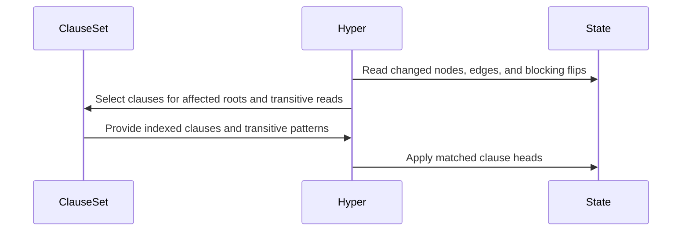

# PR #456 — comments and review threads

1 comment(s). **Every one needs a disposition** in
`review-debt.md`: addressed (with the commit hash) or declined (with the
reason posted in reply). Bot comments count.

## 1. coderabbitai — 

<!-- This is an auto-generated comment: summarize by coderabbit.ai -->
<!-- review_stack_entry_start -->

<!-- review_stack_entry_end -->
<!-- This is an auto-generated comment: rate limited by coderabbit.ai -->

> [!WARNING]
> ## Review limit reached
> 
> Your organization has reached its usage spending cap. Adjust your spending cap in the [billing tab](https://app.coderabbit.ai/settings/billing?tab=usage&orgId=b268aba6-a194-4fd6-8ca5-f1a13a313209).
> 
> **Next included review available in 36 minutes.**
> 
> [Check out review usage here](https://app.coderabbit.ai/dashboard/review-capacity?orgId=b268aba6-a194-4fd6-8ca5-f1a13a313209).
> 
> 

> 
View limit details

> 
> **Limit details:** You’ve used the included review currently available. Your 107 included PR review attempts over the past 7 days set your current allowance at 1 review per hour.
> 
> [Learn how review limits work](https://docs.coderabbit.ai/management/plans#rate-limits).
> 
> **Review configuration:**
> 
> 

> 
⚙️ Run configuration

> 
> - **Configuration used**: defaults
> - **Review profile**: CHILL
> - **Plan**: Team
> - **Run ID**: `3f8d2801-13b2-4997-bae1-44f45f4c0fe9`
> 
> 

> 
> 

> 
📥 Commits

> 
> Reviewing files that changed from the base of the PR and between 96c2c95b227003f0b34b169835fb1f4d9b8078df and d8a16213e2379def29452483ddebd829da47a16c.
> 
> 

> 
> 

> 
📒 Files selected for processing (2)

> 
> * `crates/entail/src/owl_dl/hyper.rs`
> * `crates/validate/tests/dl_nominal_witnesses.rs`
> 
> 

> 
> 

<!-- end of auto-generated comment: rate limited by coderabbit.ai -->

<!-- walkthrough_start -->

📝 Walkthrough

## Walkthrough

OWL-DL saturation now matches clauses over affected graph regions and maintains blocking and branch indexes incrementally. Selected witnesses wait for relevant identification choices. Transitive-role closure now includes sub-role and inverse-partner edges. Tests and benchmarks cover verdicts, work, and choice-heavy cases.

### Changes

**OWL-DL saturation and consistency**

|Layer / File(s)|Summary|
|:---|:---|
|**Clause indexes and role patterns**   `crates/entail/src/owl_dl/clause.rs`|Role-first clauses are indexed by edge patterns. Clause metadata records transitive reads and match radius, and role patterns include sub-roles and inverse declarations.|
|**Delta-region matching**   `crates/entail/src/owl_dl/hyper.rs`, `crates/entail/src/owl_dl/mod.rs`, `crates/entail/src/owl_dl/parser.rs`|Hyper matches clauses at roots reached by graph changes and supports single-read matching against closure gains. Test builds can select full rematching for differential checks.|
|**Incremental state and deferred witnesses**   `crates/entail/src/owl_dl/hyper.rs`, `crates/entail/src/owl_dl/tableau.rs`, `crates/validate/tests/dl_nominal_witnesses.rs`|Blocking and open-disjunction indexes are maintained incrementally. Selected witnesses are retried after identification choices resolve. Regression tests cover nominal-witness cases.|
|**Transitive-role closure and oracle checks**   `crates/entail/src/owl_dl/proof.rs`, `crates/entail/src/owl_dl/oracle.rs`, `CHANGELOG.md`|Transitive closure includes edges through sub-roles and inverse partners. Oracle checks add hierarchy cases, polarity-aware bounded-domain checks, and comparison with full rematching.|
|**Work accounting and benchmark coverage**   `crates/entail/benches/consistency.rs`, `crates/entail/Cargo.toml`, `crates/validate/tests/dl_step_ledger.rs`, `crates/validate/tests/dl_work_budget.rs`, `crates/entail/src/owl_dl/tableau.rs`, `CHANGELOG.md`|Neighborhood work charges use indexed edges plus one. Ledger values and work-budget tests are updated, and a report-only benchmark measures choice-heavy fixtures.|

<!-- change_assessment_start -->
**Priority:** ➖ Normal

**Estimated code review effort:** 4 (Complex) | ~60 minutes

<!-- change_assessment_commit:"96c2c95b227003f0b34b169835fb1f4d9b8078df" -->
**Change:** Feature · **Severity of issue fixed:** Medium
<!-- change_assessment_end -->

### Sequence Diagram(s)

<!-- walkthrough_end -->
<!-- final_review_risk_start -->
**Merge Risk:** _🔵 Low_ · up to `96c2c`
<!-- final_review_risk_coverage:{"sourceCommitId":"96c2c95b227003f0b34b169835fb1f4d9b8078df","coveredCommitId":"96c2c95b227003f0b34b169835fb1f4d9b8078df","kind":"reviewed"} -->

The reasoning changes are mergeable; no behavior problem was found. One benchmark comment understates how quickly work grows as blocks are added, which could mislead anyone planning larger benchmark runs. It is a small documentation fix.
<!-- final_review_risk_end -->
<!-- pre_merge_checks_walkthrough_start -->

🚥 Pre-merge checks | ✅ 4 | ❌ 1

### ❌ Failed checks (1 warning)

|      Check name     | Status     | Explanation                                                                                                                                                                                               | Resolution                                                                                                                                                                         |
| :-----------------: | :--------- | :-------------------------------------------------------------------------------------------------------------------------------------------------------------------------------------------------------- | :--------------------------------------------------------------------------------------------------------------------------------------------------------------------------------- |
| Linked Issues check | ⚠️ Warning | Issue `#445`'s delta-saturation, allocation-free read, open-disjunction index, oracle/W3C verdict, ledger, and benchmark objectives are addressed by the reported implementation and tests. The transitive… | Implement and verify the `#445` gmeow performance target for `graph/logic` and `rl-default`, or update the active issue's acceptance criteria through the appropriate issue process. |

✅ Passed checks (4 passed)

|         Check name         | Status   | Explanation                                                                                                                                                                                               |
| :------------------------: | :------- | :-------------------------------------------------------------------------------------------------------------------------------------------------------------------------------------------------------- |
| Out of Scope Changes check | ✅ Passed | The reported code changes support `#445`. Delta matching, read buffers, transitive closures, blocking and disjunction indexes, witness handling, proof checking, benchmarks, and regression tests all rela… |
|     Docstring Coverage     | ✅ Passed | Docstring coverage is 97.56% which is sufficient. The required threshold is 80.00%. Docstring coverage is scoped to functions touched by this diff. Analyzed 123 functions across 11 files. (2 skipped: … |
|      Description Check     | ✅ Passed | Check skipped - CodeRabbit’s high-level summary is enabled.                                                                                                                                               |
|         Title check        | ✅ Passed | The title clearly summarizes the main performance changes: delta-driven saturation and allocation-free neighborhood reads.                                                                                |

Full details: Linked Issues check

**Explanation**

Issue `#445`'s delta-saturation, allocation-free read, open-disjunction index, oracle/W3C verdict, ledger, and benchmark objectives are addressed by the reported implementation and tests. The transitive-role soundness fix and targeted witness hold support correct decisions during saturation. The gmeow `graph/logic` and `rl-default` performance objective remains unmet: the PR states that it was not run and does not claim the target was met.

<!-- pre_merge_checks_walkthrough_end -->
<!-- finishing_touch_checkbox_start -->

✨ Finishing Touches

📝 Generate docstrings

- [ ] <!-- {"checkboxId":"3e1879ae-f29b-4d0d-8e06-d12b7ba33d98"} --> Commit to this branch
- [ ] <!-- {"checkboxId":"7962f53c-55bc-4827-bfbf-6a18da830691"} --> Create a new PR

🧪 Generate unit tests (beta)

- [ ] <!-- {"checkboxId": "6ba7b810-9dad-11d1-80b4-00c04fd430c8", "radioGroupId": "utg-output-choice-group-unknown_comment_id"} --> Commit to this branch
- [ ] <!-- {"checkboxId": "f47ac10b-58cc-4372-a567-0e02b2c3d479", "radioGroupId": "utg-output-choice-group-unknown_comment_id"} --> Create a new PR

<!-- finishing_touch_checkbox_end -->

<!-- autopilot:start -->
- [ ] <!-- {"checkboxId":"2708ad07-9f24-4260-9c11-7dc76a49f2e3"} --> <strong title="Keep fixing CodeRabbit findings and required CI, and resolving merge conflicts">Autopilot</strong> · Keep fixing CodeRabbit findings and required CI, and resolving merge conflicts
<!-- autopilot:end -->
<!-- tips_start -->

---

Comment `@coderabbitai help` to get the list of available commands.

<!-- tips_end -->

