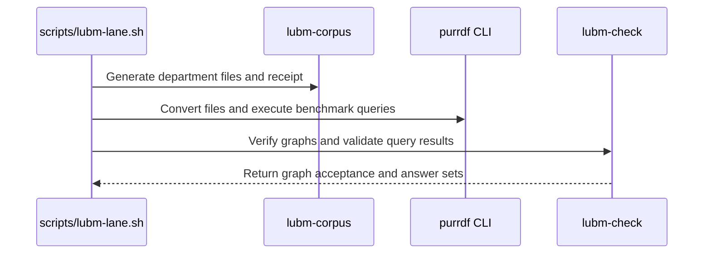

# PR #503 — comments and review threads

5 comment(s). **Every one needs a disposition** in
`review-debt.md`: addressed (with the commit hash) or declined (with the
reason posted in reply). Bot comments count.

## 1. coderabbitai — 

<!-- This is an auto-generated comment: summarize by coderabbit.ai -->
<!-- review_stack_entry_start -->

<a href="https://app.coderabbit.ai/change-stack/Blackcat-Informatics/purrdf/pull/503?scope=ghh_OusAJGA4HG8ljoOV0wJvVx8NmnZIjc2DdjmxOu0xZWA&amp;cs_source=review_comment"></a>

<!-- review_stack_entry_end -->
<!-- recent_review_start -->

No actionable comments were generated in the recent review. 🎉

<details>
<summary>ℹ️ Recent review info</summary>

<details>
<summary>⚙️ Run configuration</summary>

- **Configuration used**: defaults
- **Review profile**: CHILL
- **Plan**: Team
- **Run ID**: `e17d71f2-4938-4934-94c5-1dba2f4d36ed`

</details>

<details>
<summary>📥 Commits</summary>

Reviewing files that changed from the base of the PR and between 5384882d65750ee22bddfeeac473095ab9c3db03 and a82d2426e8bcd7ad6e9ba3484301fd604e7b7861.

</details>

<details>
<summary>⛔ Files ignored due to path filters (1)</summary>

* `Cargo.lock` is excluded by `!**/*.lock`

</details>

<details>
<summary>📒 Files selected for processing (26)</summary>

* `AGENTS.md`
* `Makefile`
* `README.md`
* `README_zh.md`
* `crates/bench/Cargo.toml`
* `crates/bench/LUBM_PROFILE.md`
* `crates/bench/README.md`
* `crates/bench/examples/lubm_fault_cli.rs`
* `crates/bench/src/lib.rs`
* `crates/bench/src/lubm/check.rs`
* `crates/bench/src/lubm/generate.rs`
* `crates/bench/src/lubm/mod.rs`
* `crates/bench/src/lubm/output.rs`
* `crates/bench/src/lubm_check_main.rs`
* `crates/bench/src/lubm_main.rs`
* `crates/bench/tests/lane_common_laws.rs`
* `crates/bench/tests/lubm_check_cli.rs`
* `crates/bench/tests/lubm_cli.rs`
* `crates/bench/tests/make_bench_lanes.rs`
* `docs/BENCHMARKS.md`
* `docs/design/purrdf-bench-lane-laws.md`
* `layers.toml`
* `scripts/benchmark-acquire.py`
* `scripts/lane-common.sh`
* `scripts/lubm-lane.sh`
* `scripts/lubm-queries.py`

</details>

**Included review availability:** This review used your included allowance. 0 included reviews remain after this review. Your included PR review attempts over the past 7 days set your current allowance at 1 review per hour.

</details>

---


<!-- recent_review_end -->
<!-- walkthrough_start -->

<details>
<summary>📝 Walkthrough</summary>

## Walkthrough

The LUBM lane now generates university data with a native Rust tool. A native checker validates receipts, RDF graphs, ontology projection, and graph-derived Q1 and Q14 results. The lane also supports a configurable join-step budget and updates its acquisition, reporting, and validation rules.

### Changes

**Native LUBM generation and verification**

|Layer / File(s)|Summary|
|:---|:---|
|**Define and generate the native corpus** <br> `crates/bench/src/lubm/*`, `crates/bench/src/lubm_main.rs`, `crates/bench/tests/lubm_cli.rs`, `crates/bench/LUBM_PROFILE.md`, `crates/bench/README.md`|Adds validated configuration, seeded sampling, department N-Triples generation, and a sorted receipt written after payloads are flushed and reread. Adds generator CLI tests and profile documentation.|
|**Verify corpus identity and query answers** <br> `crates/bench/src/lubm/check.rs`, `crates/bench/src/lubm_check_main.rs`, `crates/bench/tests/lubm_check_cli.rs`, `crates/bench/Cargo.toml`, `layers.toml`|Adds receipt, inventory, graph, conversion, and ontology-projection checks. The checker derives Q1 and Q14 URI sets and validates query results against them.|

**Lane integration**

|Layer / File(s)|Summary|
|:---|:---|
|**Run and qualify the native benchmark lane** <br> `scripts/lubm-lane.sh`, `scripts/lubm-queries.py`, `scripts/lubm_fault_cli.rs`, `scripts/benchmark-acquire.py`, `Makefile`, `crates/bench/tests/make_bench_lanes.rs`, `crates/bench/tests/lane_common_laws.rs`, `docs/*`, `README.md`, `README_zh.md`, `AGENTS.md`|Replaces Java/UBA generation with the native generator and checker. The lane rechecks corpus and input identities, validates Q1 and Q14 against graph-derived answers, and reports whether queries ran on the full corpus. Adds `LUBM_MAX_JOIN_STEPS` and updates related tests and documentation.|

<!-- change_assessment_start -->
**Priority:** ➖ Normal

**Estimated code review effort:** 4 (Complex) | ~75 minutes

<!-- change_assessment_commit:"a82d2426e8bcd7ad6e9ba3484301fd604e7b7861" -->
**Change:** Feature · **Severity of issue fixed:** Medium
<!-- change_assessment_end -->

### Sequence Diagram(s)



**Possibly related PRs**

- [Blackcat-Informatics/purrdf#351](https://github.com/Blackcat-Informatics/purrdf/pull/351): Established LUBM lane validation and corpus-oracle behavior that this change adapts to the native corpus.

</details>

<!-- walkthrough_end -->
<!-- final_review_risk_start -->
**Merge Risk:** **⚪ Minimal** · up to `a82d2`
<!-- final_review_risk_coverage:{"sourceCommitId":"a82d2426e8bcd7ad6e9ba3484301fd604e7b7861","coveredCommitId":"a82d2426e8bcd7ad6e9ba3484301fd604e7b7861","kind":"reviewed"} -->

The LUBM benchmark lane now uses a native Rust generator, and its output is checked by native validators. No concrete merge-blocking issue was found. Corpus file ordering is stable across operator locales.
<!-- final_review_risk_end -->
<!-- pre_merge_checks_walkthrough_start -->

<details>
<summary>🚥 Pre-merge checks | ✅ 3 | ❌ 2</summary>

### ❌ Failed checks (2 warnings)

|      Check name     | Status     | Explanation                                                                                                                                                                                               | Resolution                                                                                                                                                                                                                                        |
| :----------------- | :--------- | :-------------------------------------------------------------------------------------------------------------------------------------------------------------------------------------------------------- | :------------------------------------------------------------------------------------------------------------------------------------------------------------------------------------------------------------------------------------------------ |
| Linked Issues check | ⚠️ Warning | Issue `#475` requires a deterministic Rust generator that is byte-identical to UBA for a given seed and university count, matches UBA output statistics and schema, and removes Java/JRE dependencies from… | Implement and verify the `#475` compatibility requirements, or update the linked issue if the native profile intentionally replaces UBA compatibility. Provide evidence for UBA byte identity, output statistics and schema compatibility, and Jav… |
|  Docstring Coverage | ⚠️ Warning | Docstring coverage is 41.41% which is insufficient. The required threshold is 80.00%. Docstring coverage is scoped to functions touched by this diff. Analyzed 99 functions across 16 files. (10 skipped… | Write docstrings for the functions missing them to satisfy the coverage threshold.                                                                                                                                                                |

<details>
<summary>✅ Passed checks (3 passed)</summary>

|         Check name         | Status   | Explanation                                                                                                                                                                                               |
| :------------------------ | :------- | :-------------------------------------------------------------------------------------------------------------------------------------------------------------------------------------------------------- |
|      Description Check     | ✅ Passed | Check skipped - CodeRabbit’s high-level summary is enabled.                                                                                                                                               |
|         Title check        | ✅ Passed | The title clearly and concisely describes the primary change: replacing Java-based LUBM generation with deterministic native Rust generation.                                                             |
| Out of Scope Changes check | ✅ Passed | The changes remain connected to issue `#475`. They add the native LUBM generator, native graph and result oracles, CLI and Make-lane integration, configuration validation, failure controls, tests, depen… |

</details>

<details>
<summary>Full details: Linked Issues check</summary>

**Explanation**

Issue `#475` requires a deterministic Rust generator that is byte-identical to UBA for a given seed and university count, matches UBA output statistics and schema, and removes Java/JRE dependencies from scripts, tests, CI, and docs. The PR adds the native `purrdf-lubm-native-v1` generator and extensive graph, receipt, and lane validation. However, the PR description explicitly states that it does not reproduce UBA's random sequence and does not establish UBA byte or answer equivalence. The available summary does not establish matching UBA output statistics or complete Java/JRE removal across every required project area.

**Resolution**

Implement and verify the `#475` compatibility requirements, or update the linked issue if the native profile intentionally replaces UBA compatibility. Provide evidence for UBA byte identity, output statistics and schema compatibility, and Java/JRE removal from all scripts, tests, CI, and documentation.

</details>

<details>
<summary>Full details: Docstring Coverage</summary>

**Explanation**

Docstring coverage is 41.41% which is insufficient. The required threshold is 80.00%. Docstring coverage is scoped to functions touched by this diff. Analyzed 99 functions across 16 files. (10 skipped: 10 unsupported.)

</details>

</details>

<!-- pre_merge_checks_walkthrough_end -->

- [ ] <!-- {"checkboxId":"585bb3f6-faf5-4dbf-96d2-74e382adf19a"} --> Fix all pre-merge checks with AI
<!-- finishing_touch_checkbox_start -->

<details>
<summary>✨ Finishing Touches 💡 1</summary>

<!-- finishing_touch_suggestion:docstrings -->
<details open>
<summary>📝 Generate docstrings 💡</summary>

- [ ] <!-- {"checkboxId":"3e1879ae-f29b-4d0d-8e06-d12b7ba33d98"} --> Commit to this branch
- [ ] <!-- {"checkboxId":"7962f53c-55bc-4827-bfbf-6a18da830691"} --> Create a new PR

</details>
<details open>
<summary>🧪 Generate unit tests (beta)</summary>

- [ ] <!-- {"checkboxId": "6ba7b810-9dad-11d1-80b4-00c04fd430c8", "radioGroupId": "utg-output-choice-group-unknown_comment_id"} --> Commit to this branch
- [ ] <!-- {"checkboxId": "f47ac10b-58cc-4372-a567-0e02b2c3d479", "radioGroupId": "utg-output-choice-group-unknown_comment_id"} --> Create a new PR

</details>

</details>

<!-- finishing_touch_checkbox_end -->

<!-- autopilot:start -->
- [ ] <!-- {"checkboxId":"2708ad07-9f24-4260-9c11-7dc76a49f2e3"} --> <strong title="Keep fixing CodeRabbit findings and required CI, and resolving merge conflicts">Autopilot</strong> · Keep fixing CodeRabbit findings and required CI, and resolving merge conflicts
<!-- autopilot:end -->
<!-- tips_start -->

---


<sub>Comment `@coderabbitai help` to get the list of available commands.</sub>

<!-- tips_end -->

## 2. paudley — 

# Original native LUBM generation and production lane

## Authority and prior work

This is the accepted portfolio's independent early475 delivery, at the Stage
worktree/branch returned by open.json, base origin/main6273b6173. Main remains
protected. Main-root .baseline/.goals, AGENTS.md and the clean deficiency ledger
govern. The owner forbids running Java on this host, including baseline probes.
No cited governing ADR or constitution was found. Independent issue analysis and
prior-art assessment are complete; their bounded recurrence is UNKNOWN, not zero.
The brief captured the complete body, zero comments, no linked references,
14related items and trailers from200commits.

The accepted greenfield portfolio specifies an original first-party Rust
generator matching the published schema/cardinality constraints. Repeatability
means identical native bytes for identical native profile/configuration. Do not
copy UBA bodies/coefficient arrays, implement its random sequence, or claim old
UBA answers/bytes for native data. Primary specification links and observed
constraints are in published-profile-notes.md. The native sampling law will be
explicit and versioned; unspecified UBA probability distributions remain unknown.

Existing bench-corpus, purrdf_hash::mix, lexical term writers, IRI validation,
content framing/hashes, production RDF conversion, shared lane-common laws,
verified external ontology/query cache,14query transformations/regimes and Rust
lane tests are reusable. None implements native university generation. Current
Java invocation/class inspection/Linux renaming and historical UBA corpus/Q1/Q14
pins must retire. No Java baseline is necessary or authorized.

Rust tools/tests, one home per job, deterministic bytes, ordinary hooks/signing,
no semantic features/new external or shipping dependencies, frozen-vector and
generated-artifact laws apply. Host-only first-party parser/lexical edges needed
by the unpublished bench tool must be explicit in Cargo/layers/lock and checked.
Do not copy an escaping, RNG, JSON, RDF reader or hashing implementation. All
final integration uses /home/paudley/stage/root/bin/ghprsq. No release/publication.

## Design

Add a separate lubm-corpus executable in crates/bench, preserving bench-corpus.
Define purrdf-lubm-native-v1: independent absolute-university-index/seed streams
through the existing specified mix home, explicit unbiased inclusive integer
selection and integer rounding/assignment laws. No wall clock, OS RNG, locale,
output-directory or randomized-table iteration enters emitted bytes.

Write one stable N-Triples document per department using the existing lexical
term-syntax writers. This avoids creating a new RDF/XML writer. Preserve actual
production conversion and each document's ontology type/import metadata using
caller-selected ontology/document-base values. URI/entity names must satisfy the
published query targets; distinguish instance namespace from caller schema terms.
Validate config/range arithmetic before creating output. Fresh owned output must
not overwrite existing source/data; a failed/partial run never has a valid receipt.
Manifest/receipt is typed JSON through the native record home, written only after
successful flushes and binding actual sorted filenames/file bytes/configuration.
No speculative cross-run reuse/cache is required.

Use original Rust graph verification/oracle tooling in the same bench home.
Read actual generated/converted bytes through the production RDF reader, derive
schema/statistical checks and Q1/Q14 expected sets independently from the graph,
and verify the multi-file receipt. This is separate from generator counters and
SPARQL-produced answers. For a custom ontology, preserve the externally fetched
ontology/query provenance and mechanically project schema terms to the selected
namespace in ignored build output through the actual RDF model. Do not silently
combine custom data/query terms with an unchanged incompatible TBox.

Replace the Java portion of scripts/lubm-lane.sh with native generation/verification,
retain the existing shared laws/conversion/query/regime pipeline, and remove UBA
and Linux-fix acquisition/dependencies. The remaining legacy Python tools may
shrink; new functions/tests are Rust, with no ratchet growth. External ontology
and original queries remain digest-verified ignored artifacts, never vendored.

## Executable completeness contract

1. Task1 runs the actual lubm-corpus CLI in distinct processes/directories and
   compares every name/byte for identical profile/seed/count/index/ontology/base.
   A university generated alone and inside a larger range has identical bytes.
   Seed/index/schema/base changes affect their intended identities; locale and
   output path changes do not. Preserve the existing scale generator's pins.
2. Task1 graph-derived tests cover EVERY fact in the published profile:15–25
   departments; staff7–10/10–14/8–11/5–7; one full-professor head;1–2courses of
   each level per faculty with disjoint ownership;10–20research groups;
   undergraduate/faculty8–14 and graduate/faculty3–4; all student memberships;
   graduate TA1/5–1/4 with distinct courses, RA1/4–1/3; one-fifth undergraduate
   and all graduate professor advisors;2–4/1–3course loads; publication ranges
   15–20/10–18/5–10/0–5 and graduate0–5coauthorships; faculty three degree-origin
   relations and graduate one. State and test precise integer rounding where
   the published prose is silent. Use a finite named seed/index/university matrix,
   boundary cases and independent parsed-graph assertions, not internal counts.
3. Task1 validates actual property direction/types, naming, distinct references,
   publication ownership/coauthors, department/university relationships, metadata
   and valid IRIs/literals. Student/Professor/Chair remain inferred memberships;
   do not assert them to satisfy queries. Degree-origin universities outside the
   generated range must be explicitly identified as external references rather
   than accidentally reported as missing owned entities or generated capacity.
4. Tasks1–2 reject zero/malformed counts, duplicates/missing operands, malformed
   IRIs, index overflow, incompatible configuration, unavailable executables,
   failed writes/flush/conversion, incomplete/empty/extra payload files, wrong
   file/config identities and malformed/partial receipts. No success summary,
   reusable certificate or empty-corpus digest may certify a failed run. Preserve
   siblings and owned-failure evidence; never blanket clean unrelated paths.
5. Task2 validates native Q14 from distinct actual UndergraduateStudent subjects
   and Q1 from actual GraduateStudent/takesCourse bindings matching the normalized
   concrete course target. Compare actual query result sets/counts against these
   independent native oracles. Q1 may legitimately be zero for some draws/index;
   positive undergraduate population/Q14 supplies non-vacuity. OldUBA Q1=4,
   Q14=5916 and serializer-specific corpus pins are never native acceptance.
6. Tasks2–3 run actual make lubm using native generator, real purrdf conversion
   and original fetched14queries. Exercise default and nonzero seed/index,
   multiple universities, custom ontology/base, relative/absolute output and
   prebuilt CLI. Invalid knobs fail before acquisition/generation. Retain all
   query transformations/query-set digest checks and regime map: Q1/Q2/Q14 none,
   Q3/Q4 RDFS class, Q5 RDFS properties/classes, Q6–Q10 derived Student,
   Q11 organization transitivity, Q12 Chair, Q13 alumni inverse/subproperty.
7. Tasks2–3 preserve full/one-file/slice identities and status laws. Unsupported
   or exhausted queries are CANNOT-EXECUTE; malformed success is BAD-RESULTS.
   No executed queries or universally vacuous output cannot be a successful
   benchmark. A subset cannot be a full-corpus answer; report-only timings never
   become CI speed assertions. Engine-wide capability remains its own portfolio
   work, and an unsupported row is never called a passing query. Native
   comparisons require identical native bytes, queries and regimes, not UBA pins.
8. Task2 removes every production Java/JRE dependency, UBA acquisition/inspection,
   class/Linux filename repair, JVM determinism assumptions and stale instruction
   from scripts/tests/Make/CI/AGENTS/bench README/BENCHMARKS. Preserve unrelated
   JavaScript, WatDiv, scale and ontology/query cache guards. Semantic retirement
   inspection is required; historical audit text is not a runtime dependency.
9. Tasks2–4 retain actual binary/profile/config/content/query identities, checked
   output writes, corrupt-cache hard refusal, verified cache-hit behavior,
   source-controlled ignore proof, locale/cleanup/certificate revocation and
   before/during/after query identity laws. Run affected Rust/hygiene/layer/target/
   generator checks and regenerate metadata normally. No frozen external vectors
   or generated artifacts are hand-edited.

## Choices and rejected alternatives

N-Triples keeps one serializer home and reduces implementation/verification cost;
its carrier/filename change is explicit in native profile identity and lane/docs.
Copying/reimplementing UBA's Java sequence offers obsolete answer comparability
at provenance/licensing cost and is outside accepted authority. A homemade
RDF/XML/JSON/RNG implementation or a Rust wrapper still launching Java fails
the repository/owner law. Approximate103k volume and self-reported counters do
not validate the published relationships. Existing external ontology/query
acquisition stays intact; replacing unrelated network acquisition is unnecessary.

## Task 1: Native generator, profile and independent graph constraints

Implement original native spec/sampling/streaming serialization, strict executable
and multi-file receipt. Preserve scale-corpus. Add independent parsed-graph
schema/statistical controls, CLI determinism/range/locale/config/failure tests and
stable public profile documentation. Focused bench checks/layers/clippy/fmt;
independent task review, normal commit/push/issue progress before Task2.

## Task 2: Native verification/oracles, production wiring and Java retirement

Implement receipt/graph-derived Q1/Q14 verification and native identity, real
generator/conversion/query lane wiring, custom-schema projection and all knob
admission. Retire Java artifacts/dependency/test/doc assumptions and historicUBA
pins without dropping shared failure/cache/query/regime guards. Update actual
Make/CI callers and Rust lane tests; regenerate affected metadata. Focused actual
entry-point/retirement/cache/lane/layer/profile checks and independent review,
normal commit/push/progress before Task3.

## Task 3: Actual native lane and nondefault acceptance

Run default real make lubm plus stated nondefault matrix, independent answers,
manifest/tamper/failure/cache-hit controls and affected WatDiv/scale/shared-law
tests. Keep external unlicensed artifacts ignored. Record actual statuses,
parameters, hashes, binary/source/compiler, measured results and finite matrix.
Cap builds8jobs; task-owned disk under/opt, one performance campaign coordinated
with root, no competing owned heavy builds during timings. No Java process.
Independent review and normal commit/push/progress for any settled qualification
fixes before Task4. Failed required behavior remains work, never a soft pass.

## Task 4: Settled full qualification, completion audit and integration

Run the workflow's single settled full local gate and required normal hooks,
separating actual generator/lane runtime from builds/hygiene and hosted gates.
Independent completeness audit against all criteria; no PR until required
acceptance is met. Create/publish the Stage PR and plan, then Stage2 hosted
CI/review remediation and Stage3 merge-tree/evidence/ghprsq integration. Preserve
evidence and clean only the merged delivery. No release/upstream action or280.

## Review and progress

Issue analysis/prior-art assessment complete; independent plan review PASS
(plan-review.md). Its explicit sampling/rounding, fixed published query targets,
custom TBox projection and file/conversion refusal checks remain binding.
Task1 native generator/profile/independent parsed-graph checks passed35 library,
20 preserved scale CLI and4 native CLI tests, strict clippy/hygiene/fmt and
independent review. Normal hooks passed;5f7c8b6fb committed/pushed. No Java ran.
Task2 production verification/wiring/custom TBox/Java retirement is next; actual
lane qualification, full gates, PR and integration remain pending.

## 3. paudley — 

# Task 4: local qualification complete; PR #503 open

The deterministic native Rust LUBM replacement is implemented and normally
committed/pushed. Four actual Make campaigns completed all fourteen queries,
including cold/warm default and custom-schema/nondefault generation. Independent
native graph/result-set checks, cache/parity checks, real command faults,
admission/tamper controls and 106 focused tests passed.

The settled full local `make check` exited 0. The independent final completion
audit passed against the original acceptance criteria. No required local gate
was skipped. The managed Cargo compiler ran in Stage's build slice, whose
effective limits were 48 GiB memory and 8 GiB swap; the outer Make scope's
64 GiB/no-swap settings did not apply to that compiler. This is correctness
qualification, with no performance claim.

PR #503 is open: https://github.com/Blackcat-Informatics/purrdf/pull/503
The `stagectl pr-create` wrapper returned a JSON parsing error after GitHub
successfully created the PR. Branch lookup confirmed the existing PR; creation
was not repeated. Hosted CI is running. Mandatory hosted jobs, complete review
adjudication and final integration through `ghprsq` remain pending.

Least confidence: the comparative interpretation of this native workload against
Java UBA. It intentionally supplies a distinct deterministic native profile,
not an identical Java random sequence or graph. Comparisons must use the same
profile, bytes, query bindings and regime.

What should be known: the query lane uses an explicit finite 100,000,000-step
join budget, and verifies full rather than partial acceptance. External ontology
and query bodies are not included in the selected Stage archive; their pinned
identities and transformation/replay dependencies are recorded. Failed earlier
runs are retained as failures. Other-repository submissions, including w3c-test,
are excluded; submissions already in flight remain untouched.

## 4. paudley — 

# Review warning dispositions

Independent Stage2 gap analysis passed for the implementation and local
acceptance, reusing the full all-criteria completion audit and real production
demonstrations. Hosted CI and final merge gates remain pending.

The linked-issue warning interprets byte identity as equality to Java UBA. The
actual issue asks for a deterministic generator “byte-identical for a given seed
and university count.” The accepted greenfield plan, already published here and
on the issue, explicitly defines repeatability for the versioned native profile.
It preserves published schema/cardinality constraints and does not claim UBA
random-sequence, byte or answer equivalence. Independent parsed-graph checks,
eleven planted faults and the full default/nondefault production matrix establish
the retained constraints and deterministic bytes. Actual source inspection and
gates establish complete Java/JRE retirement from the benchmark lane.

The documentation-percentage warning is a default bot metric across private
helpers and tests as well as public functions. The independent review inspected
the public native module, validated configuration, receipts, generation,
verification, projection and result-checking APIs and their error contracts.
Those contracts, actual CLI examples, profile sampling and comparison limitations
are documented. No concrete missing public documentation was identified; adding
private-helper prose solely to reach the percentage is unnecessary.

Neither warning requires source changes. Formal reviews, inline comments and
review threads were fully captured and contain zero entries at this snapshot;
the complete bot conversation is retained. This records dispositions rather
than inferring approval from an empty endpoint. The current clean merge
prediction matches the locally tested tree exactly; future changed inputs will
be reassessed before integration.

## 5. paudley — 

Replace Java LUBM generation with deterministic native Rust

Closes #475

## What changed

Generate versioned native university corpora with the published schema and
cardinality constraints. Use native receipts, independently parsed graph checks
and graph-derived Q1/Q14 URI sets throughout the actual fourteen-query benchmark
lane. Remove Java/UBA acquisition, execution and obsolete answer pins. The
sampling law is explicit: native repeatability does not claim historical UBA
random-sequence, byte or answer equality. Keep strict full/partial workload,
cache, identity and fault laws and an explicit finite100,000,000-step join budget.

The unpublished bench tools use the existing first-party RNG, term writer, RDF
reader, JSON and hash homes. No shipping runtime dependency or semantic feature
is added. Native Rust tools replace Java; remaining acquisition/normalization
scripts shrink. Make, benchmark documentation and both README surfaces explain
the actual profile, comparison rules, admission and limitations.

Actual validation: four complete fourteen-query Make campaigns, default/custom
schema and cold/warm/alias/locale byte parity, independent exact answers, six
real command faults, thirteen early admissions, two corrupt-cache trials and
eight retained-run tamper trials. All106 affected focused tests passed. The
single settled full makecheck exited0, including native workspace, hygiene,
metadata drift, consumer checks and every release-library wasm build. Normal
source hooks passed. Actual compiler children inherited Stage's48GiB/8GiBswap
envelope; outer64GiB/no-swap did not constrain them. No speedup or compiler
no-swap claim follows from correctness qualification.

Current hosted CI is complete: Stagectl captures48SUCCESS and two explicit
optional skips (Pages deployment and SIMD projection). Independent all-criteria
completion and Stage2 gap reviews passed. Distinct review-debt audit passed;
all formal/inline/thread surfaces were captured. Both narrative bot warnings
were adjudicated and replies published: the accepted native identity contract
is not UBA byte equivalence, and concrete public API documentation is present
without adopting a private-helper docstring percentage. No unresolved finding
remains. The fresh clean merge prediction equals the locally qualified tree;
unchanged evidence is applicable, so no extra synchronization/full gate is needed.

Authoritative plan: .stage/benchmarks-replace-the-java-lubm/plan.md.
Selected Stage: /home/paudley/Active/purrdf/.worktrees/475-benchmarks-replace-the-java-lubm/.stage/benchmarks-replace-the-java-lubm.
Essential execution receipts and complete review evidence are selected for the
separate ghprsq audit archive. External ontology/query bodies remain pinned
replay dependencies; licensed payloads and whole build trees are not bundled.
Standing Rust-first, deterministic, shared-home, portability and protected-main
constraints are satisfied. No external repository submission or release is part
of this delivery.

## Commits squashed (4)

- `a82d2426e` Apply an explicit entailment join budget throughout the LUBM lane
- `d526fc530` Supply the native graph acceptance certificate description
- `b994b61d0` bench: run and verify LUBM through the native corpus lane
- `5f7c8b6fb` Add deterministic native university corpus generator

## Files

```
AGENTS.md                               |   6 +-
 Cargo.lock                              |   1 +
 Makefile                                |  16 +-
 README.md                               |   2 +-
 README_zh.md                            |   2 +-
 crates/bench/Cargo.toml                 |  23 +-
 crates/bench/LUBM_PROFILE.md            |  12 +
 crates/bench/README.md                  |  21 +-
 crates/bench/examples/lubm_fault_cli.rs | 115 +++++
 crates/bench/src/lib.rs                 |   3 +
 crates/bench/src/lubm/check.rs          | 489 +++++++++++++++++++++
 crates/bench/src/lubm/generate.rs       | 282 ++++++++++++
 crates/bench/src/lubm/mod.rs            | 177 ++++++++
 crates/bench/src/lubm/output.rs         | 157 +++++++
 crates/bench/src/lubm_check_main.rs     | 125 ++++++
 crates/bench/src/lubm_main.rs           |  66 +++
 crates/bench/tests/lane_common_laws.rs  |  11 +-
 crates/bench/tests/lubm_check_cli.rs    | 398 +++++++++++++++++
 crates/bench/tests/lubm_cli.rs          | 676 +++++++++++++++++++++++++++++
 crates/bench/tests/make_bench_lanes.rs  | 138 +++---
 docs/BENCHMARKS.md                      | 163 ++-----
 docs/design/purrdf-bench-lane-laws.md   |  59 +--
 layers.toml                             |   2 +-
 scripts/benchmark-acquire.py            | 134 +-----
 scripts/lane-common.sh                  |  12 +-
 scripts/lubm-lane.sh                    | 738 +++++++++-----------------------
 scripts/lubm-queries.py                 |   7 +-
 27 files changed, 2901 insertions(+), 934 deletions(-)
```

## Conflicts

The current final merge candidate has no conflicts and equals the qualified
source tree. Ordinary earlier main synchronization preserves current shared
interfaces and does not introduce an unqualified final integration delta.

---

Defect-Class: none

