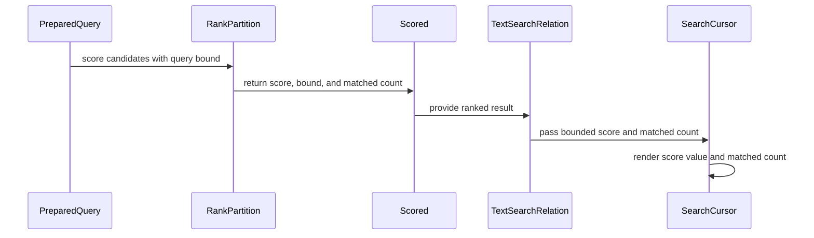

# PR #525 — comments and review threads

4 comment(s). **Every one needs a disposition** in
`review-debt.md`: addressed (with the commit hash) or declined (with the
reason posted in reply). Bot comments count.

## 1. coderabbitai — 

<!-- This is an auto-generated comment: summarize by coderabbit.ai -->
<!-- review_stack_entry_start -->

<!-- review_stack_entry_end -->
<!-- recent_review_start -->

No actionable comments were generated in the recent review. 🎉

<strong>ℹ️ Recent review info</strong>

<dl>
<dd>

<strong>⚙️ Run configuration</strong>

<dl>
<dd>

- **Configuration used**: defaults
- **Review profile**: CHILL
- **Plan**: Team
- **Run ID**: `335078d1-c867-48d9-a294-0b38aa0a4ac7`

</dd>
</dl>

<strong>📥 Commits</strong>

<dl>
<dd>

Reviewing files that changed from the base of the PR and between 866765b3e88bb6ae5108e387708d29a85c101b17 and d577e6a0ba9971828c9eea2280a6515872116ff2.

</dd>
</dl>

<strong>📒 Files selected for processing (20)</strong>

<dl>
<dd>

* `CHANGELOG.md`
* `Makefile`
* `crates/text/RANKING.md`
* `crates/text/benches/search.rs`
* `crates/text/src/fixed.rs`
* `crates/text/src/index.rs`
* `crates/text/src/lib.rs`
* `crates/text/src/ranking.rs`
* `crates/text/src/relation.rs`
* `crates/text/src/score.rs`
* `crates/text/tests/bm25f.rs`
* `crates/text/tests/field_populations.rs`
* `crates/text/tests/scoring.rs`
* `crates/text/tests/support/bm25f_reference.rs`
* `crates/text/tests/support/ranking_oracle.rs`
* `crates/text/tests/support/unrestricted_ranking_cases.rs`
* `crates/text/tests/unrestricted_ranking.rs`
* `crates/text/tests/wasm_determinism.rs`
* `docs/WASM_TESTING.md`
* `docs/design/purrdf-text-scoring.md`

</dd>
</dl>

**Included review availability:** This review used your included allowance. 0 included reviews remain after this review. Your included PR review attempts over the past 7 days set your current allowance at 1 review per hour.

</dd>
</dl>

---

<!-- recent_review_end -->
<!-- walkthrough_start -->

<strong>📝 Walkthrough</strong>

<dl>
<dd>

## Walkthrough

BM25F ranking advances to profile revision 2. It removes selected admission ceilings, promotes intermediate arithmetic to exact integers when needed, and returns query-specific score bounds with ranked results.

### Changes

**Unrestricted BM25F ranking**

|Layer / File(s)|Summary|
|:---|:---|
|**Profile and score-bound contract**   `crates/text/src/ranking.rs`, `crates/text/src/lib.rs`, `crates/text/RANKING.md`, `CHANGELOG.md`, `crates/text/tests/bm25f.rs`, `crates/text/tests/scoring.rs`, `docs/design/purrdf-text-scoring.md`|The profile identity advances to revision 2. Selected fixed ceilings are removed, and prepared queries expose a profile-bound score certificate. The public API adds `BoundedScore` and `ScoreBound` and removes the fixed-limit exports.|
|**Exact ranking arithmetic**   `crates/text/src/fixed.rs`, `crates/text/src/ranking.rs`, `crates/text/tests/field_populations.rs`, `crates/text/tests/support/ranking_oracle.rs`, `crates/text/tests/support/bm25f_reference.rs`, `docs/design/purrdf-text-scoring.md`|Fixed-point operations use a shared signed wide-arithmetic kernel. Ranking intermediates promote to exact integer arithmetic when required, with rounding boundaries retained. Tests use an independent scoring oracle and updated boundary cases.|
|**Unrestricted indexing and query execution**   `crates/text/src/index.rs`, `crates/text/src/ranking.rs`, `crates/text/src/score.rs`, `crates/text/tests/support/unrestricted_ranking_cases.rs`, `crates/text/tests/unrestricted_ranking.rs`, `crates/text/tests/wasm_determinism.rs`, `Makefile`, `docs/WASM_TESTING.md`|Indexing and scoring use dynamically sized field and term collections. Added test cases cover 5,000-term queries, large declared corpora, promoted arithmetic, and 32-field indexing and ranking.|
|**Bounded result propagation and rendering**   `crates/text/src/score.rs`, `crates/text/src/relation.rs`, `crates/text/src/lib.rs`, `crates/text/benches/search.rs`, `crates/text/tests/scoring.rs`|Scored results carry `ScoreBound`, and matched-term counts use `usize`. RDF rows render the score value and matched count; rank and language output remain unchanged.|

<!-- change_assessment_start -->
**Priority:** ➖ Normal

**Estimated code review effort:** 4 (Complex) | ~45 minutes

<!-- change_assessment_commit:"d577e6a0ba9971828c9eea2280a6515872116ff2" -->
**Change:** Feature · **Severity of issue fixed:** Medium
<!-- change_assessment_end -->

### Sequence Diagram(s)

**Possibly related PRs**

- [Blackcat-Informatics/purrdf#302](https://github.com/Blackcat-Informatics/purrdf/pull/302): Introduced the bounded BM25F profile and ranking limits that this change revises.
- [Blackcat-Informatics/purrdf#226](https://github.com/Blackcat-Informatics/purrdf/pull/226): Introduced the text index, BM25 scoring path, ranked retrieval, explanations, and `Scored` result used by this change.

</dd>
</dl>

<!-- walkthrough_end -->
<!-- final_review_risk_start -->
**Merge Risk:** **⚪ Minimal** · up to `d577e`
<!-- final_review_risk_coverage:{"sourceCommitId":"d577e6a0ba9971828c9eea2280a6515872116ff2","coveredCommitId":"d577e6a0ba9971828c9eea2280a6515872116ff2","kind":"reviewed"} -->

No actionable merge-blocking issue was established for this change. Normal validation should still be completed before merging.
<!-- final_review_risk_end -->
<!-- pre_merge_checks_walkthrough_start -->

<strong>Pre-merge checks | <picture></picture> 5</strong>

<dl>
<dd>

<strong>✅ Passed checks (5 passed)</strong>

<dl>
<dd>

|         Check name         |                                             Status                                             | Explanation                                                                                                                                                                                               |
| :------------------------ | :--------------------------------------------------------------------------------------------: | :-------------------------------------------------------------------------------------------------------------------------------------------------------------------------------------------------------- |
|      Description Check     |  | Check skipped - CodeRabbit’s high-level summary is enabled.                                                                                                                                               |
|         Title check        |  | The title clearly summarizes the main change: deriving exact BM25F capacity from query and corpus inputs while removing fixed input ceilings.                                                             |
|     Linked Issues check    |  | Issue `#482` requires exact ranking beyond the former query, corpus, field-length, term-frequency, and field-count ceilings. The PR removes those fixed refusals, uses dynamic field inputs and addressabl… |
| Out of Scope Changes check |  | The changed source, public API, documentation, and tests support Issue `#482`. Fixed-point kernel changes preserve the required rounding law. Dynamic field storage, count-width changes, ScoreBound/Bound… |
|     Docstring Coverage     |  | Docstring coverage is 80.77% which is sufficient. The required threshold is 80.00%. Docstring coverage is scoped to functions touched by this diff. Analyzed 78 functions across 15 files. (5 skipped: 5… |

</dd>
</dl>

</dd>
</dl>

<!-- pre_merge_checks_walkthrough_end -->
<!-- finishing_touch_checkbox_start -->

<strong>✨ Finishing Touches</strong>

<dl>
<dd>

<strong>📝 Generate docstrings</strong>

<dl>
<dd>
<dl>
<dd>

- [ ] <!-- {"checkboxId":"3e1879ae-f29b-4d0d-8e06-d12b7ba33d98"} --> Commit to this branch
- [ ] <!-- {"checkboxId":"7962f53c-55bc-4827-bfbf-6a18da830691"} --> Create a new PR

</dd>
</dl>

</dd>
</dl>

<strong>🧪 Generate unit tests (beta)</strong>

<dl>
<dd>

- [ ] <!-- {"checkboxId": "6ba7b810-9dad-11d1-80b4-00c04fd430c8", "radioGroupId": "utg-output-choice-group-unknown_comment_id"} --> Commit to this branch
- [ ] <!-- {"checkboxId": "f47ac10b-58cc-4372-a567-0e02b2c3d479", "radioGroupId": "utg-output-choice-group-unknown_comment_id"} --> Create a new PR

</dd>
</dl>

</dd>
</dl>

<!-- finishing_touch_checkbox_end -->

<!-- autopilot:start -->
- [ ] <!-- {"checkboxId":"2708ad07-9f24-4260-9c11-7dc76a49f2e3"} --> <strong title="Keep fixing CodeRabbit findings and required CI, and resolving merge conflicts">Autofix</strong> · Keep fixing CodeRabbit findings and required CI, and resolving merge conflicts
<!-- autopilot:end -->
<!-- tips_start -->

---

Comment `@coderabbitai help` to get the list of available commands.

<!-- tips_end -->

## 2. paudley — 

# Exact ranking over input-derived capacity

Primary issue: #482. Branch `paudley/482-text-rank-inputs-past-query-terms-max`, isolated worktree `/home/paudley/Active/purrdf/.worktrees/482-text-rank-inputs-past-query-terms-max`, originally fetched base `origin/main` at `37e3a26a7`, now synchronized normally to `3ac169b96`. Full issue and zero comments are captured in `issue.md`; `brief.json` and `prior-art.md` record the eight linked issues and bounded recurrence search. The implementation and acceptance fixtures are written; `validation.md` is the authoritative current evidence and publication index.

The complete delivery removes the chosen term, document, field, frequency, weight and score ceilings while preserving every operation and truncation of the published BM25F law. Negative weights, malformed routing, inconsistent corpus/document facts, undefined zero normalization, and intrinsic storage representation failures remain typed errors. No accepted requirement is deferred to the broader arithmetic optimization or retrieval work.

## Governing constraints and relevant prior art

The root `.baseline` requires no deferrals, immediate ownership of touched defects, and no development references in shipping documentation. `.goals` requires maximal performance, portability and utility, Rust-first implementation and RDF 1.2. `AGENTS.md` requires one home per job, no new semantic features, no implicit vocabulary, deterministic bytes, unchanged conformance corpora, normal hooks and complete gates. The existing exact numeric tower (`xsd::exact::Integer` and `xsd::bigint::BigInt`) supplies the checked i128 fast path and unbounded fallback; `xsd::wide::mul_div` already handles a scaled product whose final result fits u128. The ranking law lives in `text/src/ranking.rs` and `text/RANKING.md`, and the index uses that same prepared scorer for full ranking, bounded heaps, point scoring and explanations.

The cited ADR-0030 is a motivating Katamari decision, not a PurRDF ADR found on disk. The brief records that absence rather than inventing a local decision. Its packing premise does not constrain this carrier. The linked numeric-tower issues are complete; the open optimization sweep is not a dependency. Bounded recurrence: 19 `none`, one `semantic-identity-loss`, one `performance` among the last 200 commit trailers; this is not an all-history recurrence claim.

## Design

Use a fixed-scale adapter around the existing canonical `exact::Integer` only for intermediates that leave i128. Share the existing `Fixed` signed wide-product kernel for small multiplication/division; promote per operation when its result no longer fits. Apply truncation at exactly the original boundaries, including normalization, field weighting, saturation and final IDF multiplication. Do not retry a second scorer, implement a new integer engine, or switch to final-only rational rounding.

Counts widen directly from u64 into i128 at the public scale. `length*population*S/total` uses the existing wide product/quotient; `length*population` fits u128. Corpus totals remain exact u128 per field because both population and per-document field length are u64. The honest consistency bound is `population*u64::MAX`; it is a consequence of the input type, not a chosen ceiling. Summing totals across unrestricted fields uses the existing exact integer home. Every frequency addition is checked before publication.

Replace the fixed sixteen-field buffers with the shared `SmallVec` (sixteen inline slots plus physical spill); profile fields themselves remain an unrestricted Vec. Preserve caller field order and mapping identity. Use usize for query ordinals and matched-term counts, avoiding the existing narrowing cast to u32. The in-memory index's explicit u32 document/position address representation is a separate physical storage law and remains honestly documented.

Prepare a private-construction `ScoreBound` from the sum of `floor(idf_i*(k1+1))` for the actual prepared query. Every nonnegative pseudo-frequency has saturation at most `k1+1`, so this is a certified bound including all truncations. Expose its exact maximum, bit width and ranking-profile fingerprint. Native ranked results carry the certificate. Pure whole-document scoring returns an explicit value-and-bound carrier, so the certificate is reported with that result too; per-term contribution remains a scalar under the same prepared query. Validate against this certificate, including exact interval rather than width alone.

The score itself still fits `Fixed`: for u64 corpus counts the shifted IDF argument is at most `2N+2`, whose natural logarithm is below 46; each addend is below `46*2.2*S`. Multiplying this by any physically addressable query length on the supported 32/64-bit targets is below i128. Large field weights and tiny positive normalizations can nevertheless create much larger intermediates, so their promotion is required. A normalization that genuinely rounds to zero under b=1 remains the original typed arithmetic-domain error, not a chosen input ceiling or clamped approximation.

Bump the ranking law identifier/revision to v2/2, remove all selected ceiling values from its canonical description, and bind the rounding, certificate law, corpus law and actual caller choices. Record the identity migration in the changelog. Original score TSV/lexical goldens stay byte-for-byte unchanged; the old profile fingerprint vectors change deliberately with the admission/identity contract.

The actual 2^25-token fixture builds one RDF document from 32 distinct comma-separated source literals, each with 2^20 analyzed terms, in one field. Commas retain the normal analyzer's lexical and surface terms while giving one substring span per literal. Release the existing lexical projection scratch after the native token walk if the owning Han/surface consumers prove it is no longer needed; preserve all auxiliary outputs and source evidence. This is actual index construction, not a fabricated field count. The fixture runs in a resource-capped native process with the full assertions intact.

## Completeness contract

| Requirement | Task | Real acceptance |
|---|---|---|
| 5,000 distinct terms rank | 1 | Build an actual RDF index and analyze the complete 5,000-term needle; native rank/select and the property-function entry agree in row order, matched count and exact score with independent unbounded reference values. |
| Actual field with 2^25 tokens indexes and scores | 1 | Native `TextIndex::from_dataset` builds the real input above; inspect retained field length/frequency and rank it, comparing every raw score to the independent reference. No ignored/synthetic substitute. |
| Declared 2^41 corpus prepares and scores | 1 | `PreparedCorpus`/prepared whole-document and contribution APIs match the independent reference; also exercise u64 maximum population/count conversion. |
| Original bounded scores are byte-identical | 1 | Preserve all sixteen frozen TSV vectors and all existing score lexical/serialized goldens; execute both population modes and unchanged `bm25f.py --check`. |
| No chosen ceiling refusal remains | 1 | Meaningful above-old-neighbor cases for query/field/frequency/weight/score and more than sixteen actual index fields; overflowing intermediates match the independent unbounded oracle. |
| Genuinely invalid inputs still fail | 1 | Negative weights, invalid coefficient/routing, zero fields, duplicate/unsorted query keys, df>N, impossible corpus totals, inconsistent document lengths and distinct-term frequency sums retain typed errors before zero shortcuts. |
| Derived bound is reported and certified | 1 | Pure result and native `Scored` carry the query/corpus certificate; actual score lies within it, exact-bound validation rejects bound+1/negative, and a 5,000-term rare query exceeds the former 56-bit/score ceiling without refusal. |
| Profile identity names the unrestricted law | 1 | Pin v2 fingerprints for dense and carrier laws, mapping-order invariance/field-order differences, exact bound-law description, and changelog migration; no ceiling folded into the identity. |
| Portability/no new engine or dependency | 1 | Affected strict all-target native lint/tests, actual portable ranking harness (including promoted arithmetic), layer/ring-fence checks and final unchanged `make check`/all-release WASM builds. |
| Qualified publication | 2 | Independent complete behavior/evidence review, normal signed hook commit/push, complete Stage artifacts, issue plan/results and PR with `Closes #482`; hosted CI/integration remain distinct. |

## Task 1: Complete unrestricted exact scoring and all consumers

Implement the complete arithmetic adapter, preparation/certificate, dynamic field and query representations, index/scoring/relation migrations, meaningful acceptance fixtures, unchanged independent Python-reference comparisons, and shipping docs/changelog as one substantive behavior unit. Reuse testkit's independent Natural arithmetic as one shared test oracle home; do not use production arithmetic to generate expectations. Include actual small-case controls distinguishing per-operation truncation from a final-only rational result. Do not add another numerical engine, public namespace, external runtime dependency or arbitrary limit.

After all source and useful fixtures are written, run one consolidated affected native strict-lint/test family, collect failures before coherent correction, and run the actual portable harness. Independent review is proportional and covers the whole contract and real callers. Regenerate metadata once the law settles. Run the unchanged mandatory full gate on settled source: the full-check ceiling is three invocations, aim one; every failure counts and `validation.md` records the actual ledger. Mandatory hooks remain normal. No baseline whole gate or per-edit/per-task test ritual.

## Task 2: Publish the complete qualified delivery

Record all actual terminal evidence in `validation.md` and task records, obtain independent complete-contract judgment, then normal signed commit/push and the Stage1 issue/PR publications. Use stagectl for supported mechanics. Parent owns sequential ghprsq integration; no issue closure credit until actual merge. Preserve all sibling worktrees, donors and PR523 evidence. If any required behavior remains missing or a gate fails, keep the delivery open with the exact blocker; no partial PR or success with caveats.

## Considered alternatives

Whole-score BigInt computation would allocate on healthy small cases and discard the existing fast path; rejected. A second outside-the-old-bounds scorer would duplicate the law; rejected. A declared-length-only large-field fixture would miss index refusal and storage behavior; rejected. A packed host comparator or new RDF result column would change an unrelated consumer contract; the native certificate provides the required host decision without inventing those surfaces. Complete generic arithmetic optimization, per-row retrieval evidence, and larger in-memory document address representation have no correctness dependency on this delivery and remain in their own accepted contracts.

## 3. paudley — 

What am I least confident about, and why?

Physical native stores near their addressability limit are less empirically sampled than the arithmetic itself. Acceptance exercises a real 33,554,432-token field and a real 5,000-term query, while full-u64 corpus counts, maximal weights and promoted intermediates are checked against independent unbounded arithmetic. Those declared-population tests are not presented as multi-billion-document native stores. The native store's document and position addresses remain honestly u32; this change removes chosen scoring ceilings without changing that physical representation.

What does the user not know that they should?

The ranking profile and index identity deliberately move to v2, and pure scoring now returns the score with its certified query-derived bound. Consumers of the Rust scoring result should read its `value` and retain or inspect its `bound`; persisted profile/index identities must identify the new law. The property-function result retains its six positions, and all previously admitted score lexicals and the original sixteen reference vectors stay byte-exact.

## 4. paudley — 

Remove fixed text-ranking input ceilings with exact native arithmetic

Closes #482

The public text index and six-cell search relation accept large query-term,
field-token, corpus-population and BM25F field inputs without the former chosen
ceilings. Counts use their physical native widths; promoted intermediates use
the existing exact Integer/BigInt home. Original score rounding and the sixteen
independent BM25F frozen vectors remain unchanged. The v2 scoring profile and
index identity explicitly describe the wider domain; each result carries an
input-derived score certificate rather than the old global bound.

The complete contract is issue 482. Changes cover text fixed/ranking/index/score
and relation code, BM25F and scoring fixtures, benchmark compatibility, published
ranking documentation and the existing portable-test inventory. No runtime
dependency, semantic Cargo feature, fabricated namespace or fallback is added.

Qualification: one original required full local make check invocation passed,
including native workspace tests, doctests, the independent preserve-order
consumer, kernel ring-fence and all 32 publishable release-WASM crates. Actual
5,000-term producer and 33,554,432-token field acceptance passed. All sixteen
unchanged independent reference vectors passed; strict affected Clippy passed;
all eight actual portable cases passed. Two native metadata expectations were
corrected and the complete scoring target subsequently passed. The historical
failure is preserved, and no failed invocation is represented as a pass.

The existing complete independent applied review and per-task reviews pass.
The clean candidate against main's schema/calendar delivery preserves all
qualified ranking and arithmetic-owner bytes. The unrelated base delta does
not invalidate their qualification; the branch is preserved without restarting
its already-passed local gate. All hosted checks are settled: 48 SUCCESS and
five conditional SKIPPED, with no pending or failing check. Distinct final
review-debt is PASS: all three comments are dispositioned, CodeRabbit reports
no actionable finding, and there are no submitted reviews or unresolved threads.
The final clean candidate remains unchanged. No conflict requires resolution.

Standing goals: one original arithmetic home, exact deterministic output,
portable shipping crates, no silent errors, unchanged result arity and no
deferred acceptance criteria. There are no declined required behaviors.

Authoritative plan: .stage/text-rank-inputs-past-query-terms-max/plan.md.
Selected evidence directory: .stage/text-rank-inputs-past-query-terms-max.
The original task autostash is preserved losslessly in
original-autostash-recovery.patch before any owned worktree cleanup.

Defect-Class: performance

