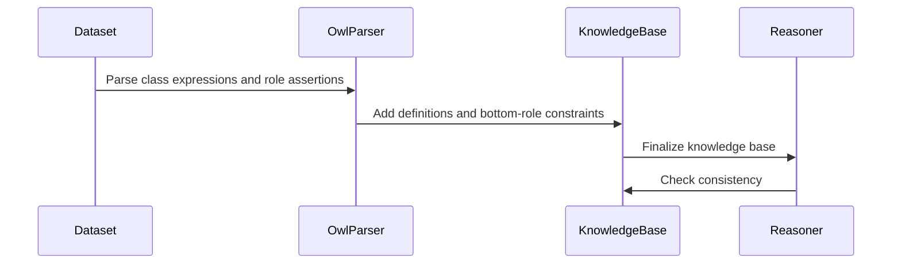

# PR #523 — comments and review threads

7 comment(s). **Every one needs a disposition** in
`review-debt.md`: addressed (with the commit hash) or declined (with the
reason posted in reply). Bot comments count.

## 1. coderabbitai — 

<!-- This is an auto-generated comment: summarize by coderabbit.ai -->
<!-- review_stack_entry_start -->

<!-- review_stack_entry_end -->
<!-- recent_review_start -->

No actionable comments were generated in the recent review. 🎉

<strong>ℹ️ Recent review info</strong>

<dl>
<dd>

<strong>⚙️ Run configuration</strong>

<dl>
<dd>

- **Configuration used**: defaults
- **Review profile**: CHILL
- **Plan**: Team
- **Run ID**: `03a2a226-332b-424a-a4c7-70bf4c5db3ef`

</dd>
</dl>

<strong>📥 Commits</strong>

<dl>
<dd>

Reviewing files that changed from the base of the PR and between 0088bc920d5fefbcf530eccfe2e8484065bf62f8 and db0c0ef158759373f2637d12dcadb01faec58f47.

</dd>
</dl>

<strong>📒 Files selected for processing (3)</strong>

<dl>
<dd>

* `crates/shapes/tests/large_schema_emission.rs`
* `docs/book/po/zh-Hans.po`
* `docs/design/purrdf-simd.md`

</dd>
</dl>

**Included review availability:** This review used your included allowance. 0 included reviews remain after this review. Your included PR review attempts over the past 7 days set your current allowance at 1 review per hour.

</dd>
</dl>

---

<!-- recent_review_end -->
<!-- walkthrough_start -->

<strong>📝 Walkthrough</strong>

<dl>
<dd>

## Walkthrough

The changes extend XSD and OWL reasoning for `dateTimeStamp` and RDF language-string value spaces, and update handling for bottom roles, cyclic class expressions, and the object domain. Schema-surface compilation updates XMLLiteral precision reporting and replaces fixed width caps with checked input-derived bounds. OWL 2 conformance reporting now shows 262 agreeing cases and no ledger entries.

### Changes

**OWL and XSD semantics**

|Layer / File(s)|Summary|
|:---|:---|
|**XSD datatype and range semantics**   `crates/xsd/src/*`, `crates/xsd/tests/data_range.rs`, `crates/sparql-eval/src/expr.rs`|XSD adds `dateTimeStamp`, requires a timezone for its parsing and relevant casts, and models it as a timezone-bearing subset of `dateTime`. The range algebra adds disjoint `rdf:langString` and `rdf:dirLangString` term spaces.|
|**OWL data ranges, roles, and class equations**   `crates/entail/src/entails/datarange.rs`, `crates/entail/src/owl_dl/{constructs,data,graph,mod,oracle,parser}.rs`|OWL range handling recognizes both RDF language-string datatypes. Parsing assigns tagged literals term-specific ranges, constrains mentioned bottom roles, and records finite class-expression cycles as reciprocal GCIs. Graph initialization creates an object-domain witness when no non-concrete object node exists.|
|**Query materialization and reasoner validation**   `crates/entail/src/owl_dl/query.rs`, `crates/entail/tests/reasoner.rs`|Query class-expression definitions and bottom-role constraints are added to the knowledge base before reasoning. Reasoner tests cover the updated datatype, role, domain, and cyclic-expression cases.|
|**OWL 2 verdicts and ledger**   `crates/sparql-conformance/src/owl2.rs`, `crates/sparql-conformance/tests/owl2_conformance.rs`, `README.md`, `docs/*`, `scripts/check-doc-claims.py`, `scripts/conformance-baseline.json`|Conformance checks require all 262 vendored verdicts to agree and the ledger to be empty. The scoreboard, baseline, and documentation report the updated count.|

**Schema surface precision and width**

|Layer / File(s)|Summary|
|:---|:---|
|**XMLLiteral coverage precision**   `crates/shapes/src/{json_schema,schema_surface}.rs`, `crates/shapes/tests/{ontology_schema_surface,owl_value_semantics}.rs`, `crates/shapes/tests/fixtures/iri-only-surface.golden.txt`, `crates/shapes/README.md`|Coverage cells that may admit unchecked XMLLiteral lexical forms are marked `representation_approximation`. Supported exclusion constraints can still produce exact coverage. Tests verify precision and emitted-validator behavior.|
|**Input-derived schema bounds**   `crates/shapes/src/{json_schema,schema_catalog,schema_surface}.rs`, `crates/shapes/src/pydantic/config.rs`, `crates/shapes/README.md`|Several fixed class, property, coverage, and traversal caps are replaced by input-derived limits with checked arithmetic. The shared schema-depth and expression-expansion guards remain.|
|**Large-schema emission and validation**   `crates/shapes/src/{graphql,pydantic,typescript}.rs`, `crates/shapes/benches/schema_surface.rs`, `crates/shapes/tests/large_schema_emission.rs`|TypeScript and GraphQL no longer reject schemas solely for exceeding 65,536 definitions. Tests exercise emission of 65,537 definitions and shared depth limits. Benchmarks separately time compilation and emission.|

<!-- change_assessment_start -->
**Priority:** ➖ Normal

**Estimated code review effort:** 5 (Critical) | ~90 minutes

<!-- change_assessment_commit:"db0c0ef158759373f2637d12dcadb01faec58f47" -->
**Change:** Feature · **Severity of issue fixed:** Medium
<!-- change_assessment_end -->

### Sequence Diagram(s)

**Possibly related PRs**

- [Blackcat-Informatics/purrdf#204](https://github.com/Blackcat-Informatics/purrdf/pull/204): Adds XSD temporal arithmetic and calendar casting, which share the datatype and casting paths extended here.

</dd>
</dl>

<!-- walkthrough_end -->
<!-- final_review_risk_start -->
**Merge Risk:** **⚪ Minimal** · up to `db0c0`
<!-- final_review_risk_coverage:{"sourceCommitId":"db0c0ef158759373f2637d12dcadb01faec58f47","coveredCommitId":"db0c0ef158759373f2637d12dcadb01faec58f47","kind":"reviewed"} -->

No merge-blocking issue is established in the reviewed changes. Complete the pending hosted checks and protected integration.
<!-- final_review_risk_end -->
<!-- pre_merge_checks_walkthrough_start -->

<strong>Pre-merge checks | <picture></picture> 4 | <picture></picture> 1</strong>

<dl>
<dd>

### ❌ Failed checks (1 warning)

|     Check name     |                                              Status                                              | Explanation                                                                                                                                                                                               | Resolution                                                                         |
| :---------------- | :----------------------------------------------------------------------------------------------: | :-------------------------------------------------------------------------------------------------------------------------------------------------------------------------------------------------------- | :--------------------------------------------------------------------------------- |
| Docstring Coverage |  | Docstring coverage is 76.19% which is insufficient. The required threshold is 80.00%. Docstring coverage is scoped to functions touched by this diff. Analyzed 168 functions across 25 files. (2 skipped… | Write docstrings for the functions missing them to satisfy the coverage threshold. |

<strong>✅ Passed checks (4 passed)</strong>

<dl>
<dd>

|         Check name         |                                             Status                                             | Explanation                                                                                                                                                                                               |
| :------------------------ | :--------------------------------------------------------------------------------------------: | :-------------------------------------------------------------------------------------------------------------------------------------------------------------------------------------------------------- |
|      Description Check     |  | Check skipped - CodeRabbit’s high-level summary is enabled.                                                                                                                                               |
|         Title check        |  | The title clearly summarizes the main changes: exact datatype-range support and OWL schema coverage improvements.                                                                                         |
|     Linked Issues check    |  | The current head meets the coding requirements for all active linked issues. [`#451`] adds timezone-required `xsd:dateTimeStamp` handling, exact temporal range operations, casts that retain the target d… |
| Out of Scope Changes check |  | The changes remain within the linked issue scope. The implementation and regression tests address datatype ranges, language literals, XMLLiteral coverage precision, schema limits, and OWL consistency.… |

</dd>
</dl>

<strong>Full details: Docstring Coverage</strong>

<dl>
<dd>

**Explanation**

Docstring coverage is 76.19% which is insufficient. The required threshold is 80.00%. Docstring coverage is scoped to functions touched by this diff. Analyzed 168 functions across 25 files. (2 skipped: 2 unsupported.)

</dd>
</dl>

</dd>
</dl>

<!-- pre_merge_checks_walkthrough_end -->

- [ ] <!-- {"checkboxId":"585bb3f6-faf5-4dbf-96d2-74e382adf19a"} --> Fix all pre-merge checks with AI
<!-- finishing_touch_checkbox_start -->

<strong>✨ Finishing Touches 💡 2</strong>

<dl>
<dd>

<!-- finishing_touch_suggestion:docstrings -->

<strong>📝 Generate docstrings 💡</strong>

<dl>
<dd>
<dl>
<dd>
<dl>
<dd>
<dl>
<dd>
<dl>
<dd>
<dl>
<dd>
<dl>
<dd>

- [ ] <!-- {"checkboxId":"3e1879ae-f29b-4d0d-8e06-d12b7ba33d98"} --> Commit to this branch
- [ ] <!-- {"checkboxId":"7962f53c-55bc-4827-bfbf-6a18da830691"} --> Create a new PR

</dd>
</dl>

</dd>
</dl>

</dd>
</dl>

</dd>
</dl>

</dd>
</dl>

</dd>
</dl>

</dd>
</dl>

<strong>🧪 Generate unit tests (beta)</strong>

<dl>
<dd>

- [ ] <!-- {"checkboxId": "6ba7b810-9dad-11d1-80b4-00c04fd430c8", "radioGroupId": "utg-output-choice-group-unknown_comment_id"} --> Commit to this branch
- [ ] <!-- {"checkboxId": "f47ac10b-58cc-4372-a567-0e02b2c3d479", "radioGroupId": "utg-output-choice-group-unknown_comment_id"} --> Create a new PR

</dd>
</dl>

<!-- finishing_touch_suggestion:fix_ci -->

<strong>🛠️ Fix failing CI checks 💡</strong>

- [ ] <!-- {"checkboxId": "9f0d24fb-b419-4f01-baf0-8b26b6424f34", "radioGroupId": "fix-ci-output-choice-group-6092897012"} --> Commit to this branch
- [ ] <!-- {"checkboxId": "6d21cfe8-ec3f-40e2-9222-b8318b64d3b0", "radioGroupId": "fix-ci-output-choice-group-6092897012"} --> Create a new PR

</dd>
</dl>

<!-- finishing_touch_checkbox_end -->

<!-- autopilot:start -->
- [ ] <!-- {"checkboxId":"2708ad07-9f24-4260-9c11-7dc76a49f2e3"} --> <strong title="Keep fixing CodeRabbit findings and required CI, and resolving merge conflicts">Autofix</strong> · Keep fixing CodeRabbit findings and required CI, and resolving merge conflicts
<!-- autopilot:end -->
<!-- This is an auto-generated comment: all tool run failures by coderabbit.ai -->

> [!WARNING]
> Some tools did not complete. Review the errors below.
> 
> 

> 
<strong>🔧 LanguageTool</strong>

> <dl>
> <dd>
> 
> 

> 
<strong>docs/design/purrdf-simd.md</strong>

> <dl>
> <dd>
> 
> LanguageTool checks are incomplete because the per-file request limit of 5 was reached. Remaining text was skipped; findings from completed checks are retained.
> 
> </dd>
> </dl>
> 

> 
> 
> 

> 
> </dd>
> </dl>
> 

<!-- end of auto-generated comment: all tool run failures by coderabbit.ai -->
<!-- tips_start -->

---

Comment `@coderabbitai help` to get the list of available commands.

<!-- tips_end -->

## 2. paudley — 

# Five-contract schema, datatype and OWL delivery

The accepted scope is the entire bodies/comments of #451, #453, #468, #474 and #476 captured in this Stage directory. This is one complete implementation/acceptance batch and one qualification/publication task, not five per-issue loops. No required behavior is deferred or replaced with recognizing an opaque range.

Repository authority: AGENTS.md, .baseline and .goals; the existing datatype/range, OWL, schema and vocabulary homes. No named governing ADR was found for these owners. Preserve main, sibling worktrees, frozen corpora and normal hooks; add no dependency, Cargo feature, implicit namespace or second algorithm. The deficiency ledger is empty. Required native, portable, generated and full-gate evidence remain distinct from issue closure.

Prior art and recurrence are in prior-art.md, brief.json and prior-art-assessment.md. The fresh #476 brief has bounded last-200-commit coverage and 14 related closed issues; it is not a full historical recurrence census. The complete written proposal and independent plan PASS are in the portfolio Stage schema-five-proposal; source was then reconciled in this isolated successor. All four related issue captures are reused without a second intake.

## Completeness contract

| Issue | Production input and owner | Required executable acceptance | Task |
|---|---|---|---|
| 451 | xsd datatype/value/temporal/range, SPARQL constructor path, OWL literal registration and public range-containment | Direct temporal parser and both existing dispatcher rules require timezone; exact proper dateTime subset/complement/enumeration/cardinality and offset value identity; actual casts preserve requested dateTimeStamp IRI; public Reasoner and verified containment have no spurious boundary | 1 |
| 453 | normalized RDF language/direction term identity, shared XSD listed-set algebra and OWL consumers | Disjoint infinite langString/dirLangString/xsd:string spaces; finite singleton/Boolean/complement/cardinality laws; stored language case/direction identity, real enum/complement/min-cardinality clash and public containment proof; ring fence unchanged | 1 |
| 468 | actual schema compiler coverage cells and unchanged unchecked XMLLiteral lexical branch | Real projected validator admits both balanced and malformed XML strings and coverage says representation_approximation; explicit/external SHACL cells included; actual datatype/nodekind/max0/In/language exclusion controls stay exact and reject XML | 1 |
| 474 | schema graph/seed propagation/coverage and source-byte emitter bounds, existing cached expression reader | Actual public compilation of 65,537 classes and 1,114,129 cells; each of TypeScript/GraphQL/Pydantic emits 65,537 definitions; shared depth refusal and shallow neighbor; report-only scaling benches at 16,384/32,768/65,537 classes; checked arithmetic without five old width caps | 1 |
| 476 | existing OWL RDF parser, graph initialization and finite GCI/cycle calculus | All four frozen published consistency verdicts; full 262 cases with zero ledger and existing RL negative controls; bottom roles/assertions/hierarchy/restrictions, nonempty empty-ABox domain, positive and negative finite cycles and malformed-list/cyclic-data-range refusals | 1 |
| All | affected production/tests/docs and generated projection inputs | Native all-target lint/runtime, useful scaling evidence, portable/WASM, actual golden/conformance regeneration, one settled mandatory full qualification; no closure before normal signed hooks, hosted checks and protected integration | 1–2 |

## Native interface reconciliation

Current base uses the existing resident temporal grammar/dispatcher and SPARQL canonical formatter; #508's new physical ParsedValue/Memory APIs are not on main. The successor extends that same original temporal grammar with parse_datetime_stamp, dispatches the recognized datatype and preserves explicit target IRI in both actual cast branches. Direct parser/dispatcher tests retain all valid and invalid semantic cases. No #508 source is copied. When #508 later combines with this batch its admitted doors must retain the same required-timezone/target-identity law; this is an integration obligation, not a prerequisite for this delivery.

The original expanded-expression occurrence guard remains at MAX_OWL_EXPRESSION_NODES because a shared DAG may expand exponentially. It is separate from the five removed input-width caps. Cached hits charge expanded visits and relative depth before clone; neither that guard nor shared depth substitutes for class/cell/definition counts.

Enhancements declined: exact XML lexical validation (#468 permits honest approximation and the current schema validator deliberately leaves XML unchecked); generalized prepared-clash architecture #499 (not needed for these source contracts); numerical optimization #443/#470 (not needed for exact datatype recognition). These do not omit any acceptance criterion.

## Task 1: Integrate and qualify the entire shared behavior

Implement all five source contracts, actual production callers, complete positive/negative acceptance fixtures and scaling benches before the first focused compilation. Reconcile deltas against current main, preserving both sides and avoiding an alternate implementation. Run one affected-package native all-target compile/lint/runtime batch once admitted resource headroom is available; inspect all failures and repair coherent causes without fixed per-edit ceremony. Run report-only meaningful scaling lanes and actual portable targets. Regenerate the IRI-only current golden through the existing production writer and the conformance scoreboard through the original measured generator; preserve frozen corpus and historical golden bytes.

An independent review covers the applied complete contract and actual evidence once available. One proportional review with concrete findings rechecks, not a new panel. Normal signed commit/push and issue update only after required acceptance is met. Record exact commands/results and any unrun criteria in validation.md and tasks/T1-review.md.

## Task 2: Complete mandatory qualification and protected publication

Aim one settled make check; maximum three full attempts including failures across this coherent delivery. Never bypass or weaken hooks. Qualify the actual base candidate without automatically restarting unrelated checks solely for branch age. Write reviewer-facing PR around complete five-issue resulting behavior, publish the exact plan/evidence and source with normal hooks, use hosted final-head checks, and integrate only through /home/paudley/stage/root/bin/ghprsq. Close all five only when their full contracts and protected merge are proven. Preserve donors until their own durable archive/successor acceptance allows cleanup.

Resource status: the private four-job/16GiB/no-swap lane has qualified affected Clippy/native acceptance, all262 OWL cases and RL controls, unchanged proof digests, all five large-schema tests, current golden/difference assertions, twelve original scaling lanes, actual XSD/shapes portable execution, complete measured scoreboard and governed metadata2. The actual37e3a26a7 base delta and numeric documentation-checker correction are independently accepted. Task1 has an independent PASS in tasks/T1-review.md. Required full make check1 is TERMINAL PASS on that combined source, ledger1/3, including all workspace tests/doctests and all31 release WASM crates. Normal signed hooks and push PASS at commit0088bc920; PR523 is open. Its actual merge-tree prediction equals the qualified committed tree. Hosted checks, fresh review debt and protected merge remain pending. Exact current results are in validation.md.

## 3. paudley — 

The least certain result is performance beyond the measured schema dimensions.
The twelve original ten-sample lanes exercise 16,384, 32,768 and 65,537 classes
with increasing property width; the exact confidence records are retained.
These measurements establish actual successful scaling at those inputs, without
claiming a matched before/after speedup or an asymptotic bound from three sizes.

Consumers should know that a generated schema can admit XMLLiteral text without
checking XML well-formedness. Its coverage now reports representation_approximation
where that admission remains possible. The executable neighbors check both
balanced and malformed XML, including member-count and effective-severity cases,
so an exact exclusion claim follows the constraints the projection actually
enforces.

The complete measured scoreboard writer, governed metadata and mandatory
make check have passed. Normal signed hooks and push have also passed.
Hosted checks and protected integration remain pending on PR523 and are
tracked separately through their actual outcomes.

## 4. paudley — 

The complete five-issue implementation and mandatory local qualification remain intact. This bounded feedback pass corrects the actual hosted Book failure and strengthens the accepted-depth fixture identified in review. Production algorithms, depth guards, corpora, frozen proof identities and all five accepted contracts stay unchanged.

1. Refresh the three stale zh-Hans source messages through the original book-po-update/msgmerge home and translate the complete current paragraphs. Preserve the excluded-corpus scope and other-suite ledger limits. Run actual check-i18n with all original poisoned-catalogue controls plus both English/Chinese book builds; sign and push with normal hooks. This step is PASS at30825eede.
2. Read the actual shared JSON catalog and all three emitters' depth gates. The fixture opens five base containers and two more per allOf wrapper. Replace the shallow success with the deepest accepted fixture member, test the immediately following member's refusal, preserve the old deep refusal and require all two definitions to be emitted by each accepted production call. Run strict affected-target Clippy and the entire original large_schema_emission native target together, then sign/push normally and reply/resolve the review thread only after actual proof.

The original full make check1 evidence remains applicable to unchanged production source, with its ledger at1/3. The affected documentation/acceptance changes have their own real checks; no blanket full-gate repetition substitutes for those checks. Independent review reuses the complete prior audit and adjudicates this delta and current hosted feedback. Hosted final-head checks, fresh review-debt disposition and protected integration remain separate required phases.

## 5. paudley — 

Both concrete feedback findings are corrected and pushed on PR #523 with normal signing and hooks.

Commit30825eede refreshes and genuinely translates the three changed Chinese source messages through the original gettext producer. Actual make check-i18n book book-zh passes: every original poisoned-catalogue arm, all six rendering gates, zero fuzzy/untranslated/template drift, and both English and Chinese HTML book builds. The excluded-corpus scope and other-suite ledger limitations are preserved.

Commit978b9e1f6 replaces the shallow depth success with the deepest accepted member of the actual fixture family. Its five base JSON containers and two per wrapper yield61 accepted wrappers and62 immediately refused under the unchanged128 cap. Each of TypeScript, GraphQL and Pydantic must actually emit both definitions at61 and return the exact shared nesting-limit error at62; the prior deeper refusal is retained. Strict affected-target Clippy and the entire original large_schema_emission target pass, all five tests.

These documentation/acceptance changes preserve production algorithms and guards. The original complete native/portable acceptance and mandatory make check1 remain applicable to unchanged production source; its ledger stays1/3. Independent review has adjudicated these deltas. Hosted final-head checks, fresh review-debt disposition and protected integration remain required and pending; none of the five issues is counted closed before the actual merge.

## 6. paudley — 

The aggregate Docstring Coverage suggestion is declined as a request for
percentage-driven documentation changes to private and test helpers. It names
no missing public API contract. The new `XsdDatatype::DateTimeStamp` variant and
`parse_datetime_stamp` entry point both document the required timezone, and
the required warning-free workspace gate and documentation checks pass.
Concrete documentation defects remain actionable; a touched-function percentage
alone does not identify one. This does not waive any repository documentation
gate or change its configuration.

The concrete accepted-depth review finding is addressed separately in
`978b9e1f6`: all three emitters accept depth61 with both definitions, refuse the
immediate depth62 neighbor and retain the original depth128 refusal. Strict
affected lint and all five original large-schema tests pass; the inline evidence
reply records those actual results and the thread is resolved.

## 7. paudley — 

Complete exact datatype ranges and OWL schema coverage

Timezone-required dateTimeStamp and normalized RDF language/direction values
participate in exact datatype ranges, complements, enumerations, cardinality and
OWL reasoning. Calendar casts preserve the requested datatype identity. The
OWL fixes preserve finite cyclic class definitions, enforce bottom roles and
require a nonempty abstract domain; every published consistency verdict agrees
with an empty divergence ledger.

Schema compiler and TypeScript/GraphQL/Pydantic width bounds derive from input
dimensions. The shared depth and expanded-expression occurrence guards remain
enforced, including cached expansions. Every schema cell that can admit unchecked
XMLLiteral text reports representation_approximation. Exclusion proofs use the
constraints the actual projection enforces, including severity and member-count
neighbors. No new XML parser, vocabulary fallback, dependency or semantic feature
was introduced.

All five full accepted contracts are retained. Original public/native fixtures,
frozen corpora, historical golden bytes and proof identities remain guarded.
The current schema golden changes five precision labels through its existing
production writer; the complete measured scoreboard and governed documentation
are regenerated from actual outcomes.

Focused qualification passes: all affected all-target Clippy; settled native
matrix; 262 consistency verdicts, 50 RL cases and 23 negative controls; both
frozen proof digests; five large-schema/depth cases; twelve original ten-sample
compiler/emitter scaling lanes through 65,537 classes and 1,114,129 cells;
actual XSD3/shapes9 WASM execution; complete measured conformance writer with
16,324 passes and zero failures; and metadata with 154 claims and 35 license
profiles. Scaling evidence is specific to the measured dimensions and host; it
does not claim a matched before/after speedup or a general asymptotic result.

Mandatory full make check1 is terminal PASS on its first attempt, including all
workspace tests/doctests and all31 release WASM crates. Normal signed hooks and
push PASS through final head db0c0ef1587. The later Chinese catalog correction
passes real translation/rendering/book gates. The accepted-depth fixture now
executes61 accepted,62 refused and the original deeper refusal under unchanged
128, through all three emitters; strict affected lint and all five tests PASS.
The generated SIMD correction comes from the original hosted compiler/writer:
111 sites across all seven configurations, matching successful aggregate, two
schema cells11→10 and6→5, with no source, threshold or manifest changes.

Current hosted acceptance is complete:48 SUCCESS, five conditional SKIPPED,
zero failures or pending. The RISC-V job's original toolchain-download timeout
was before compilation; its failed-only retry passes. Successful qualification
was preserved. The actual hosted workspace checks out eb8f0a5dc, merging source
db0c0ef1587 into accepted main3ac169b96, with tree61c97af6a9c4eda02fd9a86f686dff2c302f5010.
That matches the clean integration candidate. Shared MIME/core/book/claims/SIMD
consumers are covered by actual combined hosted qualification; there is no
unnecessary source synchronization or repeated full Rust gate for branch age.

Distinct final review-debt judgment PASS and qualifying independent complete
contract audit apply to this final source and integration tree. All six comments,
three reviews and the resolved/outdated inline thread are captured completely.
The depth finding is fixed, not declined. Percentage-only private/test docstring
churn was declined with its reason actually posted, while required public API
documentation and real gates remain intact. No accepted behavior is deferred,
stubbed, waived or moved to another issue.

The authoritative plan and selected evidence directory are
.stage/owl-2-dl-close-the-four-ledgered-w3c. The actual37e3a26a7 base assessment
preserves both sides of the retrieval/access-cost addition and reuses qualifying
unchanged focused acceptance. The final3ac/db0c integration assessment and actual
hosted test-merge proof are indexed in validation.md. Selected188 MiB evidence
retains all required original seven-configuration manifests/reports/assembly,
local/portable/scale/full logs and complete final feedback without symlinks.
No conflicts require resolution. Existing datatype, term, canonical hash,
schema, evaluator and generator homes are reused; no runtime dependency or
semantic feature is added, and every required hook ran normally.

Defect-Class: none

Closes #451
Closes #453
Closes #468
Closes #474
Closes #476

