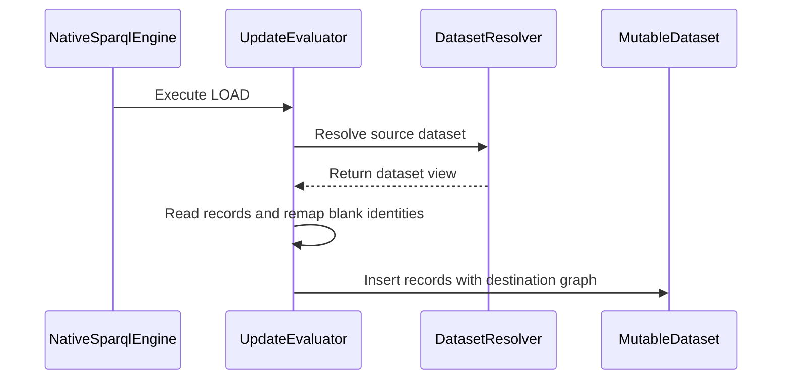

# PR #507 — comments and review threads

5 comment(s). **Every one needs a disposition** in
`review-debt.md`: addressed (with the commit hash) or declined (with the
reason posted in reply). Bot comments count.

## 1. coderabbitai — 

<!-- This is an auto-generated comment: summarize by coderabbit.ai -->
<!-- review_stack_entry_start -->

<!-- review_stack_entry_end -->
<!-- This is an auto-generated comment: rate limited by coderabbit.ai -->

> [!WARNING]
> ## Review limit reached
> 
> Your organization has reached its usage spending cap. Adjust your spending cap in the [billing tab](https://app.coderabbit.ai/settings/billing?tab=usage&orgId=b268aba6-a194-4fd6-8ca5-f1a13a313209).
> 
> **Next included review available in 41 minutes.**
> 
> [Check out review usage here](https://app.coderabbit.ai/dashboard/review-capacity?orgId=b268aba6-a194-4fd6-8ca5-f1a13a313209).
> 
> 

> 
View limit details

> 
> **Limit details:** You’ve used the included review currently available. Your 119 included PR review attempts over the past 7 days set your current allowance at 1 review per hour.
> 
> [Learn how review limits work](https://docs.coderabbit.ai/management/plans#rate-limits).
> 
> **Review configuration:**
> 
> 

> 
⚙️ Run configuration

> 
> - **Configuration used**: defaults
> - **Review profile**: CHILL
> - **Plan**: Team
> - **Run ID**: `929dfd23-3f8a-42f4-a634-2455d0c867b6`
> 
> 

> 
> 

> 
📥 Commits

> 
> Reviewing files that changed from the base of the PR and between 20e2e637cd7bee8c18ed80f15a2b4397155f489d and be3fdeb84d77c1bfd5210347079a494eb96fe7c8.
> 
> 

> 
> 

> 
📒 Files selected for processing (1)

> 
> * `crates/rdf-core/src/ir/mutable.rs`
> 
> 

> 
> 

<!-- end of auto-generated comment: rate limited by coderabbit.ai -->

<!-- walkthrough_start -->

📝 Walkthrough

## Walkthrough

The RDF IR now represents ordinary, reifier, and annotation records as distinct physical records. Mutable datasets preserve those roles through insertion, removal, snapshots, and freezing. SPARQL UPDATE transfers retain record roles, and LOAD remaps blank identities in imported records.

### Changes

**Typed RDF record handling**

|Layer / File(s)|Summary|
|:---|:---|
|**Record types, validation, and import/export**   `crates/rdf-core/src/ir/{builder.rs,import.rs,mod.rs,validate.rs}`, `crates/rdf-core/src/lib.rs`|Adds public record-kind and record-value types, validation before interning, and functions to insert and export typed records.|
|**Typed mutable membership and classification**   `crates/rdf-core/src/ir/mutable.rs`|Tracks records by role, classifies records around reifier declarations, and updates mutation metrics and graph lifetime.|
|**Role-aware snapshots and delta views**   `crates/rdf-core/src/ir/mutable.rs`, `crates/rdf-core/src/ir/mutable/delta_view.rs`|Carries typed suppression and conversion masks through snapshots and delta views. Tests cover typed replay, frozen records, and admission limits.|
|**Typed UPDATE transfers and LOAD remapping**   `crates/sparql-eval/src/update.rs`, `crates/sparql-eval/tests/update_typed_records.rs`, `crates/sparql-eval/Cargo.toml`|Transfers records with their roles. LOAD remaps blank identities, including identities in nested terms and composite literals. Tests cover graph transfers, identity separation, and fuel accounting.|

<!-- change_assessment_start -->
**Priority:** ➖ Normal

**Estimated code review effort:** 4 (Complex) | ~60 minutes

<!-- change_assessment_commit:"20e2e637cd7bee8c18ed80f15a2b4397155f489d" -->
**Change:** Bug fix
<!-- change_assessment_end -->

### Sequence Diagram(s)

<!-- walkthrough_end -->
<!-- final_review_risk_start -->
**Merge Risk:** **🔵 Low** · up to `20e2e`
<!-- final_review_risk_coverage:{"sourceCommitId":"20e2e637cd7bee8c18ed80f15a2b4397155f489d","coveredCommitId":"20e2e637cd7bee8c18ed80f15a2b4397155f489d","kind":"reviewed"} -->

Typed record handling and the LOAD identity remapping look sound. In one narrow sequence of edits, declaring and then undoing a reifier can leave the insertion order of records nondeterministic. A small follow-up fix is advisable, but the change is otherwise mergeable.
<!-- final_review_risk_end -->
<!-- pre_merge_checks_walkthrough_start -->

🚥 Pre-merge checks | ✅ 4 | ❌ 1

### ❌ Failed checks (1 warning)

|     Check name     |                                              Status                                              | Explanation                                                                                                                                                                                               | Resolution                                                                         |
| :---------------- | :----------------------------------------------------------------------------------------------: | :-------------------------------------------------------------------------------------------------------------------------------------------------------------------------------------------------------- | :--------------------------------------------------------------------------------- |
| Docstring Coverage |  | Docstring coverage is 44.17% which is insufficient. The required threshold is 80.00%. Docstring coverage is scoped to functions touched by this diff. Analyzed 120 functions across 9 files. (1 skipped:… | Write docstrings for the functions missing them to satisfy the coverage threshold. |

✅ Passed checks (4 passed)

|         Check name         |                                             Status                                             | Explanation                                                                                                                                                                                               |
| :------------------------ | :--------------------------------------------------------------------------------------------: | :-------------------------------------------------------------------------------------------------------------------------------------------------------------------------------------------------------- |
|      Description Check     |  | Check skipped - CodeRabbit’s high-level summary is enabled.                                                                                                                                               |
|         Title check        |  | The title clearly and concisely describes the two primary changes: preserving RDF 1.2 record roles and generating fresh identities during LOAD.                                                           |
|     Linked Issues check    |  | Direct issue `#401` has coding requirements. `LOAD` remints blank identities per request and covers nested terms and CDT-embedded blanks. `ADD`, `COPY`, and `MOVE` transfer typed records and preserve or… |
| Out of Scope Changes check |  | The changes stay within issue `#401`. Mutable dataset role tracking, validation, delta handling, builder/import APIs, evaluator transfer logic, and integration tests support typed record preservation or… |

Full details: Docstring Coverage

**Explanation**

Docstring coverage is 44.17% which is insufficient. The required threshold is 80.00%. Docstring coverage is scoped to functions touched by this diff. Analyzed 120 functions across 9 files. (1 skipped: 1 unsupported.)

<!-- pre_merge_checks_walkthrough_end -->
<!-- finishing_touch_checkbox_start -->

✨ Finishing Touches 💡 1

<!-- finishing_touch_suggestion:docstrings -->

📝 Generate docstrings 💡

- [ ] <!-- {"checkboxId":"3e1879ae-f29b-4d0d-8e06-d12b7ba33d98"} --> Commit to this branch
- [ ] <!-- {"checkboxId":"7962f53c-55bc-4827-bfbf-6a18da830691"} --> Create a new PR

🧪 Generate unit tests (beta)

- [ ] <!-- {"checkboxId": "6ba7b810-9dad-11d1-80b4-00c04fd430c8", "radioGroupId": "utg-output-choice-group-unknown_comment_id"} --> Commit to this branch
- [ ] <!-- {"checkboxId": "f47ac10b-58cc-4372-a567-0e02b2c3d479", "radioGroupId": "utg-output-choice-group-unknown_comment_id"} --> Create a new PR

<!-- finishing_touch_checkbox_end -->

<!-- autopilot:start -->
- [ ] <!-- {"checkboxId":"2708ad07-9f24-4260-9c11-7dc76a49f2e3"} --> <strong title="Keep fixing CodeRabbit findings and required CI, and resolving merge conflicts">Autopilot</strong> · Keep fixing CodeRabbit findings and required CI, and resolving merge conflicts
<!-- autopilot:end -->
<!-- tips_start -->

---

Comment `@coderabbitai help` to get the list of available commands.

<!-- tips_end -->

## 2. paudley — 

# Typed RDF transfer and document-local LOAD identity

Authorized portfolio delivery: additive foundation for issue 401, followed promptly
by the separate v4 remembered-graph default adaptation (471). Do not combine the
breaking default with the additive semver qualification. Entire portfolio remains
authorized; LargeRDFBench and all external-repository submissions are excluded.

Base is current main aab23cbf2. Existing opt-in remembered graph, typed importer,
term folds, CDT blank rewriting, governor and blank minting homes are retained.
The prior three public-path defect witnesses remain preparation, not current-head
correctness evidence. Inspect current source and turn them into failing-first tests.
No governing ADR or constitution was discovered in the repository file inventory;
AGENTS.md, .baseline, .goals and helpers-ledger.toml govern this work.

Detailed design and concrete acceptance fixtures are in
tasks/typed-transfer-design.md. Its additive 401 phase is part of this plan;
its later v4 phase describes sequencing, not a cut from 401 requirements.
The pre-change source used flat QuadKey added/suppressed sets and LOAD obtained
QuadValues from a mutable wrapper. Task1 is committed and pushed at b0fc9e889;
its role-aware storage and probe-order preservation are independently reviewed.
Task2 is committed and pushed at 20e2e637c on the same branch, wiring typed
transfers and document-local LOAD identities through the production engine.

## Completeness contract

| Requirement | Task | Executable acceptance |
|---|---|---|
| Additive typed physical record API and exact role preservation | 1 | Public builder/mutable insertion, role-specific removal/restoration, equal-value cross-role fixtures; snapshot and freeze tables match exact kinds and counts after each transition. |
| Preserve untyped mutation/classification and graph lifetime | 1 | Existing mutable/delta/import/graph-existence tests plus base+delta, promotion/demotion, same-kind dedup, cross-role collision, clone/retained snapshot and net-zero graph transitions in both explicit modes. |
| ADD/COPY/MOVE preserve ordinary/reifier/annotation roles | 2 | NativeSparqlEngine::update on default/named source/destination, orphan annotations and overlapping physical rows; exact typed frozen tables, source blanks unchanged, self/missing/empty neighbours. On error/trip the production engine leaves the caller Arc unchanged; internal mutable operation ordering remains intact. |
| Every successful LOAD gets fresh blank identity | 2 | Same cached Arc and IRI loaded twice and across requests; same label at different source scopes, bare/nested-triple/CDT List/Map co-reference within a document and separation between documents; suppressed/unused/CDT-only destination identities cannot collide. |
| Errors, cancellation and governed physical attempts remain truthful | 2 | Existing LOAD SILENT/resolver/stop tests and new valid/refused neighbours; charge original physical rows before dedup, successful empty named LOAD remembers destination, failed/canceled resolution publishes no rows or declaration. |
| Public API purely additive | 3 | Actual cargo semver-checks against pre-change base for affected public crates, without weakening exclusions or changing v4 default in this delivery. |
| Full required native and WASM qualification | 3 | One settled make check and make wasm qualification (reuse actual equivalent hosted gates only where issue/repository permit); meaningful actual native update execution and affected WASM runtime parity. |
| Normal publication, independent acceptance, merge and cleanup | 4 | Normal hooks/commit/push, full PR feedback dispositions, current required CI, integration assessment, completion audit, ghprsq archived evidence, remote merged state and own-worktree cleanup. |

## Task 1: Role-aware mutable storage and typed snapshots

Add RecordKind/RecordValues next to QuadValues, retain existing DatasetMut APIs.
Represent physical membership and suppression by kind+value; maintain exact row
counts, graph live counts, ordinal ordering and delta view admission.
Preserve public added_len/suppressed_len value-key metrics for existing callers:
cross-role equal-value suppressions still count as one value, with physical role
cardinality maintained separately for effective rows and retained-view accounting.
Test overlapping base-role removal/restoration explicitly; do not replace these
metrics with physical record lengths silently. Maintain counts in the mutation
owner rather than allocating a set each time a public metric is read.
Reuse builder validation and import traversal, normalize ordinary classification in its owner,
and remove lazy duplicate classification from delta publication. Typed ingress is
exact and must never infer a different role. Preserve source locations/sidecars and
freeze through the existing importer. Implement failing-first semantic regressions
and meaningful state-machine/property neighbours, review independently, then normal
commit/push and issue update for this coherent unit.

## Task 2: Wire typed transfers and fresh LOAD through production Update

Use an owned typed source snapshot before destination mutation. Retain ADD/COPY/MOVE
admission ordering, physical governor charging, destination clearing, source removal
and declaration semantics in both modes. LOAD shares the request blank counter and
destination prefix, uses a fresh pair-keyed map for each successful resolution,
rewrites triple/CDT identities through existing iterative homes, and prepares the
translated document before publication. Preserve SILENT and cancellation laws.
Run the full affected native update/core/CDT/governor controls and valid neighbours;
independent review, normal commit/push and issue update.

At the internal operation layer, COPY/MOVE can modify their private branch before
a later charge fails. The production engine publishes only after complete success
and drops the branch on every error/trip, leaving the caller's original Arc intact.
Preserve that actual boundary; internal prefix state is never a public partial success.

## Task 3: Qualify the complete additive foundation

Run actual additive semver checks and required settled native/WASM gates; retain
failures honestly, repair owning defects and rerun only invalidated coverage.
Record one full workflow qualification in validation.md. Use managed nightly SDK,
production profiles, bounded jobs/memory and private output directories; no sibling
process or cache mutation. Complete independent implementation audit against every
row and literal issue body. No implementation requirement may be deferred, stubbed,
silently omitted or counted satisfied by refusal.

## Task 4: Publish and integrate without branch accumulation

Open one focused PR for the fully qualified 401 foundation; post plan and evidence,
resolve actual feedback, assess the fresh merge-tree candidate against main, and
merge with ghprsq when required gates are green. Preserve selected Stage evidence
separately from source and remove only this merged worktree/branch. Then adapt 471
on the landed foundation; preserved dirty sibling files remain untouched until
their owning adaptation. No external-repository submission is authorized.

## Design choices and costs

Explicit record kinds increase membership/index width but are necessary to preserve
three physical RDF surfaces. Keep indexed role probes rather than full base scans.
LOAD needs one per-document blank map and translated snapshot; charge and bound
physical work at existing governor homes. Do not create a second classifier,
blank-token scanner, flattened freezer, recursive mapper or speculative compatibility
engine. Do not globally switch graph defaults during additive qualification.

Current status: Tasks1/2 are implemented, independently reviewed, committed and
pushed. Actual additive API comparison and all ten portable WASM runtime cases
pass. The first full CI=1 make check terminated2 under controller86259: three
helper-census temporary-directory controls failed because the private Cargo
output root lacks CACHEDIR.TAG. The original failure is retained. Owning setup
correction and focused all-six policy proof completed. Mandatory retry38424
now terminates0, including full native workspace/consumer/kernel gates and
actual nested all-release make wasm. Original failure remains retained;
independent Task3 closure is PASS against those actual receipts. Task4 is active:
PR507 is OPEN on the pushed20e2e637c source, current hosted CI/review and
integration/merge/archive/cleanup remain pending.
The current acceptance index is validation.md; historical defect witnesses remain
failing-behavior evidence, not current-head correctness evidence.

## 3. paudley — 

# Publication answers and evidence preparation

Least confidence: throughput of very large LOAD documents is not established by
a matched throughput benchmark in this delivery. The implementation uses one
document-local blank map, prepares the document before publication and selects
transfer records through native indexes before owned projection. Actual
correctness, governor refusal and native/WASM identity demonstrations are retained;
they do not claim a measured large-corpus performance improvement.

What the user should know: graph existence policy and physical record identity are
separate. This additive delivery repairs all three physical roles in both modes
and preserves the current default. The next planned breaking delivery changes
the default and carries explicit opt-out across each real language surface.

Selected evidence contains ordinary files and no symlinks. Completed API/WASM,
original failed full gate, legitimate setup correction and successful required
full retry commands/outputs/exits are retained under tasks/T3-logs. Both required
local implementation and independent qualification gates pass. Hosted CI,
complete current PR feedback and fresh integration/merge/archive/cleanup remain
pending. No build outputs are intended for the selected archive; squash content
remains a draft until its binding integration gates pass.

## 4. paudley — 

# PR507 ordering remediation

The sole current review finding is valid: classification overwrites the insertion ordinal of an independently authored annotation when its source is a delta ordinary record. Undo then leaves duplicate ordinals. The base-origin regression did not exercise this branch.

Use the lightweight Stage 2 path for this bounded three-line correction within the independently reviewed classification design. Retain the complete T1/T2/T3 contract assessment and actual execution evidence; recheck affected ordering, mutable ownership and production UPDATE paths, with one independent reviewer covering the changed behavior and evidence reuse. Escalate if those checks expose wider effects.

1. Add a delta-origin regression with an interleaved annotation, preserving target order before/during/after classification and checking ordinal uniqueness after undo. The failing-first run is recorded in tasks/T4-ordinal-before.log and .exit (101, expected ordinal 2, actual 0).
2. Remove the unconditional ordinal minimum rewrite. insert_record_rows already assigns the supplied ordinal when it creates the target; an independent existing target retains its own ordinal.
3. Run core library and immutable shared-view controls, public native UPDATE typed-record cases, their WASM runtime counterpart, strict affected lint and formatting. Reuse the earlier full qualification for unchanged contracts, explicitly retaining its original tested tree and setup-failure/retry history. Fresh hosted CI must qualify the updated PR head.
4. Independent reviewer adjudicates the delta and current index, then normal hooks/commit/push publish this one coherent fix. Post actual evidence to issue and PR and resolve the underlying review thread after publication.
5. Refresh current CI, complete feedback and merge-tree assessment. Finalize and integrate only through ghprsq, then clean up this delivery and proceed with remembered-graph defaults.

No contract is cut or deferred. Local regression repair is not hosted CI or completed integration.

## 5. paudley — 

The docstring percentage warning is acknowledged as an advisory, not a passed check. The new public record types, fields and ingress/removal/export contracts are documented, including errors and graph/role behavior. The repository's strict documentation/build gates passed. I am declining cosmetic documentation of private/test bodies solely to reach the bot's proposed percentage.

The optional generated-test/autofix/CLI offers are also declined. The owning delta-origin regression reproduced the real ordinal defect, and the existing production native/WASM controls cover the affected path. Their actual results and the fix are being published separately; no original golden, admission rule or hook has been weakened.

