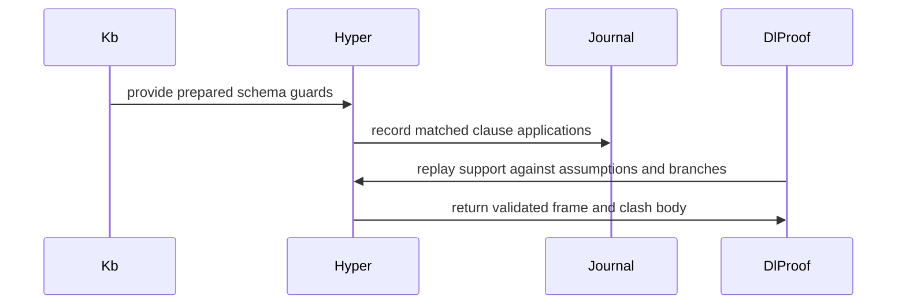

# PR #527 — comments and review threads

7 comment(s). **Every one needs a disposition** in
`review-debt.md`: addressed (with the commit hash) or declined (with the
reason posted in reply). Bot comments count.

## 1. coderabbitai — 

<!-- This is an auto-generated comment: summarize by coderabbit.ai -->
<!-- review_stack_entry_start -->

<a href="https://app.coderabbit.ai/change-stack/Blackcat-Informatics/purrdf/pull/527?scope=ghh_OusAJGA4HG8ljoOV0wJvVx8NmnZIjc2DdjmxOu0xZWA&amp;cs_source=review_comment"><picture><source media="(prefers-color-scheme: dark)" srcset="https://storage.googleapis.com/coderabbit_public_assets/review-stack-in-coderabbit-ui-dark.svg?v=3"><source media="(prefers-color-scheme: light)" srcset="https://storage.googleapis.com/coderabbit_public_assets/review-stack-in-coderabbit-ui.svg?v=3"></picture></a>

<!-- review_stack_entry_end -->
<!-- This is an auto-generated comment: rate limited by coderabbit.ai -->

> [!WARNING]
> ## Review limit reached
> 
> Your organization has reached its usage spending cap. Adjust your spending cap in the [billing tab](https://app.coderabbit.ai/settings/billing?tab=usage&orgId=b268aba6-a194-4fd6-8ca5-f1a13a313209).
> 
> **Next included review available in 40 minutes.**
> 
> [Check out review usage here](https://app.coderabbit.ai/dashboard/review-capacity?orgId=b268aba6-a194-4fd6-8ca5-f1a13a313209).
> 
> 

> 
<strong>View limit details</strong>

> <dl>
> <dd>
> 
> **Limit details:** You’ve used the included review currently available. Your 109 included PR review attempts over the past 7 days set your current allowance at 1 review per hour.
> 
> [Learn how review limits work](https://docs.coderabbit.ai/management/plans#rate-limits).
> 
> **Review configuration:**
> 
> 

> 
<strong>⚙️ Run configuration</strong>

> <dl>
> <dd>
> 
> - **Configuration used**: defaults
> - **Review profile**: CHILL
> - **Plan**: Team
> - **Run ID**: `440f8a96-7ddf-4b8c-9b23-e0130910a096`
> 
> 
> 

> 
> </dd>
> </dl>
> 

> 
> 

> 
<strong>📥 Commits</strong>

> <dl>
> <dd>
> 
> Reviewing files that changed from the base of the PR and between b40c598a671c0baf3126b6930f0f165ffac66fc5 and 41a224bd006695b12e86ddd742a5fe256616bcf4.
> 
> 
> 

> 
> </dd>
> </dl>
> 

> 
> 

> 
<strong>📒 Files selected for processing (1)</strong>

> <dl>
> <dd>
> 
> * `crates/entail/src/owl_dl/support.rs`
> 
> </dd>
> </dl>
> 

> 
> 
> 

> 
> </dd>
> </dl>
> 

<!-- end of auto-generated comment: rate limited by coderabbit.ai -->

<!-- recent_review_start -->

No actionable comments were generated in the recent review. 🎉

<strong>ℹ️ Recent review info</strong>

<dl>
<dd>
<dl>
<dd>

<strong>⚙️ Run configuration</strong>

<dl>
<dd>
<dl>
<dd>

- **Configuration used**: defaults
- **Review profile**: CHILL
- **Plan**: Team
- **Run ID**: `388c1f64-0d62-454f-af3c-5e32234fdff3`

</dd>
</dl>

</dd>
</dl>

<strong>📥 Commits</strong>

<dl>
<dd>
<dl>
<dd>

Reviewing files that changed from the base of the PR and between d5ee0c862536b97dcba3bf0e8b55c28d641f077d and b40c598a671c0baf3126b6930f0f165ffac66fc5.

</dd>
</dl>

</dd>
</dl>

<strong>📒 Files selected for processing (5)</strong>

<dl>
<dd>
<dl>
<dd>

* `crates/entail/src/owl_dl/bounds.rs`
* `crates/xsd/src/bigint.rs`
* `crates/xsd/src/exact/decimal.rs`
* `crates/xsd/src/exact/integer.rs`
* `crates/xsd/tests/range_storage.rs`

</dd>
</dl>

</dd>
</dl>

**Included review availability:** This review used your included allowance. 0 included reviews remain after this review. Your included PR review attempts over the past 7 days set your current allowance at 1 review per hour.

</dd>
</dl>

</dd>
</dl>

---

<!-- recent_review_end -->
<!-- walkthrough_start -->

<strong>📝 Walkthrough</strong>

<dl>
<dd>

<strong>📝 Walkthrough</strong>

<dl>
<dd>

## Walkthrough

The change prepares class-level cardinality contradictions and adds guards that require current class membership. It adds bounded preparation and support recording, replayable clash evidence, preparation-status APIs, proof-format updates, and tests and vectors for schema-preparation behavior.

### Changes

**Schema cardinality preparation**

|Layer / File(s)|Summary|
|:---|:---|
|**Budgeted range and allocation support**   `crates/lex/src/walk.rs`, `crates/xsd/src/*`, `crates/entail/src/interner.rs`, `crates/entail/src/owl_dl/concept.rs`, `crates/entail/src/owl_dl/data.rs`|Adds fallible storage and exact numeric operations, plus lookup helpers used by preparation.|
|**Prepare class bounds and evidence**   `crates/entail/src/owl_dl/bounds.rs`, `crates/entail/src/owl_dl/{mod.rs,parser.rs}`|Derives class implications and compatible restriction bounds. Contradictions retain evidence and membership guards; budget or allocation limits record an obstruction.|
|**Connect preparation to entailment**   `crates/entail/src/owl_dl/{clause.rs,hyper.rs}`|Clause access includes the prepared guard suffix. Hypertableau matching and trigger lookup use the schema-aware clause APIs.|
|**Fire guards and record current support**   `crates/entail/src/owl_dl/{graph.rs,hyper.rs,support.rs}`|Recording captures bounded clause applications and branch context. Support replay checks recorded applications against assumptions, frames, and branches.|
|**Verify and encode prepared clashes**   `crates/entail/src/owl_dl/proof*`|Prepared-clash replay checks bound evidence and support. The proof codec adds v4 fields for schema evidence and recording obstructions while retaining v3 for proofs without them.|
|**Expose preparation status and verify service proofs**   `crates/entail/src/reasoner/*`|Reasoner APIs expose preparation budgets, statistics, bounds, and retries. Certificates and service receipts carry typed obstructions; service proof checks validate schema-evidence runs.|
|**Validate outputs and resource boundaries**   `crates/entail/README.md`, `crates/entail/tests/*`, `crates/validate/*`, `crates/rdf-capi/src/entail.rs`, `bindings/python/tests/test_entail_reasoning.py`, `crates/hash/README.md`|Adds schema-preparation tests, vectors, certificate parsing and rendering, proof-vector expectations, and documentation. The tests include budget, retry, stop, boundary, proof-replay, and scaling cases.|

<!-- change_assessment_start -->
**Priority:** ➖ Normal

**Estimated code review effort:** 5 (Critical) | ~120 minutes

<!-- change_assessment_commit:"b40c598a671c0baf3126b6930f0f165ffac66fc5" -->
**Change:** Feature
<!-- change_assessment_end -->

### Sequence Diagram(s)

</dd>
</dl>

</dd>
</dl>

<!-- walkthrough_end -->
<!-- final_review_risk_start -->
**Merge Risk:** **⚪ Minimal** · up to `b40c5`
<!-- final_review_risk_coverage:{"sourceCommitId":"b40c598a671c0baf3126b6930f0f165ffac66fc5","coveredCommitId":"b40c598a671c0baf3126b6930f0f165ffac66fc5","kind":"reviewed"} -->

The change prepares class-level cardinality contradictions once per class. Each guard fires only when an individual is currently a member of the class, and the existing checker independently validates the evidence. No concrete defect was established, so the change appears ready to merge once the pending hosted CI passes.
<!-- final_review_risk_end -->
<!-- pre_merge_checks_walkthrough_start -->

<strong>Pre-merge checks | <picture></picture> 4 | <picture></picture> 1</strong>

<dl>
<dd>
<dl>
<dd>

### ❌ Failed checks (1 warning)

|     Check name     |                                              Status                                              | Explanation                                                                                                                                                                                   | Resolution                                                                         |
| :---------------- | :----------------------------------------------------------------------------------------------: | :-------------------------------------------------------------------------------------------------------------------------------------------------------------------------------------------- | :--------------------------------------------------------------------------------- |
| Docstring Coverage |  | Docstring coverage is 55.70% which is insufficient. The required threshold is 80.00%. Docstring coverage is scoped to functions touched by this diff. Analyzed 307 functions across 31 files. | Write docstrings for the functions missing them to satisfy the coverage threshold. |

<strong>✅ Passed checks (4 passed)</strong>

<dl>
<dd>
<dl>
<dd>

|         Check name         |                                             Status                                             | Explanation                                                                                                                                                                                               |
| :------------------------ | :--------------------------------------------------------------------------------------------: | :-------------------------------------------------------------------------------------------------------------------------------------------------------------------------------------------------------- |
|      Description Check     |  | Check skipped - CodeRabbit’s high-level summary is enabled.                                                                                                                                               |
|         Title check        |  | The title clearly and concisely describes the primary change: preparing schema-invariant cardinality contradictions once per class.                                                                       |
|     Linked Issues check    |  | Issue `#499` is active and has coding requirements. The reviewed changes prepare qualified object and data cardinality contradictions per class, retain source-bound derivations, and attach current type … |
| Out of Scope Changes check |  | The changes stay within issue `#499`. The bounds, support journal, proof formats, clause integration, reasoner APIs, storage controls, validation vectors, host-boundary tests, and documentation implemen… |

</dd>
</dl>

</dd>
</dl>

</dd>
</dl>

</dd>
</dl>

<!-- pre_merge_checks_walkthrough_end -->
<!-- finishing_touch_checkbox_start -->

<strong>✨ Finishing Touches 💡 1</strong>

<dl>
<dd>
<dl>
<dd>

<!-- finishing_touch_suggestion:docstrings -->

<strong>📝 Generate docstrings 💡</strong>

<dl>
<dd>
<dl>
<dd>
<dl>
<dd>
<dl>
<dd>
<dl>
<dd>
<dl>
<dd>

- [ ] <!-- {"checkboxId":"3e1879ae-f29b-4d0d-8e06-d12b7ba33d98"} --> Commit to this branch
- [ ] <!-- {"checkboxId":"7962f53c-55bc-4827-bfbf-6a18da830691"} --> Create a new PR

</dd>
</dl>

</dd>
</dl>

</dd>
</dl>

</dd>
</dl>

</dd>
</dl>

</dd>
</dl>

<strong>🧪 Generate unit tests (beta)</strong>

<dl>
<dd>
<dl>
<dd>

- [ ] <!-- {"checkboxId": "6ba7b810-9dad-11d1-80b4-00c04fd430c8", "radioGroupId": "utg-output-choice-group-unknown_comment_id"} --> Commit to this branch
- [ ] <!-- {"checkboxId": "f47ac10b-58cc-4372-a567-0e02b2c3d479", "radioGroupId": "utg-output-choice-group-unknown_comment_id"} --> Create a new PR

</dd>
</dl>

</dd>
</dl>

</dd>
</dl>

</dd>
</dl>

<!-- finishing_touch_checkbox_end -->

<!-- autopilot:start -->
- [ ] <!-- {"checkboxId":"2708ad07-9f24-4260-9c11-7dc76a49f2e3"} --> <strong title="Keep fixing CodeRabbit findings and required CI, and resolving merge conflicts">Autofix</strong> · Keep fixing CodeRabbit findings and required CI, and resolving merge conflicts
<!-- autopilot:end -->
<!-- tips_start -->

---

Comment `@coderabbitai help` to get the list of available commands.

<!-- tips_end -->

## 2. paudley — 

# Prepared schema cardinality contradictions

Complete issue #499, including all nine acceptance families in the fresh `issue.md` (zero comments). Isolated worktree `/home/paudley/Active/purrdf/.worktrees/499-entailment-prepare-schema-invariant`, branch `paudley/499-entailment-prepare-schema-invariant`, fetched base `origin/main` at `866765b3e`. The full Stagectl brief includes six linked issues and seven related closed issues; no unavailable issue surface is being treated as empty. This is independent of the unfinished per-row evidence migration and full incremental maintenance.

## Governing laws and source evidence

Root `.baseline`, `.goals` and `AGENTS.md` apply: full scope, one shipping engine and checker, no fabricated vocabulary or namespace defaults, no semantic features/new shipping dependencies, deterministic bytes, unchanged strict profiles/hooks, original conformance controls, and native plus actual WASM acceptance. No repository ADR or constitution was found or cited by the issue. The prepared-products design record establishes intrinsic ownership and certification against the selected input; its SHACL-specific validator is not an OWL cache implementation to copy.

Current `owl_dl::parser` compiles source restrictions into `Concept::{Min,Max,Some}` and exact qualifications, equivalent/subsumed classes into `Kb::tbox`, and XSD qualifiers into `data::DataRangeTable`. `Kb::encode_until` owns the schema-only encoding. `Kb::push_gci` is the sole mutable TBox ingress and invalidates that encoding. `hyper::match_region` consults current node labels, respects object/data-domain scope and merges, and already handles branch-dependent successor counting. `proof::DlProofContext` independently reconstructs a consumer's own knowledge base; `replay_clash` grounds the consumer's clause and compares the observed witness, while service proofs bind the ontology's RDFC identity and the selected query/refutation assumptions. Those existing homes remain authoritative.

Owned GMEOW `reason/refute/counting.rs` at `4e5196fd` supplies extraction/closure, per-class contradictory lower/upper pairs, and the rule that current type support is attached only when a contradiction exists. `5d43eb77` makes that class entry a single memoized preparation. Transfer that design into the native concept/compiler representation, rather than importing GMEOW vocabulary, runtime interfaces or an alternative reasoner. Donor timings are historical context, not measured PurRDF results. The bounded recurrence search found 21 `none`, one semantic-identity-loss and one performance trailer among the last 200 commits; it does not establish an all-history recurrence rate.

## Design and complete ownership boundary

Prepare a class-bound table under the owning `Kb` encoding. The selected ontology, structural concept table, TBox/RBox and concrete ranges are owned inputs, never global state or borrowed aliases of a mutable dataset. A changed TBox invalidates its dependent preparation at the same `push_gci` home; newly interned query classes are covered when encoding is finalized. Rebuilding a reasoner from a revised/retracted/purged dataset creates a new owner and cannot reuse an old entry. Existing proofs remain bound to the old immutable input and are rejected against changed input. No new incremental session/lifetime architecture is introduced.

The restriction closure is positive and schema-only: class equivalence/subsumption, conjunction decomposition and guarded, justified class consequences. It does not guess union alternatives, treat a nominal name as an existence assertion, inspect ABox successor counts, or import current graph equalities into a schema entry. Close qualified lower/upper bounds only when the lower qualifier is certified contained in the upper qualifier and the counted role is compatible. Object qualifier implications retain the actual schema derivation. Data qualifier implications and finite value extents use the existing exact `xsd::range` home and require its exactness evidence; an opaque/unsupported approximation cannot certify the transfer. Keep all bounds exact at the original native numeric/parser home, including the existing intrinsic count representation rather than adding a chosen ceiling.

For each prepared class keep one complete entry. A clash-free entry contains no copied bound-proof tree. For a contradiction retain the exact restriction descriptors and the relevant source/qualifier derivation once, and compile a guarded empty-head clause in the existing clause set. Current node membership is its execution premise: the existing hypertableau discovers asserted or entailed membership, including current equality and branch effects. The preparation itself never makes an individual or witnesses class existence. Consequently an empty unsatisfiable class is consistent, a class satisfiability question has its explicit fresh witness, and an ABox/existentially supported inhabitant yields a clash at that actual node. Equality, nominal identification, unrelated qualifier membership, actual successor counting and every disjunctive alternative continue through their original branch-aware checks.

Record the prepared restriction/qualification derivation with the actual clash rather than presenting a bare cache hit as a proof. Extend the existing proof/checker home to validate this derivation against the consumer's own immutable source and to compare the actual current type/existence witness. The checker verifies individual proof steps and the arithmetic/qualifier entailment; it does not trust the producer's prepared boolean. Serialization, decoding, contract identity and service proof replay must carry the new evidence through their actual consumers. No-clash instances never manufacture evidence. Preserve unrelated frozen proof bytes; any affected proof identity change must follow from an actual new derivation and be explained, never a changed historical expectation merely to pass.

Preparation has explicit complete/incomplete states, counted work, retained bytes and temporary peak storage. Admission occurs before new preparation/evidence vector growth; checked layouts/physical allocation failures are typed. The existing caller stop signal reaches extraction and checking. A refused/truncated discovery or qualifier comparison is never a successful no-clash entry and cannot yield a decided negative: report the typed obstruction through the native service/certificate path and leave the affected entry incomplete. A subsequently sufficient retry must perform the missing preparation. Cache, evidence and construction owners release their original allocations/pins on drop. Expose deterministic native preparation statistics and controls that permit real cold/warm/count/refusal tests without introducing a second production execution mode.

An uncached **test/benchmark reference door at the same native preparation home** runs the same restriction algorithm for each current membership and suppresses entry reuse. It is not a shipped alternative engine or semantic setting. Compare its verdict and independently checked proof support with the prepared path, then measure both under the repository's exact optimized O3 profile. Recording observations must not change search budget semantics; unaffected original work/proof controls remain meaningful.

## Completeness contract

| Requirement | Task | Falsifiable production acceptance |
|---|---|---|
| One preparation for N instances; no no-clash proof trees | 1 | `Reasoner` over an actual ontology with 1/64/256 shared instances and growing restrictions reports one preparation for that class; cold/warm statistics and counting allocator distinguish schema evidence from per-instance work. Clash-free instances create zero bound-proof trees. |
| Exact contradiction premises and independent proof | 1 | Native consistency/class-satisfiability services retain both qualified bounds, every needed source/qualification derivation and current inhabitance. Fresh `Reasoner::with_proofs` checker verifies each service proof; altered source, bounds, qualification, current support and serialized evidence are rejected. Equivalent uncached reference has the same verdict and checked premises. |
| Object/data/equivalence/subsumption/unrelated/exact numeric | 1 | Real parser ontologies cover object qualifier inclusion, equivalent/subclass paths, qualified boolean/integer/decimal/text/temporal value ranges and finite data extents, unrelated qualifiers, opaque datatype controls, exact-cardinality decomposition and largest representable native bound without materializing that many successors. |
| Empty class versus supported inhabitance | 1 | Uninstantiated contradictory class: ontology True, class satisfiability False. Asserted instance, subclass/equivalence-derived instance, role-derived/existential anonymous inhabitant: corresponding False with independently checked actual support. Absent and alternate support are tested independently. |
| Branch/equality/nominal/successor safety | 1 | Actual merges, compatible and incompatible nominal alternatives, changed successor counts and a union with only one contradictory alternative retain the original branch-specific verdict; no cached class answer is used as an ABox identity/count fact. |
| Ontology/program/revision/source binding and invalidation | 1 | Same selected owner reuses one entry. Restriction/qualifier change, retraction and purge rebuild invalidate that entry; ABox support replacement uses current support. Old proof replay fails against the changed input. Internal `push_gci` re-encoding cannot retain stale clauses or source paths. |
| Honest truncation and complete ownership | 1 | Actual low work/storage admission and latched stop interrupt extraction/bound checking, report typed incomplete evidence, publish no exhaustive no-clash entry, and succeed on sufficient retry. Counting allocator/refusal fixtures establish retained, temporary and drop-release ownership, including retained proof clones/extraction. |
| Exact O3 timing/allocation/peak and portable parity | 1 | Existing testkit benchmark/counting allocator sweeps both restriction and shared-instance axes for prepared and equivalent uncached paths, records exact profile/environment and measured results. Shared native production fixture/proof checks also run through the actual packaged WASM entailment boundary, with interruption/refusal and verdict/proof byte controls. |
| One engine, all consumers, conformance/full gate | 1 | Affected native all-target strict lint and complete entail/validate/host families, existing all262 OWL cases and four historical divergence controls, actual WASM package family, layer/dependency/hygiene, metadata and unchanged settled full `make check`. No generated hand edits or source scope cuts. |
| Qualified publication | 2 | One proportional independent complete-contract review, actual terminal evidence, normal signed hooks/push, issue plan/results and complete PR. Hosted CI, protected integration and issue closure remain distinct. |

## Task 1: Complete prepared cardinality behavior and every production consumer

Write the entire schema extraction/cache/compiler/checker/typed-obstruction/ownership unit, native public statistics/control seams, all affected serializers and service callers, meaningful parser/ABox/branch/equality/retention/refusal fixtures, shared actual-WASM proof controls, scaling benches and maintained documentation before compiling. Do not stop at a cache-only implementation. Do not import the unpublished Sparrow branch or add a dependency on its broader accounting architecture.

Then use the admitted 4-job/16GiB/no-swap compiler lane for one consolidated affected strict compiler/lint/native family, collect failures before coherent correction, run actual packaged WASM and the meaningful O3 scaling measurements, and obtain parent independent judgment against all current criteria. Regenerate metadata once stable. Reserve the unchanged mandatory `make check` for settled source and reuse qualifying evidence while its inputs remain applicable. Repeat checks only when relevant changes or unresolved failures justify them; the current repository instructions impose no fixed gate count. Keep mandatory hooks normal. No baseline full gate or repeated test/eval ritual per edit.

## Task 2: Publish the whole qualified delivery

Keep authoritative acceptance and the full-check ledger in `validation.md`; preserve historical failure evidence separately. Record the substantive task review, then normal signed hook commit/push and supported Stagectl issue/PR publications with `Closes #499`. Parent owns distinct hosted review/debt, actual merge-tree assessment, ghprsq integration and cleanup. No completion/closure credit until actual integration. Preserve published PR525 source/evidence and every donor/sibling worktree.

## Alternatives and boundaries

Per-individual restriction extraction copies the donor's original throughput defect and is the measured uncached control, not a shipped fallback. A global class cache cannot bind ontology revisions or source support and is rejected. Full tableau preprocessing for every class would repeat large branch trees and mix ABox identities with schema invariants; retain the existing branch-aware search for those facts. A new vocabulary/proof engine or waiting for whole incremental/per-row evidence architecture is unnecessary. Role-chain completeness remains its existing distinct contract; none of the nine cardinality-preparation requirements is moved there.

## 3. paudley — 

The complete #499 delivery is published in
[PR #527](https://github.com/Blackcat-Informatics/purrdf/pull/527), commit
`d5ee0c862536b97dcba3bf0e8b55c28d641f077d`. Normal configured signing, commit
hooks and push passed. All nine original acceptance families and the unchanged
full mandatory gate passed; the independent complete-contract review is PASS.
Hosted checks, integration and issue closure remain pending. The current
evidence index is `validation.md` in the selected Stage.

Qualification includes all 262 OWL cases and four original divergence controls,
the complete native proof/ownership family, all 104 C ABI tests, all 70 affected
Python tests through a fresh native binding, all 439 optimized packaged-WASM
runtime tests and the original identity ABI suffix. The unchanged full gate
passed workspace tests/doctests, strict lint, original hygiene/generated gates,
the separate preserve-order consumer, ring-fence and all 32 release-WASM crates.
Stable metadata and all 36 exact O3 estimates passed.

Classes sharing schema restrictions reuse one preparation and its original
guard. A contradiction still needs independently checked current inhabitance;
an empty contradictory class does not make the ontology inconsistent. Native
refusal/interruption, exact ownership, retry, revision/retraction/purge and
branch/equality controls retain their full acceptance. The old seven golden
cases are byte-identical; nine additional cases and typed controls pass through
the actual optimized WASM checker.

Least confident: how the measured speed difference transfers to an arbitrary
mixed ontology on another host. The complete two-axis O3 matrix uses the same
uncached algorithm and original counting allocator, with all36 standard
estimates saved; these are controlled local measurements, not a universal
production speed guarantee.

What users should know: prepared-clash traces use the canonical v4 DL layout,
and preparation-refusal receipts use service v3. Unrelated legacy DL v3/service
v2 bytes remain unchanged. Existing generic proof trust disclosures remain
explicit, while every current-support premise necessary for the new prepared
contradictions is independently checked.

## 4. paudley — 

# PR 527 workspace lint remediation

Use the lightweight Stage 2 path for one concrete owned CI finding. The original
complete issue, plan, source judgment and nine-family qualification remain the
authoritative context; this repair does not change production behavior.

Completed workspace job 114221558900 of run 38055010701 failed strict Clippy at
`owl_dl/bounds.rs:677`: `owner_tests` preceded production items. Its job-specific
metadata/logs are preserved as `hosted-workspace-job-1.json/.log`; a full-run log
was not needed. All preceding workspace and preserve-order checks passed.

Move the entire unchanged ownership-test module after the production items. No
test, assertion, implementation, lint or CI gate is removed or suppressed. Run
the managed affected all-target strict entailment lint and both actual ownership
tests, obtain the parent's proportional delta judgment, then commit and push with
configured signing/hooks. Fresh exact hosted CI remains the binding hosted
acceptance. No broad mandatory-gate restart is needed for this test-only move.

The existing local compiler is 1.100 nightly4b6d04e70 (2026-09-13); this CI job used
1.101 nightly32dba69d6 (2026-10-09). A direct isolated Rustup install was rejected
by automatic tool review because Stage owns Rust toolchain installation and
selection. That attempted command did not run. Parent explicitly instructed us
to use the existing managed focused checks and leave exact hosted CI binding;
there is no installer/selection bypass or global toolchain mutation.

The ordinary one-file source delta is `hosted-workspace-layout.patch`. Original
full4/O3/native/portable/host evidence is reused only for unchanged production
and assertions. Published head, hosted status and integration are updated
separately after actual results. Parent owns final review/debt and ghprsq merge.

## 5. paudley — 

The owned workspace Clippy failure is corrected in
`b7195b537f535b688c77c8dbd3ee9b97246e198c`, normally signed and pushed to
[PR #527](https://github.com/Blackcat-Informatics/purrdf/pull/527).

Completed job 114221558900 failed `items_after_test_module` because the prepared
schema ownership tests preceded production items in `owl_dl/bounds.rs`. The fix
moves the complete unchanged test module to the end. Production code, both
original ownership fixtures, every assertion and the strict gate are unchanged;
no lint suppression is added.

Focused managed validation passed: formatting, strict all-target entailment
Clippy and both original allocator/retained/borrow/drop tests (2/2). Independent
affected source/consumer judgment is PASS. Configured normal signing/hooks and
push each completed successfully. The unchanged production retains its original
complete nine-family and mandatory full4 qualification, including actual portable,
O3 and host acceptance; this layout repair does not repeat or replace those tests.

The managed local compiler is 1.100 nightly4b6d04e70; the failed hosted job used
1.101 nightly32dba69d6. Fresh exact hosted CI remains binding and pending, as do
current-main candidate assessment, protected integration and issue closure.
No failing check is waived and no sibling job was cancelled or restarted.

Automatic tool review rejected a direct isolated Rustup installation because
Stage owns Rust toolchain installation and selection. That command did not run;
no tooling guard or global toolchain was changed. The documented focused managed
checks were used under the parent's instruction, with exact hosted acceptance
kept separate.

## 6. paudley — 

Signed synchronization head `b40c598a671c0baf3126b6930f0f165ffac66fc5` is now
published to this issue's existing PR527. Normal commit/merge hooks and ordinary
push each passed, with a verified valid signature and clean working tree. Its
tree exactly matches the tested combination tree
`a222610de483e8c0fe0845ca362a4d5dbc5f50f7`.

The actual main #508 overlap is resolved by preserving the existing native
integer/decimal copy, comparison, rounding and rendering bodies. Original
decimal digit/quotient scratch now receives the selected allocator throughout;
the obsolete core boxing body is removed in favor of main's shared lexical
home. All nine #499 contracts remain intact, including independent checking of
current type/existence support and revision-bound prepared contradictions.

Actual combined-source qualification passed in the existing four-job,
16GiB/no-swap lane:

- Strict affected all-target Clippy, all1739 native/C ABI cases, all70 freshly
  rebuilt Python reasoning cases and complete shared-helper/hash gates.
- The unequal-scale513-digit range fixture measures allocation count, peak
  admission and complete scratch release while asserting an independently
  known empty interval. Original refusal/cause/owner controls remain intact.
- Actual WASM XSD3 and SPARQL2 cases preserve their original frozen digests and
  independent answers. Fresh optimized package and all43 public entailment,
  proof-checker, byte-golden and typed-refusal cases pass with no skip.

The original full mandatory #499 gate passed on its captured source. The real
overlap is qualified by these affected combination checks and the existing
independent resolution review; historical gate results are not relabeled as
new executions. Failed preliminary combination attempts remain failed records.
Fresh hosted CI, final protected candidate/integration and issue closure remain
pending. No required behavior, assertion, hook or gate is waived.

## 7. paudley — 

CodeQL alert240 is declined as a false positive after independent source review. The flagged sink is the ignored, test-only seal_schema_vectors generator writing deliberately public proof/check fixture bytes; fixed cases() example.org inputs supply the certificate and proof-premise count. It is not a production logging path or secret-bearing input.

The CodeRabbit docstring percentage warning is also declined as a nonbinding heuristic. The new public preparation budget, statistics, retry, obstruction and proof APIs document their behavior and typed refusal contracts. The percentage counts private functions and fixture code among309 touched functions without identifying an undocumented public contract. Adding boilerplate to satisfy that separate80% heuristic would not establish a missing API guarantee. Concrete documentation findings remain actionable; none is open in the current review.

These feedback dispositions do not establish hosted acceptance or issue closure. Required final-head checks must finish successfully before protected integration.

