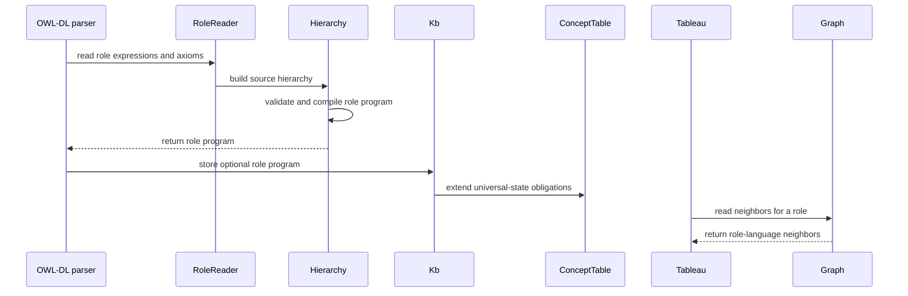

# PR #528 — comments and review threads

6 comment(s). **Every one needs a disposition** in
`review-debt.md`: addressed (with the commit hash) or declined (with the
reason posted in reply). Bot comments count.

## 1. coderabbitai — 

<!-- This is an auto-generated comment: summarize by coderabbit.ai -->
<!-- review_stack_entry_start -->

<a href="https://app.coderabbit.ai/change-stack/Blackcat-Informatics/purrdf/pull/528?scope=ghh_OusAJGA4HG8ljoOV0wJvVx8NmnZIjc2DdjmxOu0xZWA&amp;cs_source=review_comment"><picture><source media="(prefers-color-scheme: dark)" srcset="https://storage.googleapis.com/coderabbit_public_assets/review-stack-in-coderabbit-ui-dark.svg?v=3"><source media="(prefers-color-scheme: light)" srcset="https://storage.googleapis.com/coderabbit_public_assets/review-stack-in-coderabbit-ui.svg?v=3"></picture></a>

<!-- review_stack_entry_end -->
<!-- This is an auto-generated comment: rate limited by coderabbit.ai -->

> [!WARNING]
> ## Review limit reached
> 
> Your organization has reached its usage spending cap. Adjust your spending cap in the [billing tab](https://app.coderabbit.ai/settings/billing?tab=usage&orgId=b268aba6-a194-4fd6-8ca5-f1a13a313209).
> 
> **Next included review available in 21 minutes.**
> 
> [Check out review usage here](https://app.coderabbit.ai/dashboard/review-capacity?orgId=b268aba6-a194-4fd6-8ca5-f1a13a313209).
> 
> <details>
> <summary><strong>View limit details</strong></summary>
> <dl>
> <dd>
> 
> **Limit details:** You’ve used the included review currently available. Your 108 included PR review attempts over the past 7 days set your current allowance at 1 review per hour.
> 
> [Learn how review limits work](https://docs.coderabbit.ai/management/plans#rate-limits).
> 
> **Review configuration:**
> 
> <details>
> <summary><strong>⚙️ Run configuration</strong></summary>
> <dl>
> <dd>
> 
> - **Configuration used**: defaults
> - **Review profile**: CHILL
> - **Plan**: Team
> - **Run ID**: `ae68b84f-55de-49b1-afc2-d90a887cabe1`
> 
> 
> <hr>
> 
> </dd>
> </dl>
> </details>
> 
> <details>
> <summary><strong>📥 Commits</strong></summary>
> <dl>
> <dd>
> 
> Reviewing files that changed from the base of the PR and between 2ce33c668e02ba83bee0e244cc7abbc3529cea23 and a6fe69de7d10c8c26b1b5425f7bfb26c6141f4bd.
> 
> 
> <hr>
> 
> </dd>
> </dl>
> </details>
> 
> <details>
> <summary><strong>📒 Files selected for processing (14)</strong></summary>
> <dl>
> <dd>
> 
> * `Makefile`
> * `crates/entail/README.md`
> * `crates/entail/src/owl_dl/constructs.rs`
> * `crates/entail/src/owl_dl/graph.rs`
> * `crates/entail/src/owl_dl/hyper.rs`
> * `crates/entail/src/owl_dl/mod.rs`
> * `crates/entail/src/owl_dl/parser.rs`
> * `crates/entail/src/owl_dl/proof.rs`
> * `crates/entail/src/owl_dl/roles.rs`
> * `crates/entail/src/owl_dl/tableau.rs`
> * `crates/entail/src/reasoner/profile.rs`
> * `crates/entail/tests/reasoner.rs`
> * `crates/entail/tests/regular_role_chains.rs`
> * `docs/design/purrdf-simd.md`
> 
> </dd>
> </dl>
> </details>
> 
> 
> <hr>
> 
> </dd>
> </dl>
> </details>

<!-- end of auto-generated comment: rate limited by coderabbit.ai -->

<!-- walkthrough_start -->

<details>
<summary><strong>📝 Walkthrough</strong></summary>
<dl>
<dd>

<details>
<summary><strong>📝 Walkthrough</strong></summary>
<dl>
<dd>

## Walkthrough

The reasoner now parses and compiles regular SROIQ role hierarchies, uses compiled role programs in OWL-DL reasoning, and propagates hierarchy, storage, and cancellation outcomes through reasoning and proof APIs. The change adds integration coverage for role-chain behavior and runs that suite in the WASM test lane.

### Changes

**Regular role-chain reasoning**

|Layer / File(s)|Summary|
|:---|:---|
|**Parse and compile role hierarchies** <br> `crates/entail/src/owl_dl/roles.rs`, `crates/entail/src/owl_dl/parser.rs`, `crates/rdf-core/src/graph.rs`, `crates/lex/src/allocation.rs`, `crates/entail/src/lib.rs`, `crates/entail/src/interner.rs`, `crates/entail/src/entails/mod.rs`|The parser reads property-chain axioms and compiles role hierarchies into role programs. Compilation validates role order and dependencies, and returns typed hierarchy errors. Graph traversal and scoped allocation now support fallible, memory-aware operations.|
|**Use role programs in OWL-DL reasoning** <br> `crates/entail/src/owl_dl/concept.rs`, `crates/entail/src/owl_dl/clause.rs`, `crates/entail/src/owl_dl/mod.rs`, `crates/entail/src/owl_dl/graph.rs`, `crates/entail/src/owl_dl/hyper.rs`, `crates/entail/src/owl_dl/saturate.rs`, `crates/entail/src/owl_dl/query.rs`, `crates/entail/src/owl_dl/tableau.rs`, `crates/entail/src/owl_dl/constructs.rs`, `crates/entail/src/owl_dl/oracle.rs`, `crates/entail/tests/regular_role_chains.rs`, `crates/entail/Cargo.toml`, `Makefile`, `crates/entail/README.md`|The knowledge base creates universal-state obligations from role automata. Clause derivation, graph reads, tableau search, and eligible saturation paths use those obligations or compiled role closure. Integration tests cover chain entailments, refusals, proof replay, and service results; the WASM lane runs the suite.|
|**Propagate refusals through results and proofs** <br> `crates/entail/src/reasoner/*`, `crates/entail/src/owl_dl/proof.rs`, `crates/validate/src/regime.rs`, `crates/validate/tests/fixtures/dl-proof.vectors`, `crates/entail/tests/reasoner.rs`, `crates/entail/tests/schema_cardinality_boundary.rs`|Reasoner preparation and services propagate errors. Decisions and certificates retain storage refusals separately from budget exhaustion and cancellation. Proof checking and certificate serialization carry the refusal cause; affected proof digests and tests are updated.|

<!-- change_assessment_start -->
**Priority:** ⬆️ High


**Estimated code review effort:** 4 (Complex) | ~60 minutes

<!-- change_assessment_commit:"2ce33c668e02ba83bee0e244cc7abbc3529cea23" -->
**Change:** Feature · **Severity of issue fixed:** Medium
<!-- change_assessment_end -->

### Sequence Diagram(s)



<hr>

</dd>
</dl>
</details>

<hr>

</dd>
</dl>
</details>

<!-- walkthrough_end -->
<!-- final_review_risk_start -->
**Merge Risk:** **🟡 Moderate** · up to `2ce33`
<!-- final_review_risk_coverage:{"sourceCommitId":"2ce33c668e02ba83bee0e244cc7abbc3529cea23","coveredCommitId":"2ce33c668e02ba83bee0e244cc7abbc3529cea23","kind":"reviewed"} -->

Regular role chains now take part in reasoning. Several unverified edge paths remain. Some chain ontologies that mention the top property may crash the reasoner. A cancellation that arrives mid-search may be reported as a definite answer. Resolve these before merging.
<!-- final_review_risk_end -->
<!-- pre_merge_checks_walkthrough_start -->

<details>
<summary><strong>Pre-merge checks | <sup><picture></picture></sup> 4 | <sup><picture></picture></sup> 1</strong></summary>
<dl>
<dd>
<dl>
<dd>

### ❌ Failed checks (1 warning)

|     Check name     |                                              Status                                              | Explanation                                                                                                                                                                                               | Resolution                                                                         |
| :---------------- | :----------------------------------------------------------------------------------------------: | :-------------------------------------------------------------------------------------------------------------------------------------------------------------------------------------------------------- | :--------------------------------------------------------------------------------- |
| Docstring Coverage |  | Docstring coverage is 70.35% which is insufficient. The required threshold is 80.00%. Docstring coverage is scoped to functions touched by this diff. Analyzed 226 functions across 30 files. (4 skipped… | Write docstrings for the functions missing them to satisfy the coverage threshold. |

<details>
<summary><strong>✅ Passed checks (4 passed)</strong></summary>
<dl>
<dd>
<dl>
<dd>

|         Check name         |                                             Status                                             | Explanation                                                                                                                                                                                               |
| :------------------------ | :--------------------------------------------------------------------------------------------: | :-------------------------------------------------------------------------------------------------------------------------------------------------------------------------------------------------------- |
|      Description Check     |  | Check skipped - CodeRabbit’s high-level summary is enabled.                                                                                                                                               |
|         Title check        |  | The title clearly and concisely describes the main change: adding reasoning support for regular OWL role chains.                                                                                          |
|     Linked Issues check    |  | Issue `#452` requires exact OWL 2 DL regular role-chain decisions and refusal of malformed, nonregular, and forbidden non-simple hierarchies. `roles.rs` implements authored-order validation, mixed simpl… |
| Out of Scope Changes check |  | The changed allocation, graph, parser, tableau, query, classification, proof, profile, validation, documentation, and test code supports issue `#452`. These changes provide bounded role-language compila… |

<hr>

</dd>
</dl>

<hr>

</dd>
</dl>
</details>

<details>
<summary><strong>Full details: Docstring Coverage</strong></summary>
<dl>
<dd>
<dl>
<dd>

**Explanation**

Docstring coverage is 70.35% which is insufficient. The required threshold is 80.00%. Docstring coverage is scoped to functions touched by this diff. Analyzed 226 functions across 30 files. (4 skipped: 4 unsupported.)

</dd>
</dl>

<hr>

</dd>
</dl>
</details>

<hr>

</dd>
</dl>

<hr>

</dd>
</dl>
</details>

<!-- pre_merge_checks_walkthrough_end -->
<!-- finishing_touch_checkbox_start -->

<details>
<summary><strong>✨ Finishing Touches 💡 2</strong></summary>
<dl>
<dd>
<dl>
<dd>

<!-- finishing_touch_suggestion:docstrings -->
<details open>
<summary><strong>📝 Generate docstrings 💡</strong></summary>
<dl>
<dd>
<dl>
<dd>
<dl>
<dd>
<dl>
<dd>

- [ ] <!-- {"checkboxId":"3e1879ae-f29b-4d0d-8e06-d12b7ba33d98"} --> Commit to this branch
- [ ] <!-- {"checkboxId":"7962f53c-55bc-4827-bfbf-6a18da830691"} --> Create a new PR

<hr>

</dd>
</dl>

<hr>

</dd>
</dl>

<hr>

</dd>
</dl>

<hr>

</dd>
</dl>
</details>
<details open>
<summary><strong>🧪 Generate unit tests (beta)</strong></summary>
<dl>
<dd>
<dl>
<dd>

- [ ] <!-- {"checkboxId": "6ba7b810-9dad-11d1-80b4-00c04fd430c8", "radioGroupId": "utg-output-choice-group-unknown_comment_id"} --> Commit to this branch
- [ ] <!-- {"checkboxId": "f47ac10b-58cc-4372-a567-0e02b2c3d479", "radioGroupId": "utg-output-choice-group-unknown_comment_id"} --> Create a new PR

</dd>
</dl>

<hr>

</dd>
</dl>
</details>

<hr>


<!-- finishing_touch_suggestion:fix_ci -->
<details open>
<summary><strong>🛠️ Fix failing CI checks 💡</strong></summary>
<dl>
<dd>

- [ ] <!-- {"checkboxId": "9f0d24fb-b419-4f01-baf0-8b26b6424f34", "radioGroupId": "fix-ci-output-choice-group-6100322794"} --> Commit to this branch
- [ ] <!-- {"checkboxId": "6d21cfe8-ec3f-40e2-9222-b8318b64d3b0", "radioGroupId": "fix-ci-output-choice-group-6100322794"} --> Create a new PR

</dd>
</dl>
</details>
</dd>
</dl>

<hr>

</dd>
</dl>
</details>

<!-- finishing_touch_checkbox_end -->

<!-- autopilot:start -->
- [ ] <!-- {"checkboxId":"2708ad07-9f24-4260-9c11-7dc76a49f2e3"} --> <strong title="Keep fixing CodeRabbit findings and required CI, and resolving merge conflicts">Autofix</strong> · Keep fixing CodeRabbit findings and required CI, and resolving merge conflicts
<!-- autopilot:end -->
<!-- tips_start -->

---


<sub>Comment `@coderabbitai help` to get the list of available commands.</sub>

<!-- tips_end -->

## 2. paudley — 

# Regular OWL role chains: authoritative delivery plan

Base: merged main `a77b743bcc6fad89d88581ef9cb5a626a326834f`.
Worktree: `/home/paudley/Active/purrdf/.worktrees/452-owl-propertychainaxiom-is-a-property`.
Stage: `.stage/owl-propertychainaxiom-is-a-property`.

The deliverable is exact reasoning over regular OWL 2 DL role inclusions in the existing production reasoner, with hard refusal of nonregular input. Removing the boundary without implementing blocked-model semantics is not delivery. No dirty #499 source is incorporated. GMEOW is a read-only, explicitly authorized donor.

## Task 1: Implement and qualify the complete role-chain contract

One shared RBox compiler will live in `crates/entail/src/owl_dl/roles.rs`, consumed by the original parser, profile checker, graph reader, clause compiler, classifier, and proof checker. It will decode ordered RDF lists and signed role expressions; normalize simple inclusions, equivalences, inverse declarations, symmetry, and transitivity; decide OWL Structural Specification §11.2 regularity; and produce finite automata for the accepted role languages. It will not infer regularity from the success of a materialization run.

Regularity checks the exact normative alternatives: top-object-property head, the two-element transitivity form, all strictly smaller members, or literal head recursion at one endpoint with every other member strictly smaller. Required strict comparisons are closed under inversion of their source; their transitive closure must be irreflexive and must not oppose the reflexive-transitive simple hierarchy. Equality of authored expressions is tested before equivalence normalization. The compiler retains an offending chain/order witness for actionable refusal. Cycles in ordinary equivalent-property axioms remain legal. The same signed hierarchy computes non-simple roles and checks chain-related simple-role restrictions (cardinality, hasSelf, functionality/inverse functionality, irreflexivity/asymmetry/disjointness), including inverse/super-role propagation. Malformed lists, invalid property operands, and nonregular hierarchies are errors, not an incomplete positive verdict. Profile certification uses the same decision and reports violations rather than pretending every chain is forbidden.

Accepted regular inclusions compile in dependency order into finite NFAs, including subrole alternatives, inverse reversal, leading/trailing recursive loops, transitive repetition, and equivalent/symmetric aliases. Equivalent-role components are normalized without changing the preceding syntactic regularity test. Automata retain the invariant that every accepted word denotes a subrelation of the head, every required inclusion word is accepted, and inverse automata accept exactly the reversed inverse language. Top/bottom roles receive their actual fixed relation semantics. Construction uses checked sizes, fallible buffer growth, shared lexical allocation/walk homes where applicable, and original cancellation boundaries; automaton expansion cannot silently truncate a language or answer a budget refusal as consistency.

The existing `Graph` neighborhood kernel will execute these languages over original graph edges and representatives, with deterministic deduplication and original work charging. Its update/invalidation and the hypertableau's dependency/delta machinery must see every relevant role transition, edge insertion, merge, and newly realized path. Simple-role readers preserve the existing fast path. No separate chain materializer becomes the decision procedure.

Most importantly, every universal restriction gains the finite automaton-state obligations of the SROIQ calculus before search. Initial-state, transition, epsilon, and acceptance implications are emitted through the original DL-clause engine. These finite state/filler labels participate in pairwise blocking, root/nominal handling, merge propagation, and clash detection. A finite graph path scan alone is insufficient: the labels must constrain every unravelling of blocked successors. Existential witnesses, negative assertions, role queries, and absorbed restrictions continue through the same role semantics. Query-time concept interning must extend the obligation closure before finalization, including the negation cache's newly introduced universals. No fabricated user-visible vocabulary identifies internal states.

The consequence classifier's original role-edge fixpoint must handle regular named chains and retain its sound/complete fragment distinction; inverse and non-Horn cases use the existing exact refutation continuation rather than a false complete taxonomy. Proof-producing runs and the independent replay checker reconstruct the same RBox/obligation clause contract from the source, validate actual state transitions and chain-derived neighborhoods, bind changed RBox content to source identity, and reject tampering. Existing proof encodings/goldens change only where the new semantic contract requires it, with explicit rationale.

Actual affected source: `owl_dl/{roles,parser,mod,concept,clause,graph,hyper,saturate,proof,constructs}.rs`, `reasoner/{profile,mod,axiom,classify,proof}.rs` as needed by their original caller contracts, and original report/inventory/portable fixtures. Exact matches determine edits; no unrelated algorithm rewrite.

Acceptance is exercised through public `Reasoner` and materialization/proof entry points, not only private chain helpers:

- Issue reproduction returns consistent/decided with no property-chain boundary; positive chain consequences and negative assertion/universal clashes are exact.
- Each normative regularity form, mixed leading/trailing recursion, transitivity, multiple heads, nested dependencies, equivalent and inverse roles, symmetric aliases, top/bottom, and permutations receive positive and negative controls. Small role hierarchies are differentially checked against an independent finite strict-order enumerator.
- Generated finite ABoxes compare automaton consequences against an independent exhaustive chain-rule closure. Cycles, repeated nodes, mixed chains, inverses and merges are included. This oracle is not used to infer infinite-model completeness.
- Dedicated satisfiable and inconsistent cyclic existential TBoxes exercise obligations beyond the first blocking point, inverse paths back to predecessors, nominals and simple-role cardinality neighbors. Frozen legacy SHOIQ tests remain unchanged and must pass.
- Actual GMEOW nine chain heads and operands, extracted from donor commit `38f568b04a5f6509e98ccb5e3b387623f1974b58`, are checked verbatim under their OWL grounding: `hasSensoryQuantity`, `eventLocation`, `wasAssociatedWith`, `hasReferenceFrame`, `memberOf`, `hasCoordinates`, `hasGeometry`, `locatedAt`, `periodStart`. Every chain gets a positive consequence and an independent contradicted consequence; the combined regular RBox is decided. Recursive propagation is exercised beyond one step. Donor paths/projection provenance are recorded in Stage; no consumer namespace becomes library configuration.
- Nonregular middle/head recursion, mutual strict cycles, inverse-order conflicts, hierarchy opposition, malformed chains and forbidden non-simple uses refuse before a certificate is published. Independent consistent neighbors demonstrate that refusal is selective.
- Public consistency, satisfiability, subsumption/classification, instance/realization and role-axiom queries agree; proof replay and deliberately tampered chain/state/source evidence are tested. Cancellation and exhausted reasoning work retain Unknown/error rather than a false decided verdict; allocation/overflow failures during new producer growth remain actionable and release their original owners.
- Native affected all-target strict Clippy, meaningful entire entailment/reasoner/proof/oracle targets, actual optimized WASM portable equivalents, and release consumers pass. Relevant scaling exercises increasing chain length/dependency depth and recursive graph size; no wall-clock semantic decisions or lowered assertions.

After the complete source batch and focused native/portable/production controls settle, run one qualifying `make check`, keeping every assertion and mandatory gate. No baseline full gate is planned. A real failure requires a coherent correction and rerun justified by that failure, not treating the attempt count as a cap. Independent parent review applies to this plan and final source/evidence, without a new reviewer panel.

### Regularity clarification approved during implementation

The printed OWL source-order test is retained, but it alone cannot certify a regular role language. Stefanoni (2015), Chapter 12, Example 12.2 establishes a counterexample; the independent two-sided recursion fixture here exposes the same gap. After the literal source check, genuine simple equivalences are normalized and the dependency graph includes simple and complex inclusions with inverse-source dependencies. A remaining cycle through a complex head refuses before automaton construction. Whole-inclusion reversal handles inverse heads. This preserves the original regular-calculus cases and legal simple cycles while refusing known nonregular languages that the printed condition overlooks. The independent parent reviewed and approved this explicit clarification of the issue's regular-SROIQ intent; it is not represented as a literal W3C erratum.

The original PDF image also confirms a typo in Definition 12.3 t3–t5: its self-inverse operand comparison is vacuous for ordinary roles. The implementation uses the original lower-role law and theorem normalization, never that comparison. Exact source evidence and the witness fixture are recorded in `regularity-specification-discrepancy.md` and `stefanoni-definition-12-3.png`. All original production, blocking, proof, nine-chain and portable acceptance obligations remain unchanged.

## Task 2: Publish and finalize the whole contract

Update shipped support/proof/reasoner documentation and generated projections from actual final behavior. Record authoritative acceptance/logs in Stage, distinguishing source review, native, portable, full gate, hooks and hosted acceptance. Commit with normal signed hooks, push and create the issue-linked PR through Stage tooling. Parent owns final independent completion/review-debt/integration assessment and `ghprsq` merge. Completion is the full contract merged to main and issue closed, not a patch, local test or PR.

## Governing evidence

- Full issue and all zero comments: `issue.md`; forge coverage: `prior-art.md`.
- Repository `AGENTS.md`, `.baseline`, `.goals`, `docs/design/purrdf-backend-contract.md`; no standalone ADR or constitution file found by repository inventory.
- [OWL 2 Structural Specification §§11.1–11.2](https://www.w3.org/TR/owl2-syntax/#Global_Restrictions_on_Axioms_in_OWL_2_DL): exact regularity and simple-role conditions.
- [Horrocks, Kutz, Sattler, The Even More Irresistible SROIQ](https://staff.cs.manchester.ac.uk/~sattler/publications/KR-06-SROIQ.pdf), Proposition 10, Lemma 11, P7–P9 and blocking proof: role-language automata and universal state obligations. Formal construction references are followed before coding their NFA algorithm; no copied third-party implementation.
- Current source: parser drops chains through the bounded inventory; profile blanket-rejects them; graph and proof checker currently read hierarchy/inverse/transitive neighborhoods; the classifier has a separate completeness predicate. GMEOW's current DL donor also exposes a chain capability gap, so its finite Horn/projection fixtures are useful prior art, not a complete SROIQ decision algorithm.

## 3. paudley — 

Issue452 implementation and local qualification are published in PR528, signed commit `2ce33c668`, after normal commit hooks and push passed. The complete source and acceptance review passed independently. Hosted CI/review and protected integration remain pending; this is not an issue-completion claim.

Local evidence: complete affected native targets; all14 optimized portable controls; nine verbatim external GMEOW chains and their positive/contradicted consequences; independent order/finite-graph differentials and physical-refusal/lifetime controls. Full gate1 retained its single doctest failure; that caller is corrected, all24 doctests and strengthened native/portable controls pass, and the original unrun suffix passes. Unchanged production evidence is reused, without relabeling the failed full invocation.

Least confidence and information the user should know:

The least certain practical property is the memory and work envelope of very
large, nested regular role hierarchies. There is no fabricated chain limit:
actual construction and execution use typed admission/refusal, and the measured
scaling and refusal controls do not claim an envelope for every possible ontology.

The printed OWL source-order condition alone does not establish regular role
languages. The shipped documentation explains the theorem-backed normalized
dependency check and its concrete counterexample. The exact external nine-chain
probe proves those caller chains and their consequences, not consistency of the
entire consumer ontology. The changed tableau calculus intentionally invalidates
older proof identities; all original projected questions and answers are retained
and the new proofs independently replay.

Local qualification reuses the original full1 passing workspace evidence after
its single doctest failure was corrected, plus affected native/doc/strict/WASM
execution and the complete original unrun suffix. The failed invocation remains
recorded as FAIL. Normal hooks passed. Hosted acceptance and final integration remain separate
obligations before declaring delivery complete.

## 4. paudley — 

Published remediation in a6fe69de7d10c8c26b1b5425f7bfb26c6141f4bd.

The four inline findings are corrected in the original implementations: both
decision drivers latch cancellation after role reads and before final publication;
top and inverse-top membership are checked before role-order lookup; proof reads
cache the original top role once; and Tableau preserves the original typed storage
refusal before interpreting consistency. Public refusals now retain original term
spelling with the typed classification, including after the private interner dies.
The reproducer also exposed and corrected top-object ABox inventory handling.

The entire affected entail/validate native suite, strict all-target Clippy,
metadata regeneration and helper hygiene pass. Final native and optimized wasm
regular-role controls pass 16/16, including mid-round cancellation sweeps, healthy
neighbors, top outside the RBox and retained source diagnostics. Required commit
hooks passed normally. Independent complete-diff review found no further defect.

Public diagnostic contracts are documented. The bot's 70.35/80 documentation
percentage warning is not a repository gate; blanket comments on private/test
functions would not improve the public contract and are declined.

Current-head CI is running at 38074965475. Original failed assembly jobs remain
recorded as failures. Their seven complete hosted measurement columns were used
to repair the projection, with compiler and source identity retained; those old
reports do not qualify this changed head. Current-head assembly qualification,
remaining CI/review assessment and protected integration remain open. The issue
is not yet complete.

## 5. paudley — 

# CodeQL synthetic assertion dispositions

The current-head CodeQL alert check originally failed on rust/cleartext-logging
alerts241/242. Both instances are classified by the analyzer as test code.

241: crates/entail/tests/reasoner.rs1690-1691 prints
ProfileCertificate::violations() only when a fixed example.org regular-chain
classification assertion fails. The certificate represents OWL profile membership;
the payload is typed ProfileViolation data. It is not a cryptographic certificate,
credential, private key or runtime user input.

242: crates/entail/tests/regular_role_chains.rs100-101 prints
DlCertificate::boundaries() only when completeness of a synthetic ontology
reasoning answer differs from Decided. Those boundaries classify unsupported
reasoning constructs. The fixture builds its own example.org ontology; no secret
or authentication certificate enters this diagnostic.

Both alerts were dismissed as false positives with explicit reasons through the
GitHub code-scanning API. The API confirmed state=dismissed for both, and the
subsequent complete PR checks surface showed CodeQL passing. The Rust CodeQL
analysis itself also passed. No code suppression, source deletion, renamed payload
or disabled security check was used. Useful assertion diagnostics remain intact.

The complete seven-configuration assembly matrix and aggregate simd-asm also pass
on the current head. Only library and integration-5 runtime jobs were live at this
checkpoint; no final merge readiness or issue closure is claimed here.

## 6. paudley — 

feat(entail): reason over regular OWL role chains

Closes #452

## What changed

Regular object-property chains now participate in actual OWL decisions,
instance queries, realization, classification and materialization, instead of
being reported as an unsupported boundary. The shared signed-role compiler
checks authored order and normalized dependencies, compiles finite role
languages, and carries universal obligations through the original graph,
blocking and both decision drivers. Nonregular, malformed and nonsimple inputs
retain typed source witnesses. The approved regularity clarification and its
formal discrepancy remain documented; printed endpoint order alone is not
misrepresented as a complete regularity proof.

The independent proof checker reconstructs role closure. Its top-role lookup is
cached once. Cancellation during role reads and physical refusal are retained
before semantic publication; neither authenticates consistency. Top-object
assertions outside the RBox preserve their universal semantics. Public diagnostic
presentations retain admitted source terms after the private interner is gone.
The original native homes remain authoritative, with no semantic Cargo feature,
runtime dependency or implicit consumer vocabulary added.

Actual public controls cover all nine consumer chain shapes, inverse and recursive
dependencies, independent contradictions, exact service payloads, healthy neighbors,
proof replay and refusal. Final affected entail/validate all-target native tests,
strict Clippy, doctests, final native16 and optimized portable16 controls,
consumer/kernel checks, release WASM build, metadata and helper hygiene pass.
Sixteen original proof inputs/answers are preserved and independently replayed
under the deliberately changed calculus identity. The original full local
invocation's sole doctest failure is retained as FAIL; its corrected example,
affected closure and originally unrun mandatory suffix pass separately. Unchanged
full-run evidence is reused for unchanged paths, not relabeled as a new full pass.
Normal signed commit and push hooks passed.

All required current-head hosted checks pass, including runtime and conformance,
all seven assembly configurations, their aggregate, architectures, WASM package
and CodeQL. Original failed SIMD measurements remain historical; the maintained
projection now records actual current-source measurements. The source and final
execution judgments in tasks/T1-review.md, tasks/T2-review.md,
reviews/root-implementation-audit.md, root-remediation-review.md and
published-review-debt.md are reused for unchanged behavior. Current independent
review-debt.md refreshes the entire published surface: all six threads resolved,
four valid source findings corrected, public diagnostic debt corrected. CodeQL
241/242 are documented false positives on synthetic OWL classification assertion
data; useful diagnostics and the analyzer remain enabled. Blanket private/test
documentation padding is legitimately declined with its posted rationale.

Fresh origin/main integration is clean and produces no additional source delta
beyond the qualified PR head. No base synchronization or repeat broad suite was
needed. plan.md in .stage/owl-propertychainaxiom-is-a-property is authoritative;
that exact Stage directory is selected for separate evidence archival. All
original issue requirements remain in scope, with no deferred behavior or
deficiency entry. Protected integration uses ghprsq; closure and owned cleanup
are verified after its result, rather than inferred from local acceptance.

## Commits squashed (2)

- `a6fe69de7` Preserve role-read refusals and actionable source witnesses
- `2ce33c668` feat(entail): reason over regular OWL role chains

## Files

```
Makefile                                           |   18 +
 crates/entail/Cargo.toml                           |    6 +
 crates/entail/README.md                            |   25 +-
 crates/entail/src/entails/mod.rs                   |    1 +
 crates/entail/src/interner.rs                      |    7 +-
 crates/entail/src/lib.rs                           |   17 +
 crates/entail/src/owl_dl/bounds.rs                 |    4 +-
 crates/entail/src/owl_dl/clause.rs                 |   53 +-
 crates/entail/src/owl_dl/concept.rs                |  141 +-
 crates/entail/src/owl_dl/constructs.rs             |   12 +-
 crates/entail/src/owl_dl/graph.rs                  |  203 ++-
 crates/entail/src/owl_dl/hyper.rs                  |   64 +-
 crates/entail/src/owl_dl/mod.rs                    |  120 +-
 crates/entail/src/owl_dl/oracle.rs                 |    5 +-
 crates/entail/src/owl_dl/parser.rs                 |  166 +-
 crates/entail/src/owl_dl/proof.rs                  |  134 +-
 crates/entail/src/owl_dl/query.rs                  |    4 +-
 crates/entail/src/owl_dl/roles.rs                  | 1754 ++++++++++++++++++++
 crates/entail/src/owl_dl/saturate.rs               |   94 +-
 crates/entail/src/owl_dl/tableau.rs                |   40 +-
 crates/entail/src/reasoner/certificate.rs          |   82 +-
 crates/entail/src/reasoner/classify.rs             |   18 +-
 crates/entail/src/reasoner/mod.rs                  |   83 +-
 crates/entail/src/reasoner/profile.rs              |   77 +-
 crates/entail/src/reasoner/proof.rs                |   18 +-
 crates/entail/src/reasoner/proof/current.rs        |    2 +-
 crates/entail/src/reasoner/schema_tests.rs         |    8 +-
 crates/entail/tests/reasoner.rs                    |   40 +-
 crates/entail/tests/regular_role_chains.rs         |  785 +++++++++
 crates/entail/tests/schema_cardinality_boundary.rs |    4 +-
 crates/lex/src/allocation.rs                       |   12 +
 crates/rdf-core/src/graph.rs                       |  142 +-
 crates/validate/src/regime.rs                      |   73 +-
 crates/validate/tests/fixtures/dl-proof.vectors    |  156 +-
 docs/design/purrdf-simd.md                         |    2 +-
 35 files changed, 4020 insertions(+), 350 deletions(-)
```

## Conflicts

None. The assessed clean candidate introduces no source delta beyond the PR head.

---

Defect-Class: none

