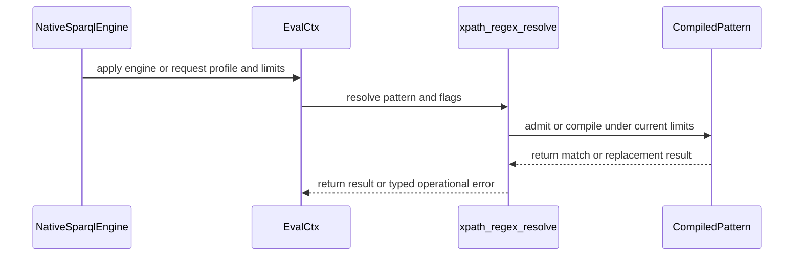

# PR #448: rdf: add dated native XPath regex profiles and operational resource refusal

State: OPEN   Repo: Blackcat-Informatics/purrdf   Forge: github

## Comments (17)

### coderabbitai — 2026-10-05T20:24:28Z

<!-- This is an auto-generated comment: summarize by coderabbit.ai -->
<!-- review_stack_entry_start -->

<!-- review_stack_entry_end -->
<!-- This is an auto-generated comment: skip review by coderabbit.ai -->

> [!IMPORTANT]
> ## Review skipped
> 
> We couldn't safely recover the incremental review. No full review was started, and the last reviewed checkpoint was preserved. Retry later, or explicitly request a full review by commenting `@coderabbitai full review`.
> 
> You can disable this status message by setting the `reviews.review_status` to `false` in the CodeRabbit configuration file.
> 
> Use the checkbox below for a quick retry:
> - [ ] <!-- {"checkboxId":"e9bb8d72-00e8-4f67-9cb2-caf3b22574fe"} --> 🔍 Trigger review

<!-- end of auto-generated comment: skip review by coderabbit.ai -->

<!-- recent_review_start -->

No actionable comments were generated in the recent review. 🎉

ℹ️ Recent review info

⚙️ Run configuration

- **Configuration used**: defaults
- **Review profile**: CHILL
- **Plan**: Team
- **Run ID**: `c27779b2-08f8-485b-96be-af91cd115db0`

📥 Commits

Reviewing files that changed from the base of the PR and between 19cf6a160c1429b79edcd748dce8da7647c11092 and efad7cc020deaab4cfa032f61fe71e43a3fe572b.

📒 Files selected for processing (3)

* `crates/lex/examples/gen_unicode_tables.rs`
* `crates/rdf-core/src/xsd_regex/xpath/compile.rs`
* `crates/rdf-core/src/xsd_regex/xpath/unicode_tables.rs`

🚧 Files skipped from review as they are similar to previous changes (1)

* crates/lex/examples/gen_unicode_tables.rs

**Limit details:** You’ve used the included review currently available. Your 95 included PR review attempts over the past 7 days set your current allowance at 1 review per hour.

---

<!-- recent_review_end -->
<!-- walkthrough_start -->

📝 Walkthrough

## Walkthrough

This change adds native XPath 2.0 and 3.1 regular-expression profiles with finite resource limits. It integrates the profiles with SPARQL, SHACL, and ShEx, and adds Unicode data generation. It also updates raw-identifier module resolution and `WorkList` APIs.

### Changes

**Native XPath regex**

|Layer / File(s)|Summary|
|:---|:---|
|**Profiles, bounded compilation, matching, and replacement**   `crates/rdf-core/src/xsd_regex/*`|Adds dated profiles, finite resource limits, bounded scanning and compilation, matching, replacement, and exact-identity pattern caching.|
|**Unicode data generation**   `crates/iri/unicode/17.0.0/SpecialCasing.txt`, `crates/lex/examples/gen_unicode_tables.rs`, `crates/lex/examples/gen_unicode_blocks.rs`, `crates/testkit/src/ucd.rs`, `scripts/*`, `license-inventory.toml`, `crates/*/licenses/inventory.json`|Adds Unicode casing input and generates XPath category, block, and direct case-variant tables. Updates generation checks, provenance, and license inventories.|
|**SPARQL integration**   `crates/sparql-eval/src/*`, `crates/sparql-eval/tests/native_xpath.rs`, `crates/sparql-eval/README.md`, `crates/sparql-eval/benches/regex_eval.rs`|Adds engine- and request-level profile selection, native regex resolution, typed operational errors, and propagation through query, filter, and UPDATE execution.|
|**SHACL integration**   `crates/shapes/src/*`, `crates/shapes/tests/native_xpath.rs`, `crates/shapes/README.md`, `crates/shapes/benches/pattern_validate.rs`, `crates/rdf-wasm/src/*`|Adds XPath-configured preparation and validation, pattern declaration inventory and caching, and typed error propagation across validation and query execution.|
|**ShEx integration**   `crates/shex/src/*`, `crates/shex/tests/native_xpath.rs`, `crates/shex/README.md`, `crates/shex/benches/pattern_validate.rs`|Adds XPath-configurable validation and shape-map APIs. Operational regex errors are distinguished from conformance findings.|
|**Conformance and benchmark documentation**   `docs/CONFORMANCE.md`, `docs/BENCHMARKS.md`|Documents compatibility and dated native paths, error behavior, and added benchmark targets.|

**Raw-identifier module resolution**

|Layer / File(s)|Summary|
|:---|:---|
|**Module path lookup**   `crates/helper-census/src/source.rs`|Removes `r#` when deriving a child module’s filesystem path while retaining the raw spelling in module symbols. Adds resolution tests for flat, directory, inline, and explicit-path modules.|

**WorkList APIs**

|Layer / File(s)|Summary|
|:---|:---|
|**Fallible push and iteration**   `crates/lex/src/walk.rs`|Adds `try_push`, which reserves spill capacity before insertion, and `iter`, which yields inline entries followed by spill entries.|

**Prepared-query stack test**

|Layer / File(s)|Summary|
|:---|:---|
|**Execution outcome expectation**   `crates/sparql-eval/tests/prepared_admission.rs`|Allows either a `true` result or a typed stack-exhaustion diagnostic for the tested prepared plans.|

<!-- change_assessment_start -->
**Priority:** ➖ Normal

**Estimated code review effort:** 5 (Critical) | ~120 minutes

<!-- change_assessment_commit:"efad7cc020deaab4cfa032f61fe71e43a3fe572b" -->
**Change:** Feature
<!-- change_assessment_end -->

### Sequence Diagram(s)

<!-- walkthrough_end -->
<!-- final_review_risk_start -->
**Merge Risk:** _🔵 Low_ · up to `efad7`
<!-- final_review_risk_coverage:{"sourceCommitId":"efad7cc020deaab4cfa032f61fe71e43a3fe572b","coveredCommitId":"efad7cc020deaab4cfa032f61fe71e43a3fe572b","kind":"reviewed"} -->

A query failure within a SHACL someValue check can fail the whole validation even when a later value conforms. This is a narrow but supported correctness risk to address before relying on affected validations.
<!-- final_review_risk_end -->
<!-- pre_merge_checks_walkthrough_start -->

🚥 Pre-merge checks | ✅ 2 | ❌ 2 | ❓ 1

### ❌ Failed checks (2 warnings, 1 inconclusive)

|         Check name         | Status         | Explanation                                                                                                                                                                                               | Resolution                                                                                                                                                                                                              |
| :------------------------: | :------------- | :-------------------------------------------------------------------------------------------------------------------------------------------------------------------------------------------------------- | :---------------------------------------------------------------------------------------------------------------------------------------------------------------------------------------------------------------------- |
| Out of Scope Changes check | ⚠️ Warning     | The `helper-census` raw-identifier path-resolution change and test address general Rust module discovery, not XPath regex profiles. The `prepared_admission.rs` change alters an existing stack-boundary… | Remove the raw-identifier module-resolution change and the unrelated stack-boundary test change, or provide evidence that each is required to implement or validate `#406`.                                               |
|     Docstring Coverage     | ⚠️ Warning     | Docstring coverage is 61.66% which is insufficient. The required threshold is 80.00%. Docstring coverage is scoped to functions touched by this diff. Analyzed 386 functions across 49 files.             | Write docstrings for the functions missing them to satisfy the coverage threshold.                                                                                                                                      |
|     Linked Issues check    | ❓ Inconclusive | [`#406`] The PR implements dated XPath 2.0 and 3.1 profiles for SPARQL, SHACL, and ShEx, with finite limits, typed operational refusals, generated Unicode data, and separate JSON Schema behavior. The re… | Provide current-head results for the required automated qualification, including `cargo semver-checks`, `make check`, and `make wasm`, or equivalent complete gate evidence that establishes those acceptance criteria. |

✅ Passed checks (2 passed)

|     Check name    | Status   | Explanation                                                                                                                     |
| :---------------: | :------- | :------------------------------------------------------------------------------------------------------------------------------ |
| Description Check | ✅ Passed | Check skipped - CodeRabbit’s high-level summary is enabled.                                                                     |
|    Title check    | ✅ Passed | The title clearly summarizes the main change: adding dated native XPath regex profiles and typed operational resource refusals. |

Full details: Linked Issues check

**Explanation**

[`#406`] The PR implements dated XPath 2.0 and 3.1 profiles for SPARQL, SHACL, and ShEx, with finite limits, typed operational refusals, generated Unicode data, and separate JSON Schema behavior. The reported follow-up also removes the excluded `Cs` category and passes the native XPath suite. However, the full-workspace, WASM, and API-compatibility qualification applies to head `19cf6a1`; current head `efad7cc` has only focused validation reported. The evidence does not establish the issue’s automated acceptance gates on the reviewed head.

Full details: Out of Scope Changes check

**Explanation**

The `helper-census` raw-identifier path-resolution change and test address general Rust module discovery, not XPath regex profiles. The `prepared_admission.rs` change alters an existing stack-boundary test’s expectations and is also unrelated to `#406`. The inspected diffs show no connection to the linked issue.

<!-- pre_merge_checks_walkthrough_end -->
<!-- finishing_touch_checkbox_start -->

✨ Finishing Touches 💡 2

<!-- finishing_touch_suggestion:docstrings -->

📝 Generate docstrings 💡

- [ ] <!-- {"checkboxId":"3e1879ae-f29b-4d0d-8e06-d12b7ba33d98"} --> Commit to this branch
- [ ] <!-- {"checkboxId":"7962f53c-55bc-4827-bfbf-6a18da830691"} --> Create a new PR

🧪 Generate unit tests (beta)

- [ ] <!-- {"checkboxId": "6ba7b810-9dad-11d1-80b4-00c04fd430c8", "radioGroupId": "utg-output-choice-group-unknown_comment_id"} --> Commit to this branch
- [ ] <!-- {"checkboxId": "f47ac10b-58cc-4372-a567-0e02b2c3d479", "radioGroupId": "utg-output-choice-group-unknown_comment_id"} --> Create a new PR

<!-- finishing_touch_suggestion:fix_ci -->

🛠️ Fix failing CI checks 💡

- [ ] <!-- {"checkboxId": "9f0d24fb-b419-4f01-baf0-8b26b6424f34", "radioGroupId": "fix-ci-output-choice-group-6002287413"} --> Commit to this branch
- [ ] <!-- {"checkboxId": "6d21cfe8-ec3f-40e2-9222-b8318b64d3b0", "radioGroupId": "fix-ci-output-choice-group-6002287413"} --> Create a new PR

<!-- finishing_touch_checkbox_end -->

<!-- autopilot:start -->
- [ ] <!-- {"checkboxId":"2708ad07-9f24-4260-9c11-7dc76a49f2e3"} --> <strong title="Keep fixing CodeRabbit findings and required CI, and resolving merge conflicts">Autopilot</strong> · Keep fixing CodeRabbit findings and required CI, and resolving merge conflicts
<!-- autopilot:end -->
<!-- tips_start -->

---

Comment `@coderabbitai help` to get the list of available commands.

<!-- tips_end -->

### paudley — 2026-10-05T20:24:30Z

Native XPath regular expressions with operational resource refusal

Issue summary

Implement the complete additive dated XPath pattern surface requested by #406. A pattern's syntax verdict and an exhausted compiler/matcher budget must remain different outcomes through SPARQL, SHACL and ShEx. JSON Schema retains its ECMA-262 engine and accepted-pattern behavior.

Primary profile definitions: [XPath F&O 2.0 Second Edition, 2010-12-14](https://www.w3.org/TR/2010/REC-xpath-functions-20101214/#regex-syntax) and [XPath F&O 3.1, 2017-03-21](https://www.w3.org/TR/2017/REC-xpath-functions-31-20170321/#regex-syntax). Replacement behavior includes the [3.1 fn:replace error conditions](https://www.w3.org/TR/2017/REC-xpath-functions-31-20170321/#func-replace).

Baseline defaults

Read `.baseline`: adversarial review; complete the requirements on this branch; own discovered defects; no development-process references in shipped documentation. `.deficiencies` is notice-only and must remain so.

Standing constraints

Read `.goals` and AGENTS.md: original first-party Rust, one home per job, deterministic RDF 1.2 behavior, bounded typed hard failures, shared lexical terminals, no semantic Cargo feature or new dependency, Rust semantic/conformance tests, and WASM portability. Commit/merge hooks are mandatory. All toolchain use is ordinary repository build/test/lint use: no investigation, installation, selection, adapters or configuration changes. Preserve every other agent's branch/worktree and excluded PRs.

Completeness contract

| Requirement | Task and proof |
| --- | --- |
| Explicit dated XPath profiles | T1/T2: a sibling native compiled-pattern type/API names XPath F&O 2.0 Second Edition (2010-12-14) and 3.1 (2017-03-21); valid/invalid neighboring grammar vectors distinguish the profiles. T4 declares and verifies selected-profile routing and unchanged unselected legacy routing. |
| Grammar and matching, including backreferences, non-capturing groups and q | T2/T3: complete applicable XSD/XPath productions, ordered captures/backreferences and all applicable flags; native byte-exact matching/capture/replacement vectors and independent small-language enumeration. XPath 2.0 already includes backreferences; only 3.1 admits non-capturing groups and q. |
| Finite VM limits | T1/T3: finite source, parser/program storage, execution steps, active states/slots and replacement output admission; native tests demonstrate each boundary and its valid neighbor. |
| Oversized patterns are resource refusals | T1/T2/T4: distinct typed resource cause before source materialization; never invalid syntax, UNDEF, negative match or a conformance finding. |
| Operational errors through SPARQL/SHACL/ShEx | T4: additive profile selection and typed fallible APIs; direct, constant-linked, dynamic/cached and nested/negated execution tests establish propagation and precedence. Reused programs/cache entries remain bound to their dated profile and compile admission; current-request bounds are admitted before a cache hit. |
| Unicode data from generator only | T2: the existing Unicode generator emits XPath category and full-case-variant data from the admitted vendored UCD; no runtime standard-library/regex Unicode inference, copied arrays or additional generator. |
| JSON Schema behavior unchanged | T5: ECMA parser/VM and existing limits remain unchanged; every existing native JSON Schema suite and its matcher tests pass. No shared VM migration is required. |
| Additive API only, no closed-enum variants | T1/T4/T6: existing public struct literals, closed enums, CompiledPattern/as_regex and legacy entry points remain source-compatible. New error wrappers/configuration entry points carry operational refusals; only already non-exhaustive errors may gain a variant. Native downstream compile fixtures and cargo semver-checks verify the surface. |
| make check and make wasm | T6: ordinary full local gate and all release-crate WASM portability builds, with actual source-bound results. No general semantic WASM executions are added. |
| PR, review, merge and issue closure | T7: final-head CodeRabbit/CI, normal main integration, concrete squash notes, ghprsq, signed result/tree/audit/closure readback. |

Enhancement audit and decisions

Transformation adopted (M/L): treat a dated pattern as a small admitted program with separate grammar and execution verdicts, rather than rewriting backreferences into a finite automaton or hiding exhaustion as a failed match. Use a flat arena/program and explicit work lists, including construction/drop/debug, so hostile nesting does not consume the machine stack.

Reuse adopted (S/M): the existing xsd_regex module remains the XPath home; reuse XML terminal tables, source whitespace scanner, block-name definitions, replacement token rules, shared work-list structures and the one Unicode generator. Character-set semantics stay profile-specific, including XPath's non-transitive full-case-variant relation and subtraction/negation rules.

Utility adopted (M): one matching/capture primitive feeds both matches and replacement, so SPARQL REGEX and REPLACE carry the same dated law. Configuration is private-field/additive builder or sibling-entry-point based; existing options structs and closed result types keep their shape.

Robustness adopted (S/M): budget admission precedes allocations and syntax erasure; loops and byte comparisons consume work; pending states account for captures/continuations as well as state count; zero-width repetition has a declared progress rule; constant linking, cache hits, nested validation, negation and alternate branches cannot erase an operational refusal. Replacement expansion is bounded.

Compatibility and routing decision: the public legacy `CompiledPattern::as_regex() -> &regex::Regex` and `Constraint::Pattern.compiled` cache remain exactly their existing types. Introduce sibling `xsd_regex::xpath::CompiledPattern` and explicit `compile(profile, pattern, flags, limits)` in that module. Existing unselected entry points keep the compatibility law; a caller explicitly selecting a dated native profile always uses the native program and typed fallible execution. SPARQL configuration lives on private engine/context state with additive setters; SHACL/ShEx expose sibling fallible validation/preparation entry points rather than changing closed error/result/options types. Native private caches cannot put backreference programs or budget errors into the legacy compatibility cache.

Cache admission decision: native programs carry immutable profile/source/flag identity and compiler admission metadata. Source and stored program/storage bounds are checked for the current request before reuse. Native memo keys include the dated law; alternating a prepared product between 2.0/3.1 cannot reuse a program admitted under the other grammar. Current matching budgets are never inherited from an earlier successful request. Syntax failures may be memoized only under the correct dated law; resource failures remain typed request outcomes and never become `None`, a cached syntax verdict or an `Arc<str>` facet finding. Low/high source/program/storage/runtime budgets and both profiles are exercised over the same prepared shape and constant/dynamic pattern. Skipped compilation is not charged as execution work, but cached artifacts must still satisfy the current admission contract.

Declined: migrating JSON Schema's distinct ECMA engine into the XPath VM. It has different capture/lookaround/property/flag semantics and current budget guarantees; migration adds compatibility risk without being needed for this complete XPath capability. Its native behavioral corpus remains an explicit regression gate. No third-party regex implementation, new crate or runtime dependency is needed.

Task 0: isolated ownership and baseline

Refresh local branches, worktrees, live issue/comments and open PR ownership immediately before creation. If still unowned, create `paudley/406-native-xpath-regex` at current origin/main in `.worktrees/406-native-xpath-regex`; preserve all siblings and root main. Record the exact base, inspect the fresh worktree contracts and establish relevant existing native regex behavior. Post this reviewed plan to issue #406.

Task 1: additive contracts and refusal classification

Introduce dated profile, finite limits and new typed syntax/resource errors for the sibling native compiled-pattern surface in the existing XPath home. Keep every legacy closed type source-compatible; declare the legacy/native routing rule above. Specify admission units/default budgets and artifact admission metadata, with meaningful refusal/valid-neighbor coverage. Validate focused core tests/fmt/lints, then normal commit, push and issue receipt.

Task 2: grammar and generated Unicode

Implement all applicable productions and exact terminal/flag rules over a flat native representation. Validate quantity/backreference numbering, closed earlier captures, character-class subtraction, permitted escapes/property/block names, profile differences and malformed neighbors. Extend only the existing generator for native XPath Unicode categories and full-case variants; generated output has reproducible provenance and version checks. Validate grammar/generation/hygiene, then normal commit, push and issue receipt.

Task 3: native execution and replacement

Implement ordered matching/captures/backreferences and replacement over the admitted representation with explicit continuation/state storage and finite budgets. Cover UTF-8 boundaries, repeated/absent captures, greedy/reluctant order, empty alternatives/repetition, anchors including final-newline behavior, class negation/subtraction, non-transitive case variants, q interactions and XPath replacement errors, including FORX0003 refusal of a pattern that matches the empty string. The empty-match check itself preserves an operational budget error. Exhaustively enumerate independent small-language matching oracles and resource-bound neighbors. Measure the affected existing/native parse/match paths before claiming any performance result. Validate, normal commit, push and issue receipt.

Task 4: all three host engines

Add explicit dated-profile selection to NativeSparqlEngine/EvalCtx and additive fallible SHACL/ShEx validation/preparation entry points. Route native caching and constant linking through the selected law and current admission without changing the legacy public compiled-pattern/cache fields. Carry explicit configuration through prepared, bound and restored validation paths, constant-linked expressions and every private evaluator context/fork; selecting a native profile must not end in a compatibility free-function facade. Retain syntactic expression/facet semantics; resource causes use the operational channel and outrank partial results, negation and alternate branches. Native end-to-end tests cover REGEX/REPLACE, linked/dynamic/cached paths, SHACL pattern evaluation, ShExJ patterns, nested shapes and limit refusals. Reuse each prepared shape and constant/dynamic pattern under alternating 2.0/3.1 profiles and low/high admission/runtime bounds, proving that cached syntax and prior successful admissions cannot erase the current refusal. Review every context/fork and the public wiring independently. Validate, normal commit, push and issue receipt.

Task 5: independent conformance and compatibility

Run existing XSD/XPath/SPARQL/SHACL/ShEx conformance plus the full JSON Schema native suites. Add dated first-party vectors and independent oracles without changing frozen payloads/expected results or masking failures. Document profile selection, grammar/Unicode provenance, finite limits and typed error handling in their existing homes, without process references. Regenerate affected projections normally. Validate, normal commit, push and issue receipt.

Task 6: complete source qualification

Run ordinary `cargo semver-checks`, `make check` and `make wasm` against the final source, plus generated/helper/layer/terminal/non-Rust hygiene. Read exit statuses and complete task-owned logs. Run mechanical deferral and deficiency checks; independently map every requirement to actual evidence, preserving pre-integration versus final-head identities. Repair concrete findings and use normal commits/hooks.

Task 7: PR through protected integration

Open a ready PR with a plain project title, source-bound validation and `Closes #406`; attach the implementation plan. Read actual final-head CodeRabbit comments/threads and all hosted checks, fix findings, synchronize origin/main normally and qualify affected source. Every feedback/integration repair passes normal verification, is committed/pushed and receives remote readback; final qualification is bound to that pushed head. Prepare and post concrete squash notes. Acquire the root serial merge lock and run only `/home/paudley/stage/root/bin/ghprsq` from the exact clean PR worktree. Verify signed result, source-tree equality, base/head/result/evidence refs, notes, PR state and issue closure, then remove only this owned worktree/branch.

### paudley — 2026-10-05T20:29:03Z

Stage-2 acceptance review at `19cf6a160c1429b79edcd748dce8da7647c11092` (main `33bc4f2f12e9c5dd874a88c3904d40217c763ab4`).

The original issue and full implementation plan are covered by the dated native compiler/matcher, finite typed admission/execution limits, generator-owned Unicode and additive selected routes in SPARQL/SHACL/ShEx. The independent integration review is clear. The earlier diagnostic-mapper defect is repaired and qualified. All 85 existing local gate payloads passed, including 20,998 native tests, the exact 32-package release-WASM build and five additive API comparisons. Literal make wrappers remain separately unrun under the user's prohibition on rustup inspection. The deficiency ledger is marker-only; the source deferral/process-reference audit is clear.

Current validation gaps:

- **HIGH — substantive final-head CodeRabbit review:** the initial attempt was refused by its usage allowance, with another included review announced in five minutes. Request the review after that reset, retrieve the full review/comment/thread surface, and fix actual findings in separate verified commits. A green bot status without an actual review does not satisfy this requirement.
- **HIGH — hosted final-head checks:** CI is running. Verify every required non-WASM lane, including actual Miri. Investigate and repair owned source failures; preserve actual failed/cancelled results. The user's temporary solely-WASM exception applies only to WASM failures and aggregates held solely by those failures.

After both requirements are met, refresh actually landed main, resolve and qualify any real integration changes, prepare concrete squash notes and use the protected serialized ghprsq workflow. Signed result/tree/audit refs, PR merge and issue closure must be read back before declaring completion.

No additional source remediation is identified at this checkpoint. This is a review/merge plan, not a merge-ready or closure claim.

### paudley — 2026-10-05T20:29:52Z

@coderabbitai review

### coderabbitai — 2026-10-05T20:30:01Z

<!-- This is an auto-generated reply by CodeRabbit -->
<!-- CodeRabbit review command invocation: v2:7d36423e37dceca28a0e05c0777e263326960ff7e9d8ec5825a4b8893351bbee -->

⚠️ Action not completed

Review rate limited.

> Note: CodeRabbit is an incremental review system and does not re-review already reviewed commits. This command is applicable only when automatic reviews are paused.

### paudley — 2026-10-05T20:31:14Z

@coderabbitai full review

### coderabbitai — 2026-10-05T20:31:21Z

<!-- This is an auto-generated reply by CodeRabbit -->
<!-- CodeRabbit review command invocation: v2:9e248def682d0164f4b21d019cd231082387e012d2eaf5389bd2cf06e4d9f09f -->

✅ Action performed

Full review finished.

### paudley — 2026-10-05T20:51:17Z

Review remediation at PR head `19cf6a160c1429b79edcd748dce8da7647c11092`:

1. **MEDIUM — invalid surrogate-category escapes.** Confirmed against XML Schema Part 2 Second Edition Appendix F productions [27]–[35], inherited by both selected XPath Recommendations: `Cs` is excluded. The native generator currently emits that name and the native compiler accepts it. Add a failing native grammar witness for positive/complemented `Cs` escapes in both dated profiles, retaining valid `C`, `Cc`, `Cf`, `Co`, `Cn` and surrogate-block neighbors. Remove only the named `Cs` entry after constructing the major `C` union, regenerate the table with the existing Rust generator, and validate the native compiler suite, generator drift, and warning-free Clippy. Commit and push this logical fix separately, then update the issue, PR and review thread.

2. **MEDIUM — tolerated query diagnostics retained as fatal causes.** Independently verify the reported `SomeValue`/`query_error`/`root_result` route and the existing SPARQL operational error classification. If confirmed, add a native failing-first witness where a later conforming value permits an ordinary query failure to be discarded, paired with a witness that a true operational refusal still aborts. Correct the classification at its existing owner; preserve typed pattern resource/allocation causes and operational query refusals. Validate the affected Shapes and evaluator tests and warning-free Clippy, then commit/push and update both discussion surfaces separately. No generic swallowing of query errors.

3. **LOW — stack refusal diagnostic assertion.** Strengthen the existing native preparation boundary test to assert the expected diagnostic message alongside its stable code, following the existing evaluator stack witness. Run the affected native tests and commit/push this test-only change separately.

4. **HIGH — current hosted native qualification is incomplete.** The integration-4 runner shut down while compiling; its cancelled step produced no test verdict. Numerous native jobs were cancelled, and Miri is still running. Preserve the original failure and wait for the actual run to terminate; the repaired source will receive a new CI run. All required non-WASM results and final-head review must pass before protected integration. The user's temporary WASM-only exception does not cover these native cancellations. No toolchain changes or verification bypasses.

Previous local receipts remain evidence for `19cf6a1`, not for a repaired head. Requalify the final changed source before declaring merge readiness. `.deficiencies` currently has its canonical marker and no entries. The full issue implementation and acceptance scope remain unchanged.

Primary specification evidence: [XML Schema Part 2 Second Edition, character-class escapes](https://www.w3.org/TR/xmlschema-2/#charcter-classes), [XPath 2.0 Second Edition regular-expression syntax](https://www.w3.org/TR/2010/REC-xpath-functions-20101214/#regex-syntax), and [XPath 3.1 regular-expression syntax](https://www.w3.org/TR/2017/REC-xpath-functions-31-20170321/#regex-syntax).

### paudley — 2026-10-05T21:01:56Z

**MEDIUM review gap fixed:** native XPath no longer accepts the excluded surrogate category `Cs`. Signed commit `efad7cc020deaab4cfa032f61fe71e43a3fe572b` removes that named category after constructing the major `C` union. The existing Rust generator reproduced the table; the generated diff removes exactly one entry, retaining major-category and surrogate-block behavior.

The new native witness failed before the correction (`Xpath20 \\p{Cs}`, actual exit 101), then the complete native XPath unit suite passed: **30 passed, 0 failed**. Positive/complemented escapes and character-class forms are rejected under both dated profiles, with valid neighboring categories and block escapes retained. `cargo fmt --all --check`, generator byte-drift verification, and Clippy for Core/Lex with all targets and `-D warnings` all exited 0. The normal pre-commit hook passed; no verification bypass or toolchain change.

Local receipts: before-test log SHA256 `bd0274cc8e5b1dbc3462453b7de5a094a9e60e6f18fcaa12f9ed0f8c759da62a`; corrected native-test log `5f70638035cc750bafa9a92ed774d4bf73844b602bb4a00aa9313a5b5d5652b4`; regenerated table `4aedea7d6a42a6afe26eb12f5ff92f55e3f0be5460ca35d114e89520e6ccbe35`.

This closes [review comment 4188544214](https://github.com/Blackcat-Informatics/purrdf/pull/448#discussion_r4188544214). The second correctness finding and stack-message assertion are still under remediation; final-head review and required hosted native CI remain incomplete. The earlier full-workspace receipts apply to their recorded head, not automatically to this new commit.

### paudley — 2026-10-05T21:36:54Z

The second review finding is reproduced by a native SHACL witness. The unfixed XPath 2.0 execution returns `native-sparql-custom-function` despite a later value conforming to `sh:someValue`; that assertion stops the failing test before its XPath 3.1 iteration. The witness includes both profiles for after-fix validation. The neighboring native XPath resource-refusal witness already passes for both profiles. The first fixture attempt failed to compile because of incorrect test API usage; that attempt is retained separately and is not the reproduction evidence.

The correction preserves the existing existential failure rule while retaining actual execution refusals. Independent review found that simply allowing generic query/seam codes would hide host panics, opaque caller errors, recursion/path ceilings, and protocol violations. Those causes will retain a distinct typed function-operational identity, including at metadata/admission and prepared-registry boundaries. Internal, composite-resource, and floating-environment refusals also retain distinct codes. Unknown/dataset-owned diagnostics remain fatal; no classification reads message text. Ordinary arity, registration, parse, data and configuration failures retain the existing validation failure channel.

This is one coherent correction to the review finding. Root owns the shared diagnostic policy, SHACL adaptor, engine reductions, and documentation; the parallel reviewer owns the disjoint callee/plan identity-preservation changes. Native integration, typed-boundary tests and denied-warning Clippy will run after both stop editing, followed by the normal signed commit hook and push. This checkpoint does not claim the uncommitted correction is qualified.

Evidence: `/tmp/purrdf-406-query-cause-before-corrected-native.log`, SHA-256 `6f2d42599b237c701f8f3defcb567f928b5db49d1fc05871089eba522b342ed7`, actual exit 101 after compilation, one semantic failure and one passing refusal neighbor.

The current C-ABI CI job's complete log shows the runner receiving a shutdown signal and the operation being cancelled during the build, rather than a source error or test verdict. Log: `/tmp/purrdf-406-448-capi-job.download.log`, SHA-256 `0f3899eaead7c1737c702024dda0352549f6a5c875f66c6a79d4b80681e5a6de`. That native gate remains unproven; final-source CI is still required.

### paudley — 2026-10-05T22:11:11Z

Query-cause review finding fixed and pushed in signed commit `f6fa617e51e53a2d547ea35dd20e0bde4c6bf2c9`.

`SomeValue` can again discard an ordinary inner query failure when a later value conforms. The exact propagation policy lives in `EvalError`; execution, storage, resource, stack, invariant and unknown diagnostic codes remain fatal. Opaque invoked-host failures now have distinct operational identity, and raw/prepared/registry/planning reductions preserve typed and caller-owned diagnostic codes before ordinary seam fallbacks. Display text and the closed protocol failure enum remain unchanged.

The actual failing-first witness reached the missing custom function and failed under XPath20 before the repair; the XPath31 iteration was not reached in that failing run. Both dated profiles now pass the ordinary-discard neighbor and the actual zero-MatchSteps refusal neighbor. The earlier fixture compilation failure remains separate from that semantic reproduction.

Qualification of the exact reviewed patch:
- Native SPARQL/SHACL libraries and integration targets: **4,102 passed, zero failures, 16 existing ignores, 155 result groups**; actual exit 0.
- Affected all-target warning-denied Clippy, formatting and diff checks: passed.
- Translation gates: 2,917 translated, zero fuzzy/untranslated/drift.
- Five fresh current Rustdoc API comparisons against `ab09fcaad8d0f393393c5bb77ad1174c28ba68c4`, additive/minor contract: each **196 passed, 58 skipped**.
- Independent source review: CLEAR; all 16 source hashes rechecked unchanged before the normal signed hook commit.

The patch adds 11 native-only regression cases; it adds no generic WASM tests, dependency, semantic feature or new runner. Exact local receipt: `/tmp/purrdf-406-query-cause-native-qualification.json`.

This closes the query-cause finding. The separate stack-message assertion is next. Final whole-workspace/hosted qualification, measured-document parity and substantive final-head review are not yet proven; this checkpoint does not claim merge readiness.

### paudley — 2026-10-05T22:16:42Z

The separate stack-diagnostic assertion is fixed and pushed in signed commit `ad990276fce1553bccd72595559acd741d3f0707`.

The deep prepared ASK helper now requires both `STACK_EXHAUSTED_CODE` and the canonical `evaluation stack exhausted` message, matching its existing sibling. The successful Boolean(true) branch is unchanged.

Actual native qualification: prepared admission, evaluation-stack and controlled smaller-stack targets all passed — **27 passed, zero failures, zero ignores**, across three result groups. Their warning-denied Clippy, formatting, diff check and normal signed commit hooks passed. Only this test assertion changed from the preceding qualified production fix; no shipping source, public API or test registration changed.

Exact local receipt: `/tmp/purrdf-406-stack-assertion-qualification.json`. Both functional review threads are resolved against their actual fixes. Final whole-workspace gates, current-head hosted checks and complete assembly-document parity remain unproven; no merge-readiness claim is made here.

### paudley — 2026-10-05T23:23:30Z

Main synchronization and measured-document correction are signed and pushed at `d5b768809c5b523a4575026582612f254a6006e8` (tree `f0566669b7b13060deeec4a78322ada66277a0ac`). Main `87382f71889fb3fa3436e1404ed669cffb696a2c` brings in the landed WASM Unicode compiler fix; the synchronization passed the normal merge hook with no conflicts.

The documentation commit changes exactly two assembly cells: `rdf.projections` x86_64 67 → 66, and `shex.char-count` aarch64 19 → 20. The existing pure generator and document validator checked all 660 completed cells from CI run 37381274933 against the unchanged manifest. Four configuration reports and the two native failed-document logs agree with the same captured source/compiler/manifest identities. The cancelled SIMD-WASM column was preserved, with no fresh measurement or pass claim. Normal signed commit hooks passed; no toolchain, gate, threshold, manifest or runner changed.

[Fresh integrated-head CI](https://github.com/Blackcat-Informatics/purrdf/actions/runs/37387956695) is running. The full local native workspace test is also running on this source. Mandatory Miri, every native assembly configuration and all other required non-WASM checks still need actual terminal passing results. The user's temporary WASM-only waiver does not cover native checks or Miri. CodeRabbit's automatic current-head attempt reports its review allowance exhausted, with the next included review in 54 minutes; its green status is not a substantive review. Both earlier functional threads remain resolved. No merge-readiness or issue-closure claim is made until the current qualification and review finish.

### paudley — 2026-10-06T03:36:43Z

@coderabbitai review

### coderabbitai — 2026-10-06T03:36:50Z

<!-- This is an auto-generated reply by CodeRabbit -->
<!-- CodeRabbit review command invocation: v2:36fecd7400c36aba39554f8de199f624d01e7b35d27337a19570b249912ffbe8 -->

⚠️ Action not completed

Review rate limited.

> Note: CodeRabbit is an incremental review system and does not re-review already reviewed commits. This command is applicable only when automatic reviews are paused.

### paudley — 2026-10-06T04:43:08Z

@coderabbitai review

### coderabbitai — 2026-10-06T04:43:15Z

<!-- This is an auto-generated reply by CodeRabbit -->
<!-- CodeRabbit review command invocation: v2:9d0d252b6a340c17f9aab6189b92d761a69e7bc9b88a26cece0087f7f0f68448 -->

⚠️ Action not completed

Review rate limited.

> Note: CodeRabbit is an incremental review system and does not re-review already reviewed commits. This command is applicable only when automatic reviews are paused.

