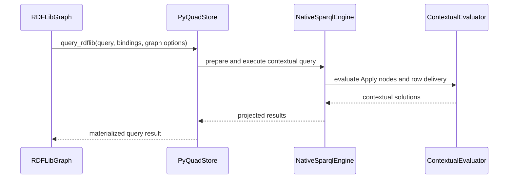

<!-- This is an auto-generated comment: summarize by coderabbit.ai -->
<!-- review_stack_entry_start -->

<!-- review_stack_entry_end -->
<!-- walkthrough_start -->

📝 Walkthrough

## Walkthrough

The change adds RDFLib-compatible contextual query compilation and evaluation, including reassignment through nested patterns and aggregation. It adds Python query dispatch and tuple-like result-row access. It also extends algebra traversal, validation, analysis, and conformance coverage for contextual applications.

### Changes

**Contextual RDFLib query execution**

|Layer / File(s)|Summary|
|:---|:---|
|**Application algebra and validation**   `crates/sparql-algebra/...`, `crates/shapes/...`|Adds `GraphPattern::Apply`, application policies, RDFLib parser mode, contextual validation, and ordinary-path rejection for contextual algebra.|
|**Contextual evaluation pipeline**   `crates/sparql-eval/src/{engine,eval,expr,binop,modifier,rdflib}.rs`|Adds prepared RDFLib queries, contextual substitutions, optional retries, row delivery, contextual grouping, aggregation, and projection restoration.|
|**Python dispatch and result rows**   `bindings/python/...`|Adds `query_rdflib`, graph-scope selection, forwarded query options, positional row access, length, iteration, and unbound cells as `None`.|
|**Analysis and compatibility coverage**   `crates/sparql-eval/...`, `crates/purrdf/...`, `crates/shapes/...`, `crates/slice/...`|Updates walkers, planners, soundness analysis, SHACL admission, blank-node handling, ownership traversal, and retained-size accounting for `Apply`.|
|**Tests and documentation**   `bindings/python/tests/...`, `crates/sparql-eval/tests/...`, `docs/...`, `CHANGELOG.md`|Adds contextual oracle, governed-execution, term-identity, dispatch, graph-scope, and result-row tests. Updates compatibility and conformance documentation.|

<!-- change_assessment_start -->
**Priority:** ➖ Normal

**Estimated code review effort:** 5 (Critical) | ~120 minutes

<!-- change_assessment_commit:"08e7cd585dfecfb335d258c187c14c2ce75e388d" -->
**Change:** Bug fix · **Severity of issue fixed:** Medium
<!-- change_assessment_end -->

### Sequence Diagram(s)

<!-- walkthrough_end -->
<!-- final_review_risk_start -->
**Merge Risk:** **🟡 Moderate** · up to `08e7c`
<!-- final_review_risk_coverage:{"sourceCommitId":"08e7cd585dfecfb335d258c187c14c2ce75e388d","coveredCommitId":"08e7cd585dfecfb335d258c187c14c2ce75e388d","kind":"reviewed"} -->

RDFLib-compatible queries against a selected context graph can silently miss triples when the dataset contains reifier rows that collide with named-graph statements. Separately, endpoint analysis for optional contextual applications can treat an optional SERVICE endpoint as always served. Fix both before merging.
<!-- final_review_risk_end -->
<!-- pre_merge_checks_walkthrough_start -->

🚥 Pre-merge checks | ✅ 4 | ❓ 1

### ❌ Failed checks (1 inconclusive)

|     Check name     | Status         | Explanation                                                                                                                                                                                               | Resolution                                                                         |
| :---------------- | :------------- | :-------------------------------------------------------------------------------------------------------------------------------------------------------------------------------------------------------- | :--------------------------------------------------------------------------------- |
| Docstring Coverage | ❓ Inconclusive | Docstring coverage is 64.68% which is insufficient. The required threshold is 80.00%. Docstring coverage is scoped to functions touched by this diff. Analyzed 269 functions across 45 files. (11 skippe… | Write docstrings for the functions missing them to satisfy the coverage threshold. |

✅ Passed checks (4 passed)

|         Check name         | Status   | Explanation                                                                                                                                                                                               |
| :------------------------ | :------- | :-------------------------------------------------------------------------------------------------------------------------------------------------------------------------------------------------------- |
|      Description Check     | ✅ Passed | Check skipped - CodeRabbit’s high-level summary is enabled.                                                                                                                                               |
|         Title check        | ✅ Passed | The title clearly and concisely identifies the two main changes: preserving RDFLib query context and adding Python row iteration support.                                                                 |
|     Linked Issues check    | ✅ Passed | `#454`: The PR adds the typed RDFLib parser, algebra compiler, shared evaluator path, caller wiring, and contextual tests. The reported 241-case RDFLib 7.6 oracle matrix covers reassignment with OPTIONA… |
| Out of Scope Changes check | ✅ Passed | The changes remain connected to `#454` and `#473`. The algebra, parser, evaluator, admission, governance, and caller changes implement contextual RDFLib reassignment and preserve strict ordinary and SHACL… |

Full details: Docstring Coverage

**Explanation**

Docstring coverage is 64.68% which is insufficient. The required threshold is 80.00%. Docstring coverage is scoped to functions touched by this diff. Analyzed 269 functions across 45 files. (11 skipped: 6 unsupported, 5 too large.)

<!-- pre_merge_checks_walkthrough_end -->
<!-- finishing_touch_checkbox_start -->

✨ Finishing Touches 💡 1

<!-- finishing_touch_suggestion:docstrings -->

📝 Generate docstrings 💡

- [ ] <!-- {"checkboxId":"3e1879ae-f29b-4d0d-8e06-d12b7ba33d98"} --> Commit to this branch
- [ ] <!-- {"checkboxId":"7962f53c-55bc-4827-bfbf-6a18da830691"} --> Create a new PR

🧪 Generate unit tests (beta)

- [ ] <!-- {"checkboxId": "6ba7b810-9dad-11d1-80b4-00c04fd430c8", "radioGroupId": "utg-output-choice-group-unknown_comment_id"} --> Commit to this branch
- [ ] <!-- {"checkboxId": "f47ac10b-58cc-4372-a567-0e02b2c3d479", "radioGroupId": "utg-output-choice-group-unknown_comment_id"} --> Create a new PR

<!-- finishing_touch_checkbox_end -->

<!-- autopilot:start -->
- [ ] <!-- {"checkboxId":"2708ad07-9f24-4260-9c11-7dc76a49f2e3"} --> <strong title="Keep fixing CodeRabbit findings and required CI, and resolving merge conflicts">Autopilot</strong> · Keep fixing CodeRabbit findings and required CI, and resolving merge conflicts
<!-- autopilot:end -->
<!-- This is an auto-generated comment: all tool run failures by coderabbit.ai -->

> [!WARNING]
> Some tools did not complete. Review the errors below.
> 
> 

> 
🔧 LanguageTool

> 
> 

> 
docs/design/purrdf-simd.md

> 
> LanguageTool checks are incomplete because the per-file request limit of 5 was reached. Remaining text was skipped; findings from completed checks are retained.
> 
> 

> 
> 

<!-- end of auto-generated comment: all tool run failures by coderabbit.ai -->
<!-- tips_start -->

---

Comment `@coderabbitai help` to get the list of available commands.

<!-- tips_end -->